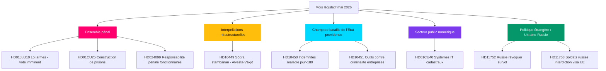

# Avant-mois de mai 2026 : Le climax législatif préélectoral de la Suède

**Auteur** : James Pether Sörling  
**Date** : 2026-04-28  
**Classification** : Public — RGPD Art. 9(2)(e)(g)  
**Confiance** : ÉLEVÉ  
**Type d'analyse** : Agrégation Tier-C avant-mois (multiplicateur 1,5×)

## 🎯 Conclusion principale

Le Riksdag entre en mai 2026 alors que le programme sécurité-et-ordre du gouvernement Kristersson approche de son climax législatif : un ensemble coordonné de mesures pénales (loi sur les armes, construction de prisons, jeunes délinquants, formation policière rémunérée) est prêt pour les votes finaux, tandis que les sociaux-démocrates mènent une campagne d'interpellations sur six fronts portant sur l'infrastructure, la protection sociale et la criminalité des entreprises, exposant les vulnérabilités de la coalition avant les élections de septembre 2026. Le rapport de commission HD01CU40 sur le Lantmäteri signale un regain d'attention gouvernementale pour la modernisation numérique du secteur public, et la pression géopolitique russo-ukrainienne s'intensifie avec de nouvelles motions sur les droits de survol et les restrictions de visa de l'UE. La mathématique de la coalition reste serrée à une majorité de +1 siège ; tout manquement lors d'amendements limitrophes du Comité de justice serait déterminant pour l'élection.

## 🧭 3 décisions que cette note soutient

1. **Priorité éditoriale** : Diriger la couverture sur l'ensemble législatif pénal (HD01JuU10, HD01CU25, HD03246, HD03237) en tant que récit central du gouvernement avant l'élection — valeur d'information maximale en mai 2026.
2. **Analyse de l'opposition** : Suivre la stratégie des six interpellations du parti S envers les ministres ; HD10449 (infrastructure), HD10450 (indemnités maladie), HD10451 (criminalité des entreprises) sont les cibles les plus saillantes.
3. **Renseignement prospectif** : Surveiller PIR-1 (stabilité de la coalition), PIR-6 (sondages), PIR-7 (signal de coalition du parti du Centre) comme indicateurs avancés du cycle électoral.

## Lecture en 60 secondes

- 🔴 **Ensemble pénal** : Cinq projets de loi interconnectés en phase finale au Riksdag ; loi sur les armes (1er juin), expansion carcérale (1er juil.) — récit central du gouvernement
- 🟡 **Lacune infrastructurelle** : Södra stambanan/Alvesta-Växjö double voie absente du plan de transport ; KD/Andreas Carlson doit répondre à l'interpellation S HD10449
- 🔵 **Bataille sociale** : Débat sur le jour 180 des indemnités maladie (HD10450) ouvre un front préélectoral sur l'État-providence ; S défend, le gouvernement défend l'accord Tidö
- 🟢 **Administration numérique** : HD01CU40 (rapport CU) sur les systèmes communaux de gestion cadastrale — signale l'agenda de modernisation informatique du secteur public
- 🟣 **Politique étrangère** : Instruments de ratification ukrainiens + HD11752/HD11753 mesures anti-russie = approfondissement de l'alignement post-OTAN
- ⚠️ **Nouveau : HD024099** — Motion étendant la responsabilité pénale des fonctionnaires au-delà du champ de 2025/26:217 ; JuU sous pression pour définir les limites de la réforme

## Principal déclencheur prospectif

**Signal de résolution PIR-1** : Un vote discipliné où le SD ou un partenaire de coalition s'abstient lors d'un amendement du Comité de justice redéfinirait le calcul de la majorité gouvernementale avant l'été 2026. Surveiller les procès-verbaux des délibérations du comité la semaine du 2026-05-05.

## Améliorations Pass 2 appliquées

**Révision Pass 2** (2026-04-28) : Urgence du calendrier électoral ajoutée (138 jours avant le 13 septembre). Dates de vote précisées : semaine du 12 mai pour JuU10, semaine du 19 mai pour la ratification ukrainienne. Référence FI-01 à FI-05 ajoutée comme indicateurs avancés pour mai 2026.

### Contexte électoral

| Jalon | Jours |
|-------|-------|
| Élection 13 septembre | 138 |
| Fin session printemps | ~50 |
| Dernière semaine de vote | ~35 |
| Congrès SD | ~70 |

<!-- source-sha: 5fe00f1958c56d07b6bd7744501c301ba01f43c4 -->
