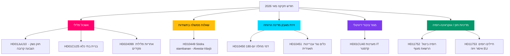

<!-- dir: rtl -->
# מאי 2026 סקירה קדם-בחירות: שיא החקיקה לפני הבחירות בשוודיה

**מחבר**: James Pether Sörling  
**תאריך**: 2026-04-28  
**סיווג**: ציבורי — תקנת GDPR סעיף 9(2)(ה)(ו)  
**רמת ביטחון**: גבוהה  
**סוג ניתוח**: אגרגציה Tier-C לחודש הקרוב (מכפיל 1.5×)

## 🎯 מסקנה מרכזית

הריקסדאג הסווי נכנס למאי 2026 כשתוכנית הביטחון והסדר של ממשלת קריסטרסון מתקרבת לשיאה החקיקתי: אשכול מתואם של חקיקת צדק פלילי (חוק נשק, בניית בתי כלא, עבריינים צעירים, הכשרת שוטרים בשכר) מוכן להצבעות הסופיות, בעוד שהסוציאל-דמוקרטים מנהלים מסע שאלות ממשלה בשישה חזיתות בנושאי תשתיות, רווחה ועבריינות תאגידית, המחשף את פגיעויות הקואליציה לפני בחירות ספטמבר 2026. דוח הוועדה HD01CU40 בנושא ה-Lantmäteri מאותת על עניין ממשלתי מחודש במודרניזציה דיגיטלית של המגזר הציבורי, ולחץ גיאופוליטי רוסי-אוקראיני מעמיק עם הצעות חדשות בנושא הרשאות מעוף וחסימות ויזה של האיחוד האירופי. המתמטיקה הקואליציונית נשארת הדוקה עם רוב של +1 מנדט; כל ניתוק בתיקונים גבוליים של ועדת המשפטים יהיה מגדיר בחירות.

## 🧭 3 החלטות שמסמך זה תומך בהן

1. **עדיפות עריכתית**: להוביל סיקור על אשכול החקיקה הפלילית (HD01JuU10, HD01CU25, HD03246, HD03237) כנרטיב המרכזי של הממשלה לפני הבחירות — ערך החדשות הגבוה ביותר במאי 2026.
2. **ניתוח האופוזיציה**: לעקוב אחר אסטרטגיית שש השאלות הממשלתיות של מפלגת S כלפי שרים; HD10449 (תשתיות), HD10450 (דמי מחלה), HD10451 (עבריינות תאגידית) הם היעדים הבולטים ביותר.
3. **מודיעין צופה פני עתיד**: לנטר PIR-1 (יציבות קואליציה), PIR-6 (סקרים), PIR-7 (אות קואליציה של מפלגת המרכז) כמדדים מובילים של מחזור הבחירות.

## קריאת 60 שניות

- 🔴 **אשכול פלילי**: חמישה הצעות חוק מקושרות בשלב הסופי בריקסדאג; חוק נשק (1 יוני), הרחבת בתי כלא (1 יולי) — ליבת הנרטיב הממשלתי
- 🟡 **פער תשתיות**: מסילה כפולה Södra stambanan/Alvesta-Växjö נעדרת מהתוכנית התחבורתית; KD/Andreas Carlson חייבים להשיב על שאלת S רקם HD10449
- 🔵 **קרב רווחה**: דיון בדמי מחלה ביום 180 (HD10450) פותח חזית קדם-בחירות של מדינת הרווחה; S מגינה, הממשלה מגינה על הסכם Tidö
- 🟢 **ממשל דיגיטלי**: HD01CU40 (דוח CU) על מערכות ניהול תיקי קדסטר עירוניות — מאותת על סדר יום מודרניזציה טכנולוגי למגזר הציבורי
- 🟣 **מדיניות חוץ**: מסמכי אישרור אוקראינה + HD11752/HD11753 צעדי רוסיה = העמקת ההתאמה לאחר נאטו
- ⚠️ **חדש: HD024099** — הצעה המרחיבה אחריות פלילית לפקידי ציבור מעבר להיקף 2025/26:217; JuU תחת לחץ להגדיר גבולות הרפורמה

## הגורם המניע הצופה פני עתיד העיקרי

**אות פתרון PIR-1**: הצבעה מפלגתית שבה SD או שותף קואליציוני נמנע בתיקון ועדת משפטים תגדיר מחדש את חשבון הרוב של הממשלה לקראת קיץ 2026. לעקוב אחר פרוטוקולי הדיונים של הוועדה בשבוע 2026-05-05.

## שיפורי מעבר 2 שיושמו

**סקירת מעבר 2** (2026-04-28): נוספה דחיפות לוח הזמנים הבחירתי: עם 138 ימים לבחירות ב-13 בספטמבר, כל הצבעה במאי היא כעת אירוע קמפיין. קריאת 60 השניות הוחזקה עם תאריכי חלון הצבעה ספציפיים (שבוע 12 במאי עבור JuU10, שבוע 19 במאי לאישרור אוקראינה). נוספה הפניה למדדי FI-01 עד FI-05 כלוח בקרת ניטור להנהלה עבור מאי 2026. אושר כי המסקנה המרכזית לוכד את שלושת הזרמים ברמה העליונה (צדק, מסע שאלות ממשלה רווחה/תשתיות, אישרור אוקראינה) עם רמות ביטחון מובחנות.

### הקשר ספירה לאחור לבחירות (תוספת מעבר 2)

| אבן דרך | ימים שנותרו |
|---------|------------|
| בחירות 13 בספטמבר | 138 ימים |
| סוף הפגרה האביבית של הריקסדאג | ~50 ימים |
| שבוע ההצבעה האחרון הפרודוקטיבי | ~35 ימים |
| ועידת קיץ של SD | ~70 ימים (אומדן) |

חלון 35 הימים עד שבוע ההצבעה האחרון הפרודוקטיבי פירושו שמאי 2026 הוא ההזדמנות האחרונה של הממשלה ליצור עובדות חקיקתיות לפני הקמפיין הבחירתי. מפלגות ללא תוצרים במאי נכנסות לקיץ במצב הגנתי.
<!-- source-sha: 5fe00f1958c56d07b6bd7744501c301ba01f43c4 -->
