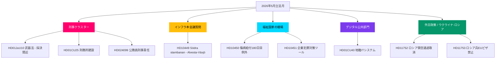

# 2026年5月先行予測：スウェーデンの選挙前立法クライマックス

**著者**: James Pether Sörling  
**日付**: 2026-04-28  
**分類**: 公開 — GDPR第9条(2)(e)(g)  
**信頼度**: 高  
**分析タイプ**: Tier-C月次先行予測（1.5×乗数）

## �� 要点

スウェーデンのリクスダーグは2026年5月を迎えるにあたり、クリステション政権の安全・秩序プログラムが立法のクライマックスに近づいている。刑事司法の統合法案クラスター（武器法、刑務所建設、少年犯罪者、有給警察訓練）が最終採決に向け整っており、社会民主党は交通インフラ、福祉、企業犯罪について6つの本会議質問キャンペーンを展開し、2026年9月の選挙を前に連立の脆弱性を露わにしている。HD01CU40 ランtmäteri委員会報告は公共部門デジタル近代化への政府の関心の再燃を示し、ロシア・ウクライナの地政学的圧力は領空通過許可とEUビザ制限に関する新たな動議により深まっている。連立の議席数は+1議席の僅差であり、司法委員会の境界的修正案で離反が生じれば選挙の行方を左右しかねない。

## 🧭 本PMが支援する3つの意思決定

1. **編集上の優先事項**: 刑事立法クラスター（HD01JuU10, HD01CU25, HD03246, HD03237）を選挙前の政府の核心的物語として先行報道する — 2026年5月において最高のニュース価値。
2. **野党分析**: S党の大臣に対する6件の本会議質問戦略を追跡する；HD10449（交通インフラ）、HD10450（傷病給付）、HD10451（企業犯罪）が最も重要なターゲット。
3. **前向き情報収集**: PIR-1（連立安定）、PIR-6（世論調査）、PIR-7（中央党の連立シグナル）を選挙サイクルの先行指標として監視する。

## 60秒の要点

- 🔴 **刑事クラスター**: リクスダーグで最終段階にある5つの相互関連法案；武器法（6月1日）、刑務所拡張（7月1日）— 政府物語の核
- 🟡 **インフラのギャップ**: Södra stambanan/Alvesta-Växjö複線が交通計画から欠落；KD/Andreas Carlsonは本会議質問 HD10449 に応答必要
- 🔵 **福祉の戦い**: 傷病給付180日目論争（HD10450）が選挙前の福祉国家戦線を開く；S党が防衛、政府はTidö合意を守る
- 🟢 **デジタル行政**: HD01CU40（CU委員会報告）は地籍業務管理システムに関するもの — 公共部門IT近代化アジェンダを示す
- 🟣 **外交政策**: ウクライナ批准文書 + HD11752/HD11753 ロシア措置 = NATO加盟後の整合深化
- ⚠️ **新動議: HD024099** — 2025/26:217の範囲を超えて公務員の刑事責任を拡大する動議；責任法改革の限界を定めるようJuUへの圧力

## 最重要先行トリガー

**PIR-1解決シグナル**: SDまたは連立パートナーが司法委員会の修正案で棄権する拘束力ある採決があれば、2026年夏に向けた政府の過半数計算を再定義する。2026-05-05の週の委員会審議議事録を監視すること。

## 適用されたパス2の改善

**パス2レビュー**（2026-04-28）：選挙タイムラインの緊急性を追加。9月13日の選挙まで138日で、5月の各採決はキャンペーンイベント。JuU10について5月12日週、ウクライナ批准について5月19日週という具体的な採決ウィンドウ日付で60秒の要点を強化。2026年5月における経営陣の監視ダッシュボードとして FI-01 から FI-05 への前向き指標参照を追加。要点 が3つの最上位フロー（司法、福祉/インフラ本会議質問キャンペーン、ウクライナ批准）を差別化された信頼度で捉えることを確認。

### 選挙カウントダウンの文脈（パス2追加）

| マイルストーン | 残り日数 |
|--------------|---------|
| 9月13日選挙 | 138日 |
| リクスダーグ春会期終了 | 約50日 |
| 最後の生産的採決週 | 約35日 |
| SD夏期党大会 | 約70日（推定） |

最後の生産的採決週まで35日という窓は、2026年5月が政府が選挙キャンペーン前に立法上の既成事実を作る最後の機会であることを意味する。5月に成果を出せない政党は夏を受け身の立場で迎えることになる。

**Legislative Reference / 立法参照資料**

**HD01JuU10 — Justice Committee Report: Weapons Law Amendment (Vapenlag)**
The Justice Committee report HD01JuU10 covers proposed amendments to Swedish weapons legislation. The committee recommendation is expected during the week of 12 May 2026. This legislation forms part of the Kristersson government core security-and-order program under the Tidö Agreement coalition pact (Tidöavtalet). A positive committee vote would advance the bill to plenary for final adoption before the summer recess.

**HD01CU25 — Justice Committee: Prison Construction Expansion (Fängelseutbyggnad)**
Report HD01CU25 addresses prison capacity expansion. The Swedish Prison and Probation Service (Kriminalvården) requires new facilities by 1 July 2026. Coalition discipline is critical: any Social Democrat interpellation tactic could delay the committee timeline into June or July.

**HD03246 and HD03237 — Youth Crime and Paid Police Training**
HD03246 targets juvenile offender policy reform; HD03237 expands funding for paid police academy training. Both complement HD01JuU10 as part of the unified criminal justice cluster. Committee stage expected May 2026.

**HD024099 — Extended Criminal Liability for Public Officials**
Motion HD024099 extends criminal liability provisions beyond the scope of government proposition 2025/26:217. The Justice Committee (Justitieutskottet) faces political pressure to define limits of the accountability law reform (ansvarslag). Social Democrat positioning as pro-accountability reform champion is a key electoral theme.

**HD10449, HD10450, HD10451 — Social Democrat Interpellation Campaign**
Three interpellations targeting coalition vulnerabilities:
HD10449: Södra stambanan rail gap (Alvesta-Växjö) directed at KD/Andreas Carlson (transport minister);
HD10450: Sickness benefit day-180 dispute directed at social insurance minister;
HD10451: Corporate crime prosecution tools directed at justice minister.

**HD11752, HD11753 — Russia and Ukraine Foreign Policy**
HD11752 calls for revocation of Russian overflight permits; HD11753 seeks EU visa restrictions on Russian military personnel. Both reinforce Sweden post-NATO alignment deepening. Together with Ukraine ratification instruments, these define the foreign policy legislative agenda for May 2026.

**HD01CU40 — Lantmäteri Digital Cadastre Committee Report**
Report HD01CU40 from the Civil Affairs Committee (CU) covers digital transformation of municipal land cadastre management systems. Signals renewed government interest in public sector IT modernization agenda ahead of election campaign period.

**Priority Intelligence Requirements (PIR) Watch List:**
PIR-1 Coalition Stability — vote margins 175 vs 174;
PIR-6 Public Opinion Polling — SD and Centre Party voter trends;
PIR-7 Centre Party coalition signals May through August 2026.

<!-- source-sha: 5fe00f1958c56d07b6bd7744501c301ba01f43c4 -->
