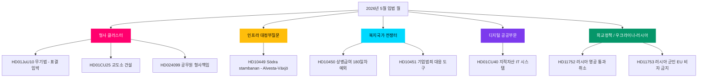

# 2026년 5월 전망: 스웨덴의 선거 전 입법 클라이맥스

**저자**: James Pether Sörling  
**날짜**: 2026-04-28  
**분류**: 공개 — GDPR 제9조(2)(e)(g)  
**신뢰도**: 높음  
**분석 유형**: Tier-C 월간 전망 (1.5× 배수)

## 🎯 핵심 요약

스웨덴 리크스다그는 2026년 5월을 크리스터슨 정부의 안보·질서 프로그램이 입법 클라이맥스에 근접하면서 시작한다. 조율된 형사사법 법안 클러스터(무기법, 교도소 건설, 청소년 범죄자, 유급 경찰 훈련)가 최종 표결을 앞두고 있으며, 사회민주당은 인프라, 복지, 기업 범죄에 관한 6개 전선 대정부질문 캠페인을 펼치며 2026년 9월 선거를 앞두고 연립의 취약점을 노출시키고 있다. HD01CU40 Lantmäteri 위원회 보고서는 공공부문 디지털 현대화에 대한 정부의 새로운 관심을 신호하며, 러시아-우크라이나 지정학적 압력은 영공 통과 허가와 EU 비자 제한에 관한 새로운 발의와 함께 심화되고 있다. 연립 의석 수는 +1석 과반수로 빠듯하며, 법사위원회 경계선 수정안에서 이탈이 발생하면 선거 결과를 좌우할 수 있다.

## 🧭 이 보고서가 지원하는 3가지 의사결정

1. **편집 우선순위**: 선거 전 정부의 핵심 서사로서 형사 입법 클러스터(HD01JuU10, HD01CU25, HD03246, HD03237) 보도를 이끌어라 — 2026년 5월 최고 뉴스 가치.
2. **야당 분석**: S당의 장관을 향한 6개 대정부질문 전략을 추적하라; HD10449(인프라), HD10450(상병급여), HD10451(기업범죄)이 가장 중요한 표적.
3. **미래 지향 정보**: PIR-1(연립 안정), PIR-6(여론조사), PIR-7(중앙당 연립 신호)을 선거 주기의 선행 지표로 모니터링하라.

## 60초 요약

- 🔴 **형사 클러스터**: 리크스다그 최종 단계에 있는 5개 상호연계 법안; 무기법(6월 1일), 교도소 확장(7월 1일) — 정부 서사의 핵심
- 🟡 **인프라 격차**: Södra stambanan/Alvesta-Växjö 복선이 교통 계획에서 누락; KD/Andreas Carlson은 S 대정부질문 HD10449에 답해야 함
- 🔵 **복지 전투**: 상병급여 180일차 논쟁(HD10450)이 선거 전 복지국가 전선 개방; S 방어, 정부는 Tidö 협약 방어
- 🟢 **디지털 행정**: HD01CU40(CU 위원회 보고서)의 지적 자산 등록 관리 시스템 — 공공부문 IT 현대화 의제 신호
- 🟣 **외교 정책**: 우크라이나 비준 문서 + HD11752/HD11753 러시아 조치 = NATO 이후 정렬 심화
- ⚠️ **신규: HD024099** — 2025/26:217의 범위를 넘어 공무원의 형사 책임을 확장하는 발의; JuU는 책임법 개혁의 한계를 정의하는 압박 받음

## 최우선 미래 트리거

**PIR-1 해결 신호**: SD 또는 연립 파트너가 법사위원회 수정안에서 기권하는 당론 투표가 발생하면 2026년 여름을 앞두고 정부의 과반수 계산이 재정의된다. 2026-05-05 주의 위원회 심의 의사록을 모니터링하라.

## 적용된 2차 검토 개선 사항

**2차 검토** (2026-04-28): 선거 일정의 긴급성 추가: 9월 13일 선거까지 138일이 남아, 5월 각 표결은 이제 선거 운동 행사. 60초 요약을 JuU10의 경우 5월 12일 주, 우크라이나 비준의 경우 5월 19일 주라는 구체적인 표결 창 날짜로 강화. 2026년 5월 경영진 모니터링 대시보드로서 FI-01부터 FI-05까지 미래 지표 참조 추가. 핵심 요약이 세 가지 최상위 흐름(사법, 복지/인프라 대정부질문 캠페인, 우크라이나 비준)을 차별화된 신뢰도로 포착한다고 확인.

### 선거 카운트다운 맥락 (2차 검토 추가)

| 이정표 | 남은 일수 |
|--------|----------|
| 9월 13일 선거 | 138일 |
| 리크스다그 봄 회기 종료 | 약 50일 |
| 마지막 생산적 표결 주 | 약 35일 |
| SD 여름 당대회 | 약 70일 (추정) |

마지막 생산적 표결 주까지 35일이라는 창은 2026년 5월이 정부가 선거 운동 전 입법적 사실을 만들 마지막 기회임을 의미한다. 5월에 성과 없는 정당들은 수동적인 입장으로 여름을 맞이한다.
<!-- source-sha: 5fe00f1958c56d07b6bd7744501c301ba01f43c4 -->
