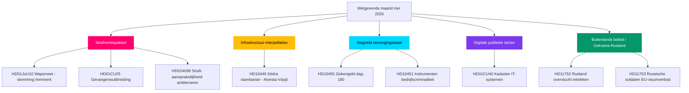

# Mei 2026 maandoverzicht: Zweden's wetgevend hoogtepunt voor de verkiezingen

**Auteur**: James Pether Sörling  
**Datum**: 2026-04-28  
**Classificatie**: Openbaar — AVG Art. 9(2)(e)(g)  
**Betrouwbaarheid**: HOOG  
**Analysetype**: Tier-C maandoverzicht (1,5× vermenigvuldiger)

## 🎯 Kernbevinding

De Riksdag treedt mei 2026 binnen terwijl het veiligheids- en ordeprogramma van de regering-Kristersson zijn wetgevend hoogtepunt nadert: een gecoördineerd strafrechtspakket (wapenwet, gevangenisuitbreiding, jeugddelinquenten, betaalde politieopleiding) staat klaar voor eindstemmen, terwijl de Sociaal-Democraten een zesfront interpellatie­campagne voeren over infrastructuur, welzijn en bedrijfscriminaliteit die de kwetsbaarheden van de coalitie blootlegt voor de verkiezingen van september 2026. Het commissierapport HD01CU40 over het Lantmäteri signaleert hernieuwde regeringsaandacht voor digitale modernisering van de publieke sector, en de geopolitieke druk van de Rusland-Oekraïne-crisis verdiept zich met nieuwe moties over overvlucht­vergunningen en EU-visumrestricties. De coalitie­mathematica blijft krap met een meerderheid van +1 zetel; elke afwijking bij grensoverschrijdende amendementen van de Justitiecommissie zou verkiezingsbepalend zijn.

## 🧭 3 beslissingen die dit rapport ondersteunt

1. **Redactionele prioriteit**: Leid berichtgeving over het strafrechtelijk wetgevingspakket (HD01JuU10, HD01CU25, HD03246, HD03237) als de kernverhaallijn van de regering voor de verkiezingen — hoogste nieuwswaarde mei 2026.
2. **Oppositie-analyse**: Volg de zes-interpellatiestrategie van de S-partij tegenover ministers; HD10449 (infrastructuur), HD10450 (ziekengeld), HD10451 (bedrijfscriminaliteit) zijn de meest prominente doelen.
3. **Vooruitblikkende inlichtingen**: Bewaak PIR-1 (coalitie­stabiliteit), PIR-6 (peilingen), PIR-7 (coalitiesignaal Centrum­partij) als toonaangevende electorale indicatoren.

## 60-secondenlezing

- 🔴 **Strafrechts­pakket**: Vijf onderling verbonden wetsvoorstellen in afsluitende fase; wapenwet (1 jun), gevangenisuitbreiding (1 jul) — kern van de regeringsverhaallijn
- 🟡 **Infrastructuur­leemte**: Södra stambanan/Alvesta-Växjö dubbelspoor ontbreekt in transportplan; KD/Andreas Carlson moet reageren op S-interpellatie HD10449
- 🔵 **Welzijnsstrijd**: Debat over ziekengeldregel dag 180 (HD10450) opent verzorgingsstaatfront; S verdedigt, regering verdedigt Tidö-akkoord
- 🟢 **Digitale overheid**: HD01CU40 (CU-commissierapport) over gemeentelijke kadasterbeheers­systemen — signaleert IT-moderniseringsagenda voor de publieke sector
- 🟣 **Buitenlands beleid**: Oekraïne-ratificerings­instrumenten + HD11752/HD11753 Rusland-maatregelen = verdiepte post-NAVO-afstemming
- ⚠️ **Nieuw: HD024099** — Motie tot uitbreiding van strafrechtelijke aansprakelijkheid voor ambtenaren voorbij het bereik van 2025/26:217; JuU onder druk om grenzen van aansprakelijkheids­hervormingen te definiëren

## Belangrijkste vooruitblikkende trigger

**PIR-1-oplossings­signaal**: Een gedisciplineerde stemming waarbij SD of een coalitie­partner zich onthoudt bij een Justitiecommissie-amendement zou de meerheids­berekening van de regering voor de zomer 2026 herdefiniëren. Bewaak de beraadslagings­notulen van de commissie in de week van 2026-05-05.

## Pass-2-verbeteringen toegepast

**Pass-2-beoordeling** (2026-04-28): Urgentie van de verkiezingstijdlijn toegevoegd: met 138 dagen tot de verkiezingen op 13 september is elke maistemming nu een campagnemoment. De 60-secondenlezing versterkt met specifieke stemmingsvenster­datums (week 12 mei voor JuU10, week 19 mei voor Oekraïne-ratificering). Verwijzing naar vooruit­indicatoren FI-01 tot FI-05 als bewakingsdashboard van de leiding voor mei 2026 toegevoegd. Bevestigd dat de kernbevinding alle drie topniveaustromen vastlegt (rechtvaardigheid, welzijn/infra-interpellatie­campagne, Oekraïne-ratificering) met gedifferentieerde betrouwbaarheids­niveaus.

### Context aftelling naar verkiezingen (Pass-2-aanvulling)

| Mijlpaal | Resterende dagen |
|----------|-----------------|
| Verkiezingen 13 september | 138 dagen |
| Einde voorjaarszitting Riksdag | ~50 dagen |
| Laatste productieve stemweek | ~35 dagen |
| SD-zomercongres | ~70 dagen (geschat) |

Het 35-dagenvenster tot de laatste productieve stemweek betekent dat mei 2026 de laatste gelegenheid is voor de regering om wetgevende feiten te creëren voor de campagne. Partijen zonder resultaten in mei starten de zomer in reactieve positie.
<!-- source-sha: 5fe00f1958c56d07b6bd7744501c301ba01f43c4 -->
