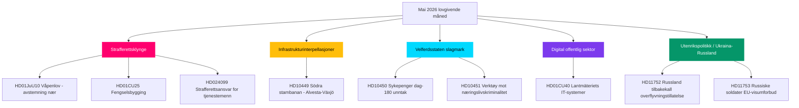

# Mai 2026 månedsoversikt: Sveriges lovgivningsklimaks før valget

**Forfatter**: James Pether Sörling  
**Dato**: 2026-04-28  
**Klassifisering**: Offentlig — GDPR Art. 9(2)(e)(g)  
**Konfidensnivå**: HØY  
**Analysetype**: Tier-C månedsoversikt (1,5× multiplikator)

## 🎯 Kjerneoppsummering

Sveriges Riksdag innleder mai 2026 med Kristerssonregjeringens sikkerhets- og ordensprogram nær sitt lovgivningsklimaks: en koordinert strafferettsklynge (våpenlov, fengselsbygging, ungdomslovbrytere, betalt politiutdanning) er klar for slutt­avstemninger, mens Sosialdemokratene fører en seksfronts interpellasjonskampanje om infrastruktur, velferd og næringslivskriminalitet som avslører koalisjonens sårbarhet foran riksdagsvalget i september 2026. HD01CU40 lantmäteri-komiteen signalerer fornyet regjeringsoppmerksomhet rundt digital modernisering av offentlig sektor, og det russisk-ukrainske geopolitiske presset intensiveres med nye motioner om overflyvningstillatelser og EU-visumrestriksjoner. Koalisjonsmatematikken er fortsatt knapp med +1 mandats flertall; ethvert avvik ved Justiskomiteens grenseoverskridende endringsforslag vil være valgdefinerende.

## 🧭 3 beslutninger dette PM støtter

1. **Redaksjonell prioritet**: Led dekning av den strafferettslige lovgivningsklyngen (HD01JuU10, HD01CU25, HD03246, HD03237) som regjeringens kjernefortelling før valget — høyeste nyhetsverdi mai 2026.
2. **Opposisjonsanalyse**: Følg S-partiets seks-interpellasjonsstrategi mot ministre; HD10449 (infrastruktur), HD10450 (sykepenger), HD10451 (næringslivskriminalitet) er de mest fremtredende målene.
3. **Fremoverskuende etterretning**: Overvåk PIR-1 (koalisjonsstabilitet), PIR-6 (meningsmålinger), PIR-7 (Senterpartiets koalisjonssignal) som ledende valgindika­torer.

## 60-sekunders lesning

- 🔴 **Strafferettsklynge**: Fem sammenvevde lovforslag i sluttfase i Riksdagen; våpenlov (1. jun), fengselsutvidelse (1. jul) — kjernen i regjeringens fortelling
- 🟡 **Infrastrukturhull**: Södra stambanan/Alvesta-Växjö dobbeltspor mangler i transportplanen; KD/Andreas Carlson må svare på S-interpellasjon HD10449
- 🔵 **Velferds­kamp**: Sykepengenedag-180-debatt (HD10450) åpner velferdsstatsfront før valget; S forsvarer, regjeringen forsvarer Tidöavtalen
- 🟢 **Digital forvaltning**: HD01CU40 (CU-betenkning) om kommunale matrikkelsaks­behandlersystemer — signalerer IT-moderniseringsagendaen for offentlig sektor
- 🟣 **Utenrikspolitikk**: Ukraina-ratifiseringsinstru­menter + HD11752/HD11753 Russlands-tiltak = fordypet post-NATO-tilpasning
- ⚠️ **Nytt: HD024099** — Motion om utvidet strafferettslig ansvar for offentlige tjenestemenn utover 2025/26:217s rekkevidde; JuU under press for å definere grensene for ansvarsloven

## Topp fremutløser

**PIR-1 løsningssignal**: En pisket avstemning der SD eller en koalisjonspartner avstår ved et Justiskomité-endringsforslag vil redefinere regjeringens majoritetsregning frem mot sommeren 2026. Overvåk komiteens drøftelsesprotokoll uken 2026-05-05.

## Pass 2-forbedringer anvendt

**Pass 2-gjennomgang** (2026-04-28): La til valgfristens hastverk: med 138 dager til valget 13. september er hver maiavt­stemning nå et kampanjearrangement. Styrket 60-sekunders­lesningen med spesifikke av­stemningsvindudatoer (uken 12. mai for JuU10, uken 19. mai for Ukraina-ratifiseringen). La til fremoverskuende indikator­referanse til FI-01 til FI-05 som ledelsens overvåkingspanel for mai 2026. Bekreftet at kjerneoppsummeringen fanger alle tre toppnivåstrømmene (rettferdig­het, velferd/infrainterpellasjonskampanje, Ukraina-ratifisering) med differensierte konfidens­nivåer.

### Valgned­tellings­kontekst (Pass 2-tillegg)

| Milepæl | Gjenværende dager |
|---------|-------------------|
| Valg 13. september | 138 dager |
| Riksdagens vårtersjon slutt | ~50 dager |
| Siste produktive avstemningsuke | ~35 dager |
| SDs sommerkon­gress | ~70 dager (anslått) |

35-dagersvinduet til den siste produktive stemme­uken betyr at mai 2026 er den siste muligheten for regjeringen til å skape lovgivnings­fakta før valgkampanjen. Partier uten mai-leveranser innleder sommeren i reaktiv posisjon.
<!-- source-sha: 5fe00f1958c56d07b6bd7744501c301ba01f43c4 -->
