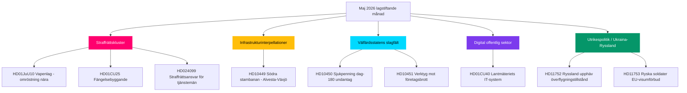

# Maj 2026 månadsöversikt: Sveriges förvalspolitiska lagstiftningsklimaks

**Författare**: James Pether Sörling  
**Datum**: 2026-04-28  
**Klassificering**: Offentlig — GDPR Art. 9(2)(e)(g)  
**Konfidensgrad**: HÖG  
**Analystyp**: Skiktnivå-C månadsöversikt (1,5× multiplikator)

## 🎯 Kärnslutsats

Sveriges riksdag inleder maj 2026 med Kristerssonregeringens säkerhets- och ordningsprogram nära sitt lagstiftningsklimaks: ett samordnat straffrättskluster (vapenlag, fängelsebyggande, ungdomslagöverträdare, avlönad polisutbildning) är redo för slutomröstningar, medan Socialdemokraterna bedriver en sexfrontad interpellationskampanj om infrastruktur, välfärd och företagsbrott som exponerar koalitionens sårbarheter inför riksdagsvalet i september 2026. HD01CU40 lantmäteri-betänkandet signalerar förnyad regeringsuppmärksamhet kring digital modernisering av offentlig sektor, och det rysk-ukrainska geopolitiska trycket fördjupas med nya motioner om överflygningstillstånd och EU-visumrestriktioner. Koalitionsmatematiken förblir tight med +1 mandats majoritet; varje avhopp vid gränsöverskridande justitieutskottsamendement vore valdefinerande.

## 🧭 3 beslut detta PM stöder

1. **Redaktionell prioritet**: Led bevakning om det straffrättsliga lagstiftningsklustret (HD01JuU10, HD01CU25, HD03246, HD03237) som regeringens kärninvestering i förvalsnarrativet — högst nyhetsvärde maj 2026.
2. **Oppositionsanalys**: Följ S-partiets sexinterpellationsstrategi mot ministrar; HD10449 (infrastruktur), HD10450 (sjukpenning), HD10451 (företagsbrott) är de viktigaste målen.
3. **Framåtsyftande underrättelse**: Bevaka PIR-1 (koalitionsstabilitet), PIR-6 (opinionsundersökningar), PIR-7 (Centerns koalitionssignal) som ledande valkretsindikatorer.

## 60-sekundersläsning

- 🔴 **Straffrättskluster**: Fem sammankopplade lagförslag i slutfas i riksdagen; vapenlagen (1 jun), fängelseexpansionen (1 jul) — kärna i regeringens narrativ
- 🟡 **Infrastrukturlucka**: Södra stambanan/Alvesta-Växjö dubbelspår saknas i transportplanen; KD/Andreas Carlson måste svara på S-interpellation HD10449
- 🔵 **Välfärdsstrid**: Sjukpenningdagen-180-debatt (HD10450) öppnar en förvals­välfärdsfront; S försvarar, regeringen försvarar Tidöavtalet
- 🟢 **Digital förvaltning**: HD01CU40 (CU-betänkande) om kommunala lantmäteriärendesystem — signalerar IT-moderniseringsagendan för offentlig sektor
- 🟣 **Utrikespolitik**: Ukrainaratificeringshandlingar + HD11752/HD11753 Rysslandsåtgärder = fördjupad post-NATOanpassning
- ⚠️ **Nytt: HD024099** — Motion om utvidgat straffrättsligt ansvar för offentliga tjänstemän utöver 2025/26:217:s räckvidd; JuU under press att definiera gränser för redovisningslagsreformen

## Topp framåtutlösare

**PIR-1 lösningssignal**: En piskat omröstning där SD eller någon koalitionspartner avstår vid ett justitieutskottsamendement skulle omdefinifera regeringens majoritetskalkyl inför sommaren 2026. Bevaka utskottets deliberationsprotokoll veckan 2026-05-05.

## Pass 2-förbättringar tillämpade

**Pass 2-granskning** (2026-04-28): Lade till valets tidslinjebrådska: med 138 dagar till valet den 13 september är varje majomröstning nu ett kampanjevenemang. Stärkte 60-sekundersläsningen med specifika omröstningsfönsterdatum (veckan 12 maj för JuU10, veckan 19 maj för Ukrainaratificeringen). Lade till framåtindikatorhänvisning till FI-01 till FI-05 som ledningens övervakningspanel för maj 2026. Bekräftade att kärnslutsatsen fångar alla tre topprioriteringsströmmar (rättvisleverans, välfärd/infrainterpellationskampanj, Ukrainaratificering) med differentierade konfidensnivåer.

### Valnedrundningskontext (Pass 2-tillägg)

| Milstolpe | Återstående dagar |
|-----------|-------------------|
| Val 13 september | 138 dagar |
| Riksdagens vårtermin slut | ~50 dagar |
| Sista produktiva omröstningsvecka | ~35 dagar |
| SD:s sommarkongress | ~70 dagar (uppsk.) |

35-dagarsfönstret till den sista produktiva omröstningsveckan innebär att maj 2026 är den sista möjligheten för regeringen att skapa lagstiftningsfakta inför valkampanjen. Partier utan majleveranser inleder sommaren i reaktiv position.
<!-- source-sha: 5fe00f1958c56d07b6bd7744501c301ba01f43c4 -->
