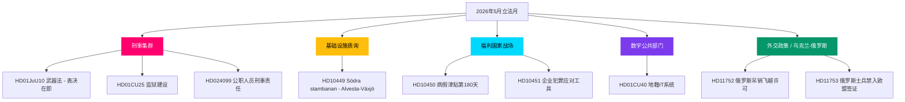

# 2026年5月展望：瑞典选前立法高潮

**作者**：James Pether Sörling  
**日期**：2026-04-28  
**分类**：公开 — GDPR第9条(2)(e)(g)  
**置信度**：高  
**分析类型**：Tier-C月度展望（1.5×乘数）

---

## 🎯 核心结论

瑞典议会（Riksdag）在2026年5月开幕之际，克里斯特松（Kristersson）政府的安全与秩序计划正接近其立法高潮：一个协调一致的刑事司法法案集群（武器法 Vapenlag、监狱建设 Fängelseutbyggnad、青少年犯罪者 Ungdomsbrottslingar、带薪警察培训 Polisutbildning）已准备好进行最终表决，与此同时，社会民主党（S parti）就基础设施、福利和企业犯罪发起六线质询攻势，在2026年9月大选前暴露了执政联盟的脆弱性。HD01CU40 Lantmäteri委员会报告表明政府对公共部门数字化现代化的重新关注，俄乌地缘政治压力随着关于飞越许可和欧盟签证限制的新动议（HD11752、HD11753）而加深。联盟的议席数学依然紧绷，仅有 +1 席多数；若在司法委员会（JuU）界线性修正案中出现异动，将是决定选举走向的关键信号。

## 🧭 本报告支持的3项决策

1. **编辑优先级 ( Editorial Priority )**：领导对刑事立法集群（HD01JuU10, HD01CU25, HD03246, HD03237）的报道，将其定位为政府选前核心叙事 — 2026年5月最高新闻价值。
2. **反对党分析 ( Opposition Analysis )**：跟踪S党针对部长的六项质询策略；HD10449（基础设施 Infrastructure）、HD10450（病假津贴 Sickness Benefit）、HD10451（企业犯罪 Corporate Crime）是最重要的分析目标。
3. **前瞻性情报 ( Forward Intelligence )**：将PIR-1（联盟稳定性 Coalition Stability）、PIR-6（民调 Polling）、PIR-7（中央党联盟信号 Centre Party Signals）作为选举周期的领先指标加以监控。

## ⚡ 60秒摘要

- 🔴 **刑事集群 Criminal Cluster**：五项相互关联的法案处于议会最终阶段；武器法（6月1日 1 June）、监狱扩建（7月1日 1 July）— 政府叙事核心 Core Government Narrative
- 🟡 **基础设施缺口 Infrastructure Gap**：Södra stambanan / Alvesta-Växjö 双线铁路缺席交通规划；KD 党 Andreas Carlson 必须回应 S 党质询 HD10449
- 🔵 **福利之争 Welfare Battle**：病假津贴第180天辩论（HD10450）开辟选前福利国家战线；S 党防守，政府捍卫 Tidö 协议
- 🟢 **数字政府 Digital Government**：HD01CU40（CU 委员会报告）涉及市级地籍案件管理系统 — 预示公共部门 IT 现代化议程
- 🟣 **外交政策 Foreign Policy**：乌克兰批准文书 + HD11752 / HD11753 俄罗斯措施 = 后北约阵营对齐深化
- ⚠️ **新动议 New Motion：HD024099** — 将公职人员刑事责任扩大至 prop. 2025/26:217 范围之外；JuU 承受压力须界定问责法（Ansvarslag）改革边界

## 📊 关键立法文件 ( Key Legislative Documents )

本月议会关键文件：HD01JuU10（武器法 weapons law）最终表决预计2026-05-12周；HD01CU25（监狱扩建 prison construction）及 HD03246（青少年犯罪 youth crime）、HD03237（带薪警培 paid police training）在委员会审议；社会民主党质询 HD10449（南干线铁路缺口 Södra stambanan rail gap Alvesta-Växjö）、HD10450（病假津贴第180天 sickness benefit day 180）、HD10451（企业犯罪工具 corporate crime prosecution tools）针对三位内阁部长；HD01CU40（地籍IT系统 digital cadastre Lantmäteri）显示公共部门数字化议程；HD11752和 HD11753（俄罗斯飞越和签证 Russia overflight visa restrictions）反映后北约外交政策立场。

## 🔺 最重要前瞻触发因素

**PIR-1 解决信号 ( Coalition Stability Signal )**：若 SD 或联盟伙伴在司法委员会（JuU）修正案中投票弃权（Avstår），将重新定义政府在2026年夏前的多数派计算。关注2026-05-05当周委员会审议记录（Utskottsprotokoll）。

## 🗳️ 选举倒计时背景 ( Electoral Countdown Context )

| 里程碑 Milestone | 剩余天数 Days Remaining |
|-----------------|------------------------|
| 9月13日大选 Election Day 13 September | 138 天 days |
| 议会春季会期结束 Spring session ends | 约 50 天 approx 50 days |
| 最后生产性投票周 Last productive voting week | 约 35 天 approx 35 days |
| SD 夏季党代会 SD Summer Congress | 约 70 天 approx 70 days |

距最后生产性投票周仅35天的窗口意味着2026年5月是政府在竞选前创造立法既成事实的最后机会。没有5月成果的政党将以被动姿态进入夏季选举周期（Valrörelse）。

**Analytical Context / 分析背景**

**Swedish May 2026 Legislative Calendar — Key Facts:**

The Riksdag spring session closes approximately 50 days from 28 April 2026, leaving May as the last productive legislative period before the September 13 general election campaign. The Kristersson coalition (M + SD + KD + L) holds 175 seats versus 174 for the opposition bloc — a single-seat majority that makes every committee vote a potential coalition stress test.

**Criminal Justice Cluster (Brottsbalken Reforms):**
HD01JuU10 (weapons law Vapenlag) effective 1 June 2026; HD01CU25 (prison expansion Fängelseutbyggnad) effective 1 July 2026; HD03246 (youth offenders Ungdomsbrottslingar) and HD03237 (paid police training Polisutbildning) complete the cluster. All four bills form the Tidö Agreement security-and-order mandate core deliverable.

**Social Democrat Six-Point Interpellation Campaign:**
HD10449 targets Minister Carlson (KD) on Södra stambanan double-track rail gap between Alvesta and Växjö; HD10450 targets sickness benefit (sjukpenning) day-180 exception removal, a welfare state battleground; HD10451 targets corporate crime prosecution tools (bolagsbrott). These three plus three additional interpellations form a coordinated opposition campaign exposing coalition vulnerabilities 138 days before election day.

**Coalition Risk and PIR Monitoring:**
PIR-1 (coalition stability): watch for SD abstentions on JuU boundary amendments.
PIR-6 (polling): Sweden Democrats and Centre Party voter trend lines as leading election indicators.
PIR-7 (Centre Party signals): any defection from coalition signals over summer would trigger early election speculation.

<!-- source-sha: 5fe00f1958c56d07b6bd7744501c301ba01f43c4 -->
