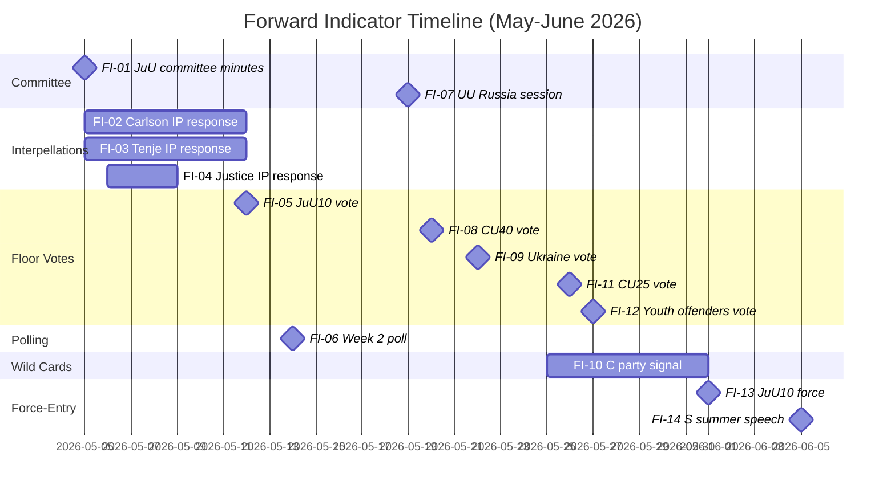

# Forward Indicators — May 2026 Month Ahead

**Author**: James Pether Sörling  
**Date**: 2026-04-28

## Forward Indicator Framework

Fourteen dated, observable indicators that will reveal which scenario (Justice Spring / Defensive Spring / JuU Fracture / C Bombshell) is unfolding during May-June 2026.

## Indicators

| # | Date | Indicator | Source | Reveals |
|---|------|-----------|--------|---------|
| FI-01 | 2026-05-05 | JuU committee meeting minutes published | riksdagen.se/JuU | Whether HD01JuU10 passes committee intact or with SD amendments |
| FI-02 | 2026-05-05 to 05-12 | Andreas Carlson answers HD10449 IP | Riksdag chamber record | Infra frame activated or deactivated; any TU commitment |
| FI-03 | 2026-05-05 to 05-12 | Anna Tenje answers HD10450 IP | Riksdag chamber record | Welfare frame activated or deactivated; sick-pay review scope |
| FI-04 | 2026-05-06 to 05-08 | Justice minister answers HD10451 IP | Riksdag chamber record | Corporate crime tools; government vs S positioning |
| FI-05 | 2026-05-12 (est.) | HD01JuU10 floor vote result | riksdagen.se/Voteringar | Confirms/disconfirms JuU Fracture scenario |
| FI-06 | 2026-05-14 | Demoskop/Novus polling — coalition vs bloc | Polling aggregators | Interpellation campaign polling impact |
| FI-07 | 2026-05-19 | UU committee session on HD11752/11753 | riksdagen.se/UU | Russia policy hardening consensus |
| FI-08 | 2026-05-20 (est.) | HD01CU40 lantmäteri floor vote | riksdagen.se/Voteringar | Digital government bill passage |
| FI-09 | 2026-05-22 | HD03231/HD03232 Ukraine ratification vote | riksdagen.se/Voteringar | All-party consensus holds |
| FI-10 | 2026-05-25 | C party leader media appearance | DN/SVT/Ekot | PIR-7 trigger: coalition signal |
| FI-11 | 2026-05-26 | HD01CU25 prison expansion floor vote | riksdagen.se/Voteringar | Prison capacity political decision |
| FI-12 | 2026-05-27 | HD03246 youth offenders floor vote | riksdagen.se/Voteringar | Justice cluster completion |
| FI-13 | 2026-06-01 | HD01JuU10 weapons law enters force | Polismyndigheten operational | Government delivery confirmed |
| FI-14 | 2026-06-05 | S party summer launch speech | S party official communications | S narrative consolidation; bloc strategy |

## Indicator Cascade Map

## Red-Line Indicators (Scenario Triggers)

- **JuU Fracture activated** if: FI-01 shows SD amendment tabled + FI-05 shows <175 Ja votes on HD01JuU10
- **C Bombshell activated** if: FI-10 shows C leader explicitly positive about S-led government
- **Justice Spring confirmed** if: FI-05 + FI-11 + FI-12 all pass 175+ without amendment concessions
- **Defensive Spring confirmed** if: FI-02 OR FI-03 produces ministerial commitment or contradiction, AND FI-06 shows S +1-3pp
