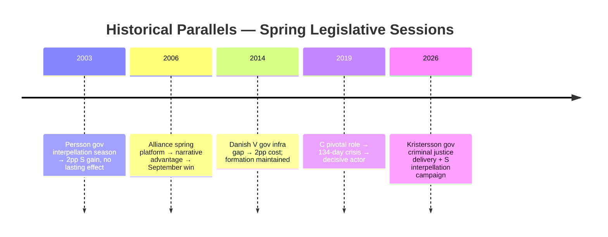

# Historical Parallels — May 2026 Month Ahead

**Author**: James Pether Sörling  
**Date**: 2026-04-28

## Parallel Selection Criteria

Historical parallels selected for: (1) minority coalition or governing-with-support model; (2) criminal justice as electoral focus; (3) spring-before-election legislative sprint; (4) interpellation campaign as opposition strategy.

## Parallel 1: 2003 Swedish Persson Government — Spring Interpellation Season

**Context**: S minority government, spring 2003; Alliance opposition coordinated interpellation campaign on welfare reform and infrastructure. Göran Persson ran "full employment" narrative against targeted interpellations.

**Key similarity to May 2026**:
- Coordinated multi-minister interpellation campaign by opposition
- Government defended by pointing to legislative delivery
- Single-issue (crime/welfare) electoral framing

**Key difference**: Persson had a majority with V + MP support; Kristersson is a true minority needing SD passivity.

**Outcome**: Persson government survived and won 2002/2006 elections; interpellation campaign produced 2-3pp short-term poll movement with no lasting effect.

**Lesson for 2026**: Coordinated interpellation campaigns in Sweden historically produce ≤3pp movement lasting ≤6 weeks unless anchored to a genuine scandal. S's May 2026 campaign needs a ministerial misstep to break this pattern.

## Parallel 2: 2006 Pre-Election Spring — Alliance "Bättre Sverige" Platform

**Context**: Alliance (M+KD+L+C) campaigning against S government; Reinfeldt executed "Bättre Sverige" platform in spring 2006 with concrete, deliverable promises. Spring 2006 legislative session was dominated by S.

**Key similarity**: Spring session defines narrative for September election; parties with clear deliverables perform better than parties with reactive messaging.

**Key difference**: Alliance was in opposition in 2006; in 2026 the government coalition is trying to demonstrate delivery.

**Lesson for 2026**: The party that "owns the spring" with concrete deliverables has a structural advantage going into summer campaigns. Government's justice delivery gives it ownership of spring 2026.

## Parallel 3: 2014 Danish "Critical Spring" — V Government vs S Interpellations

**Context**: Danish V minority government, spring 2014; S-party launched coordinated interpellations on welfare, health, and regional infrastructure. Danish Folkeparti (SD analog) maintained passive support.

**Key similarity**: Nordic minority government + populist support party model; coordinated opposition interpellation strategy; infrastructure gap as interpellation target.

**Outcome**: V government delivered on its primary agenda but suffered 2-3pp polling decline from infrastructure gap narrative. DF (Folkeparti) maintained support. S formed government after September 2015 elections.

**Lesson for 2026**: The infrastructure interpellation (HD10449) follows the Danish pattern closely. In Denmark, the infrastructure gap narrative was real and persistent; Swedish Södra stambanan is similarly real and documented. Expect 1-2pp lasting effect on government coalition from this interpellation track.

## Parallel 4: 2019 Swedish Formation Crisis — C Party Pivotal Role

**Context**: After 2018 election, C party's refusal to support S government without market reform concessions led to record 134-day formation delay. Annie Lööf's willingness to abstain on Löfven government ended the crisis.

**Key similarity**: C party has a decisive coalition role when neither bloc has a majority. PIR-7 tracks whether C makes a pre-summer 2026 signal.

**Lesson for 2026**: C's pivotal role is structural. Any C leadership signal (positive or negative) about coalition preference will trigger immediate, significant polling movement across all parties. The "C Bombshell" scenario (8% probability) is anchored in this historical pattern.

## Summary Timeline

