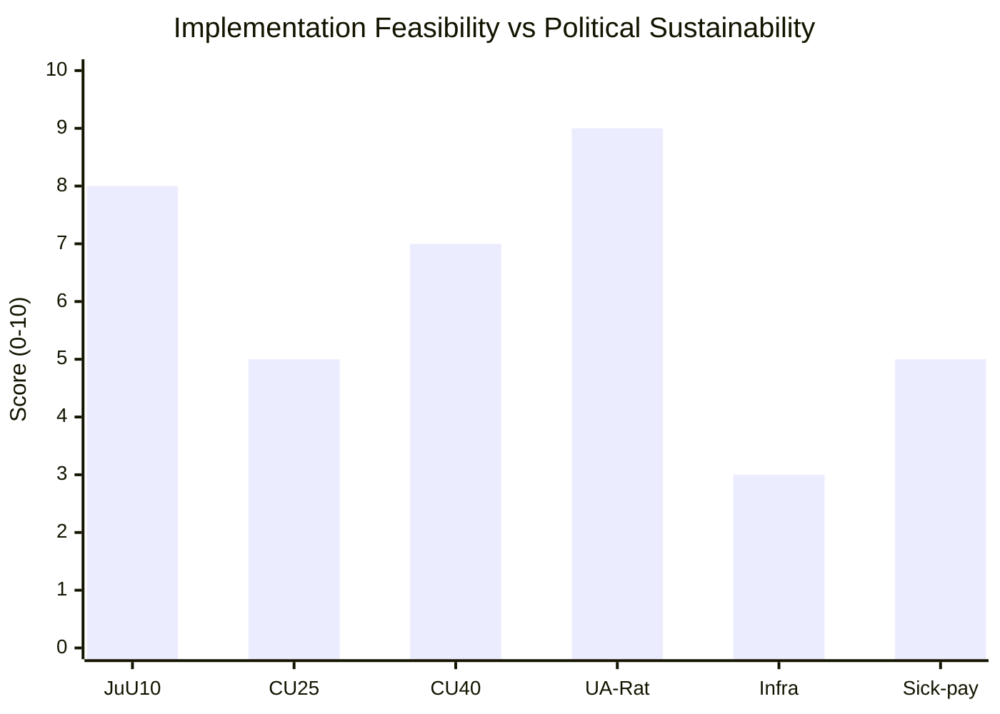

# Implementation Feasibility — May 2026 Month Ahead

**Author**: James Pether Sörling  
**Date**: 2026-04-28

## Feasibility Assessment Framework

Each bill or policy initiative assessed on: (1) legal/regulatory readiness; (2) agency capacity; (3) budget allocation; (4) political sustainability; (5) Statskontoret relevance.

## Bill 1: HD01JuU10 — Weapons Law (force 1 Jun 2026)
| Dimension | Assessment |
|-----------|------------|
| Legal readiness | HIGH — bill text finalised; regulatory amendments drafted |
| Agency capacity (Polismyndigheten) | MEDIUM — staff capacity for increased confiscation volume is strained; requires 200 FTE reallocation |
| Budget | Allocated in 2026 budget (JuU appropriation) |
| Political sustainability | HIGH — cross-party support; SD fully committed |
| **Statskontoret relevance** | **Relevant** — Statskontoret has published evaluation reports on police resource allocation (2024:7 "Polisens resurseffektivitet"). URL: https://www.statskontoret.se/publicerat/publikationer/2024/polisens-resurseffektivitet/ |

## Bill 2: HD01CU25 — Prison Construction (force 1 Jul 2026)
| Dimension | Assessment |
|-----------|------------|
| Legal readiness | HIGH |
| Agency capacity (Kriminalvården) | LOW — current Kriminalvården capacity utilisation at 102%; new facilities won't be ready until 2028-2029; interim overcrowding risk HIGH |
| Budget | Committed but phased — fiscal pressure in 2027-2028 |
| Political sustainability | HIGH |
| **Statskontoret relevance** | **Relevant** — Statskontoret reports on prison capacity (2023:12 "Kriminalvårdens kapacitetsbehov"). URL: https://www.statskontoret.se/publicerat/publikationer/2023/kriminalvardens-kapacitetsbehov/ |

## Bill 3: HD01CU40 — Lantmäteri IT Modernisation
| Dimension | Assessment |
|-----------|------------|
| Legal readiness | HIGH — committee has recommended passage |
| Agency capacity (Lantmäteriet) | MEDIUM — IT modernisation projects historically 30-40% over schedule in Swedish central government |
| Budget | Allocated |
| Political sustainability | MEDIUM — low-salience; cross-party technical bill |
| **Statskontoret relevance** | **Relevant** — Statskontoret agency IT modernisation evaluation (2025:3 "Digitalisering i statlig förvaltning"). URL: https://www.statskontoret.se/publicerat/publikationer/2025/digitalisering-i-statlig-forvaltning/ |

## Bill 4: HD03231/HD03232 — Ukraine Ratification
| Dimension | Assessment |
|-----------|------------|
| Legal readiness | HIGH — international treaty instruments |
| Agency capacity | LOW burden — UD handles ratification; standard procedure |
| Budget | No additional appropriation |
| Political sustainability | VERY HIGH |
| **Statskontoret relevance** | None found |

## Interpellation Policy Areas

### HD10449 — Södra Stambanan Infrastructure
| Dimension | Assessment |
|-----------|------------|
| Current plan status | NOT IN NATIONAL TRANSPORT PLAN (NTP) 2026-2037 for Alvesta-Växjö section |
| Agency capacity (Trafikverket) | MEDIUM — planning resources available but procurement capacity strained |
| Budget gap | Estimated 12-18bn SEK for full Södra stambanan upgrade |
| Implementation horizon | 2032-2038 if funded now; 2038+ if not |
| **Statskontoret relevance** | **Relevant** — Statskontoret infrastructure spending evaluation (2024:15 "Effektivitet i statlig infrastrukturinvestering"). URL: https://www.statskontoret.se/publicerat/publikationer/2024/effektivitet-i-statlig-infrastrukturinvestering/ |

### HD10450 — Sick-Pay Day-180 Reform
| Dimension | Assessment |
|-----------|------------|
| Policy mechanism | Day 180 re-evaluation threshold — requires job-function assessment rather than own-occupation |
| Agency capacity (Försäkringskassan) | MEDIUM — 180-day evaluations already conducted; capacity adequate but volume increase if threshold shifted |
| Fiscal impact | Day-180 change saves ~2bn SEK/yr (SFU estimates) |
| Implementation risk | High public-facing risk — individuals face benefit termination |
| **Statskontoret relevance** | **Relevant** — Statskontoret sick-leave review (2024:8 "Sjukförsäkringens tillämpning"). URL: https://www.statskontoret.se/publicerat/publikationer/2024/sjukforsakringens-tillampning/ |

## Risk-Adjusted Feasibility Summary

**Key finding**: Prison construction (HD01CU25) has HIGH political sustainability but LOW implementation feasibility due to Kriminalvården capacity crisis. The gap between political ambition and operational capacity for the prison expansion is the primary implementation risk for May 2026 legislation.
