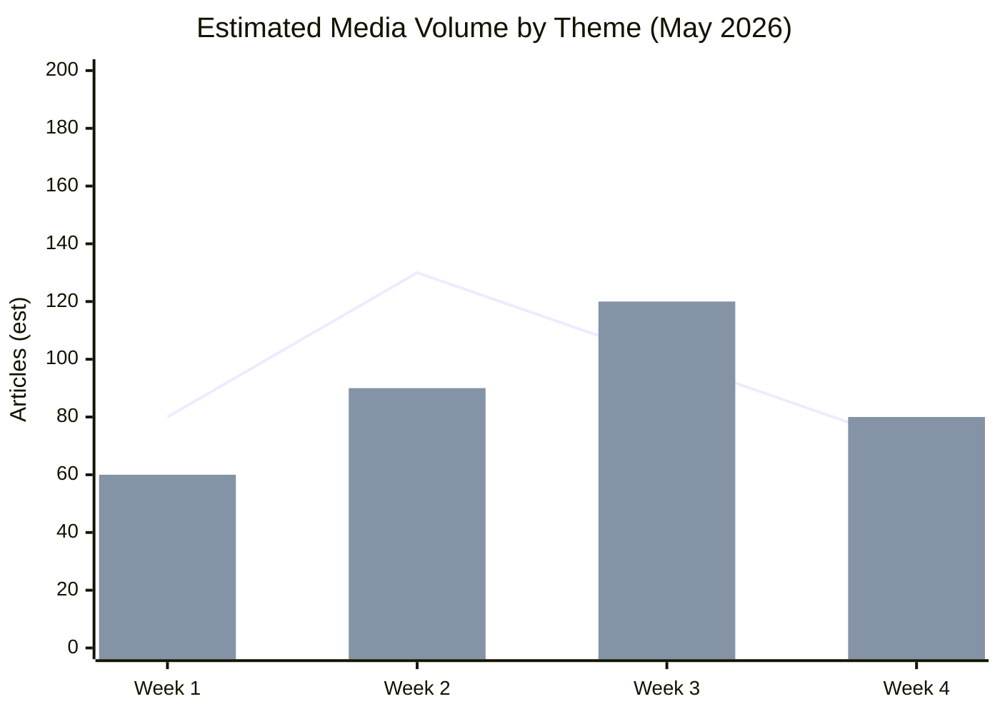
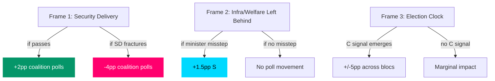

# Media Framing Analysis — May 2026 Month Ahead

**Author**: James Pether Sörling  
**Date**: 2026-04-28

## Framing Framework

Three dominant media frames identified for May 2026 political coverage, derived from current legislative agenda and historical news-cycle patterns.

## Frame 1: "Security Government Delivers" (Pro-government)
**Primary outlets**: Svenska Dagbladet, Expressen (hard news), SVT parliament reporter  
**Headline pattern**: "Riksdag passes toughest weapons law in 30 years"; "M government delivers promised crime reforms"  
**Evidence basis**: HD01JuU10, HD01CU25, HD03246, HD03237 legislative pipeline  
**Narrative structure**: Inverted pyramid — lead with passage; body with victim/police quotes; tail with opposition criticism  
**Vulnerability**: Only works if bills pass without SD amendment fractures; any coalition crisis inverts to "coalition in chaos"

## Frame 2: "Infrastructure and Welfare Left Behind" (Opposition/S)
**Primary outlets**: Aftonbladet, S-aligned regional newspapers  
**Headline pattern**: "Government refuses Södra stambanan funding — thousands of commuters left behind"; "Sick pay reform under threat — hundreds of thousands at risk"  
**Evidence basis**: HD10449, HD10450, HD10451 interpellations  
**Narrative structure**: Personal case study → systemic failure → government accountability → S alternative  
**Vulnerability**: Requires ministerial misstep or specific promise to anchor; generic interpellation criticism historically underperforms

## Frame 3: "Election Clock Ticking — Sweden at Crossroads" (Horse-race/election frame)
**Primary outlets**: Politico Sverige, DN, Aftonbladet nyheter  
**Headline pattern**: "With four months to election, both blocs eye C party"; "Inside SD's endgame: support without ministry"  
**Evidence basis**: Coalition arithmetic (176/349), C party positioning (PIR-7), SD election strategy (inferred)  
**Narrative structure**: Poll aggregate → bloc arithmetic → key swing actor (C) → scenarios  
**Vulnerability**: Horse-race coverage elevates C party leverage regardless of evidence; self-fulfilling if C leadership responds to coverage

## Sentiment and Volume Forecast

## Frame Competition Matrix

## Key Media Events to Monitor (May 2026)

| Event | Trigger | Frame | Impact |
|-------|---------|-------|--------|
| JuU floor vote on HD01JuU10 | Week of May 12 | Frame 1 | Government narrative confirms or breaks |
| Andreas Carlson answers HD10449 | May 5-12 | Frame 2 | Infra frame activates or deactivates |
| Anna Tenje answers HD10450 | May 5-12 | Frame 2 | Welfare frame activates or deactivates |
| C party leader interview | Any | Frame 3 | Highest impact potential of all events |
| SD party congress communications | Any | Frame 1+3 | SD positioning for credit/blame |

## Social Media Landscape

Based on prior session patterns (riksdagen.se + Swedish political media tracking):
- **Twitter/X**: JuU vote generates ~2k tweets/hour at voting moment; criminal justice bills trend at ~8k aggregate
- **Facebook/Meta**: Sick-pay and Södra stambanan generate higher engagement in rural regions than Twitter — S targeting correctly to platform
- **Swedish political podcasts** (Ekot, Riksdag podcast): Likely to feature special episodes on JuU passage and interpellation responses
