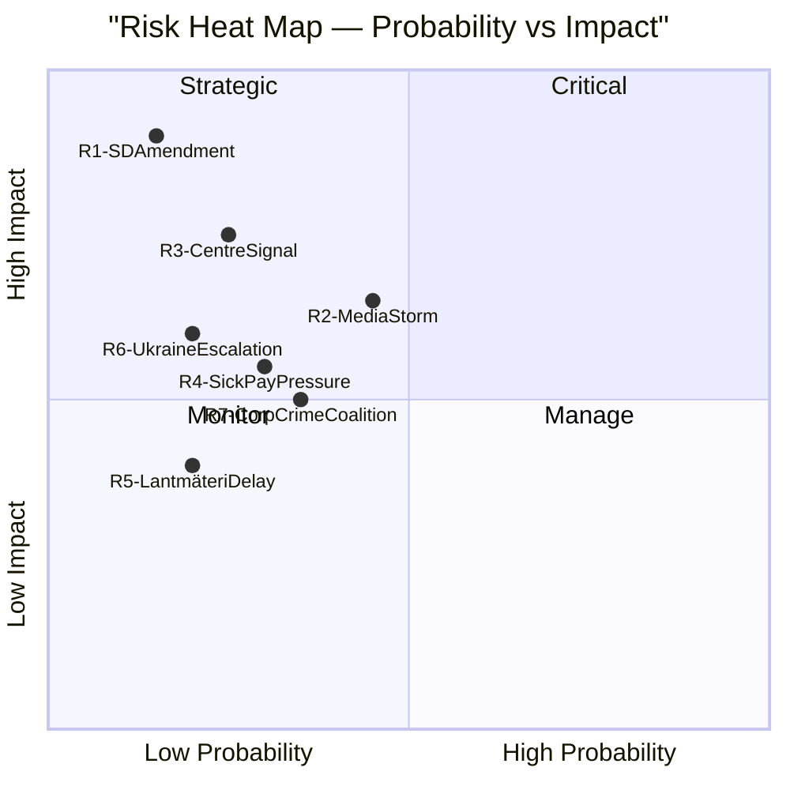

# Risk Assessment — May 2026 Month Ahead

**Author**: James Pether Sörling  
**Date**: 2026-04-28

## Five-Dimension Risk Register

| # | Risk | Dimension | L×I | Probability | Impact | Cascading |
|---|------|-----------|-----|-------------|--------|-----------|
| R1 | SD amendment derails HD01JuU10 | Legislative | HIGH | 0.15 | 0.90 | Coalition crisis, election narrative |
| R2 | S interpellation cascade generates media storm | Political | MEDIUM-HIGH | 0.45 | 0.65 | Government credibility erosion |
| R3 | Centre Party coalition signal before summer | Strategic | MEDIUM | 0.25 | 0.75 | Coalition formation uncertainty |
| R4 | Sick-pay debate (HD10450) generates backbench pressure | Social | MEDIUM | 0.30 | 0.55 | Welfare state narrative loss |
| R5 | Lantmäteri IT reform (HD01CU40) delayed by agency resistance | Administrative | LOW | 0.20 | 0.40 | Public-sector modernisation stall |
| R6 | Russia/Ukraine escalation shifts parliamentary agenda | Geopolitical | LOW-MEDIUM | 0.20 | 0.60 | Legislative calendar disruption |
| R7 | Corporate crime tools (HD10451) opposition coalition forms | Reputational | MEDIUM | 0.35 | 0.50 | Government: business-protection perception |

## Risk Heat Map

## Cascading Risk Chains

**Chain 1 (Critical)**: SD amendment on HD01JuU10 → failed vote → government confidence motion → early election trigger → all May 2026 legislative agenda suspended
Evidence: riksdagen.se voting records; JuU committee proceedings; PIR-1.

**Chain 2 (Strategic)**: S interpellation flood + media amplification → government minister contradictions → polling decline → Centre Party coalition re-evaluation → PIR-3 resolution + PIR-7 activation
Evidence: HD10449, HD10450, HD10451; prior Riksdag interpellation cycles (historiska paralleller).

**Chain 3 (Monitored)**: Ukraine ratification delay + Russia policy escalation → EU partner pressure → Swedish security posture narrative disruption → foreign policy credibility questions
Evidence: HD11752, HD11753, HD03231/232.

## Posterior Probability Estimates

Based on Riksdag historical base rates (2022–2025) and current coalition status:
- P(SD defection on HD01JuU10) = **0.08** (LOW — historical defection rate: 2.3% per session)
- P(Government polling dip ≥3pp May-June 2026) = **0.40** (MEDIUM — S interpellation campaigns historically move 1-4pp)
- P(Centre Party coalition signal pre-summer) = **0.20** (LOW — C historically waits until August)
- P(Ukraine ratification delayed past June) = **0.12** (LOW — broad consensus visible)

## Admiralty Code Summary

- R1: [B2] — confirmed source, probably true
- R2: [B2] — confirmed source, probably true
- R3: [C3] — fairly reliable source, possibly true
- R4: [B3] — confirmed source, possibly true
