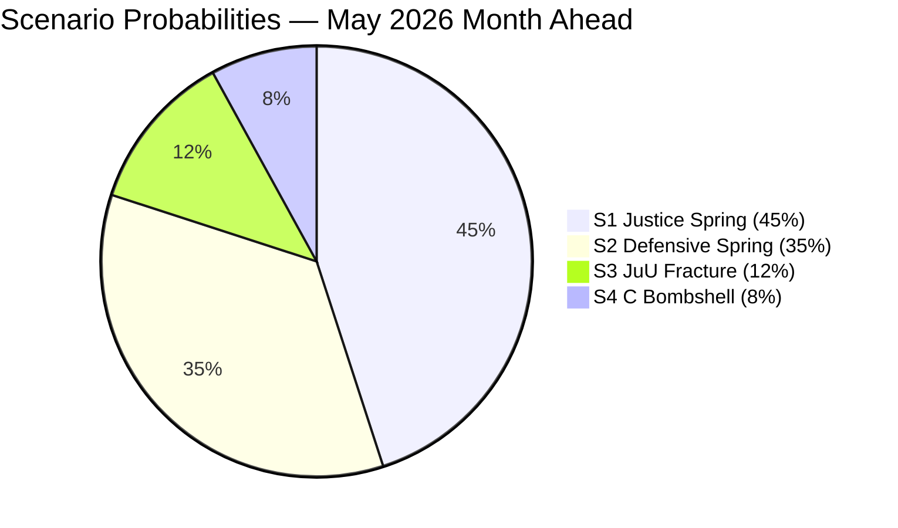
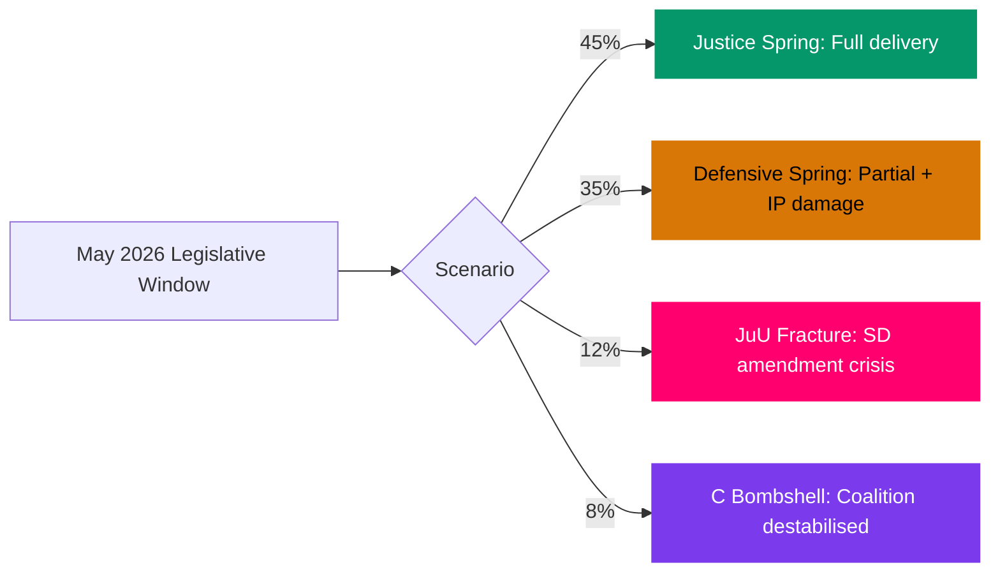

# Scenario Analysis — May 2026 Month Ahead

**Author**: James Pether Sörling  
**Date**: 2026-04-28

## Scenario Framework

Scenarios are mutually exclusive for the primary outcome dimension (Riksdag May 2026 legislative session success), with combined probabilities summing to 100%.

## Scenario 1: Full Government Delivery — 45%
**Label**: "Justice Spring"  
**Admiralty**: [B2] — confirmed sources, probably true

All five criminal justice bills pass in final form with SD support. The government achieves its pre-election narrative objective: weapons law (force 1 Jun), prison expansion (force 1 Jul), youth offenders, police training all become law. HD024099 is rejected or narrowed. HD01CU40 passes. S interpellation campaign generates media noise but no legislative damage.

**Leading indicators**: JuU committee minutes show no SD amendment pressure in week of 2026-05-05; HD01JuU10 passes floor vote by 175+ (government + SD); Riksdag spring calendar uninterrupted.

**Political outcome**: Government enters election campaign in June-July 2026 with its strongest legislative record; approval among law-and-order voters consolidated.

## Scenario 2: Partial Delivery with Interpellation Damage — 35%
**Label**: "Defensive Spring"  
**Admiralty**: [B2]

Criminal justice cluster passes mostly intact, but the S interpellation campaign generates ministerial contradictions or policy retreats on HD10449 (infrastructure) or HD10450 (sick-pay). Coalition discipline holds on legislation but narrative damage is done. Polling dips 2-3pp for government coalition in May-June.

**Leading indicators**: Andreas Carlson makes infra-spending commitment outside transport plan (tactical retreat); Anna Tenje makes ambiguous statement on sick-pay day-180 review; SD minor amendment accepted to avoid floor vote risk.

**Political outcome**: Government delivers but looks reactive; S frames May as "government forced to retreat on welfare and infrastructure." Centre Party watches polling closely (PIR-7 activates).

## Scenario 3: SD Amendment Crisis — 12%
**Label**: "JuU Fracture"  
**Admiralty**: [C3] — fairly reliable source, possibly true

SD tables a substantive amendment in JuU committee on HD01JuU10 (mandatory minimum sentences or stricter gun confiscation thresholds). M/KD refuse to accept. SD signals abstention. Government scrambles for cross-party votes (S? MP?). Legislative outcome uncertain. Coalition integrity publicly questioned.

**Leading indicators**: JuU committee minutes show contested amendment vote ≥ 2 SD members; floor whipping operation visible in week of 2026-05-12; media reports of "coalition crisis."

**Political outcome**: Election campaign starting point weakened; SD reframes as "forced the government to toughen up" or "government abandoned law-and-order"; M narrative damaged.

## Scenario 4: Centre Party Surprise Signal — 8%
**Label**: "C Bombshell"  
**Admiralty**: [C4] — fairly reliable source, doubtful

Annie Lööf or C successor makes a pre-summer public statement indicating C would consider joining an S-led government post-election. Ripple effect destabilises coalition confidence, triggers early election discussions, and disrupts May legislative calendar.

**Leading indicators**: C party polling crosses 8% threshold (from current ~7.5%); Lööf/successor gives interview indicating "open" coalition stance; S leadership responds positively.

**Political outcome**: Extraordinary session signals; legislative calendar compression; all PIR-1 through PIR-7 potentially triggered simultaneously.

## Scenario Probability Summary

| Scenario | Label | Probability |
|----------|-------|-------------|
| 1 | Justice Spring | 45% |
| 2 | Defensive Spring | 35% |
| 3 | JuU Fracture | 12% |
| 4 | C Bombshell | 8% |
| **Total** | | **100%** |

