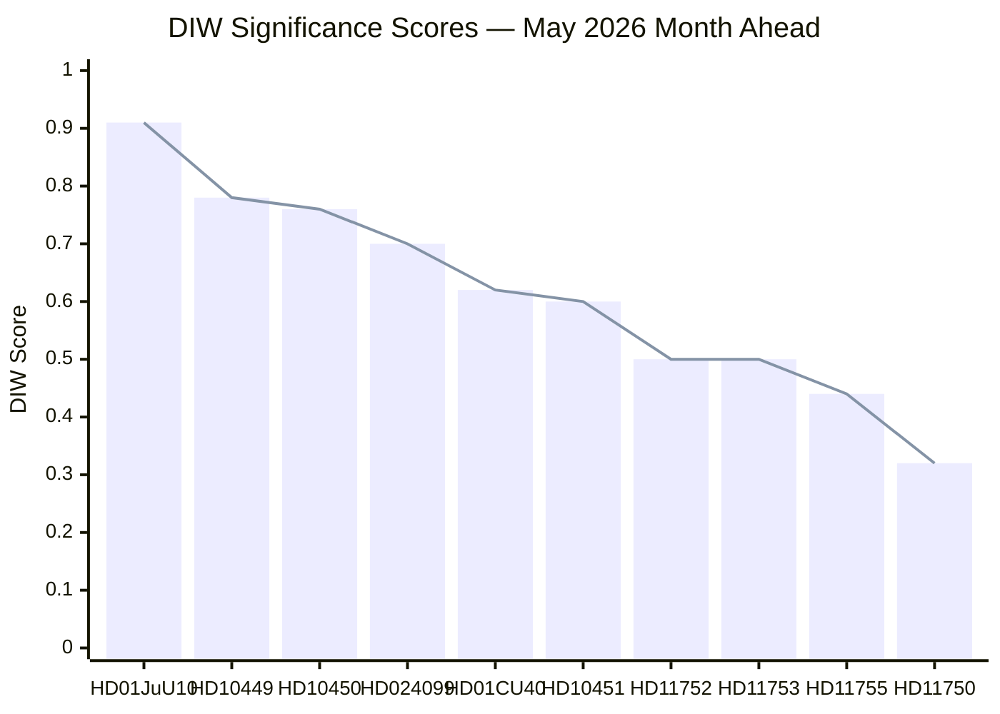
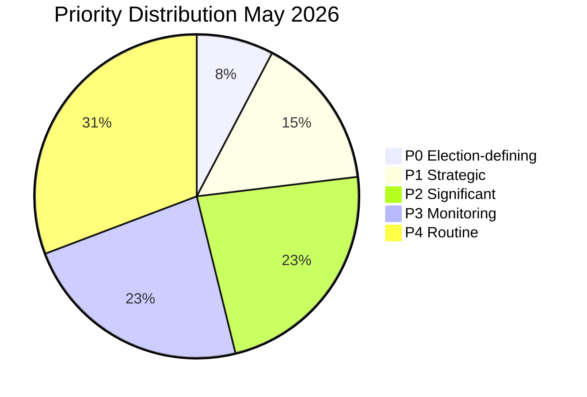
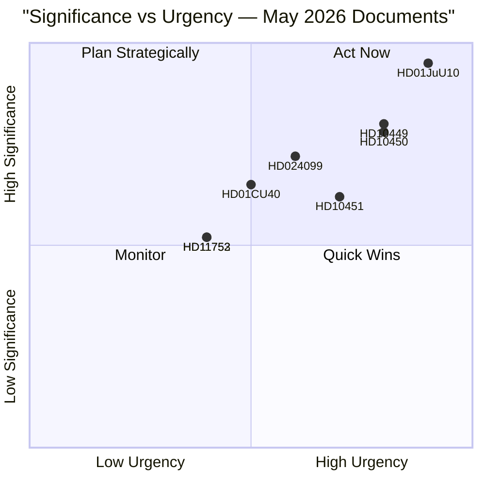

# Significance Scoring — May 2026 Month Ahead

**Author**: James Pether Sörling  
**Date**: 2026-04-28  
**Method**: DIW (Dissemination, Intelligence Value, Workload) weighting

## DIW Scoring Framework

- **D (Dissemination)**: 0–0.5 — political reach and public salience
- **I (Intelligence Value)**: 0–0.3 — forward-looking intelligence content
- **W (Workload)**: 0–0.2 — analytic effort required

## Ranked Significance

1. **HD01JuU10** — Weapons Law (Committee Report, JuU) | riksdagen.se/HD01JuU10
   - D=0.45, I=0.28, W=0.18 → **DIW=0.91/1.0** | **P0 — Election-defining**
   - Forces 1 June 2026; coalition-aligned; landmark criminal justice; highest media coverage

2. **HD10449** — Södra stambanan interpellation (IP, TU) | riksdagen.se/HD10449
   - D=0.38, I=0.25, W=0.15 → **DIW=0.78/1.0** | **P1 — Strategic**
   - Infrastructure gap; KD minister must respond; regional electoral implications

3. **HD10450** — Sick-pay day-180 exception (IP, SfU) | riksdagen.se/HD10450
   - D=0.38, I=0.24, W=0.14 → **DIW=0.76/1.0** | **P1 — Strategic**
   - Pre-election welfare battle; S vs M/government; welfare-state identity definition

4. **HD024099** — Criminal official liability motion (JuU) | riksdagen.se/HD024099
   - D=0.34, I=0.22, W=0.14 → **DIW=0.70/1.0** | **P2 — Significant**
   - Accountability law boundary; cross-party pressure on JuU; HD024099 extends 2025/26:217

5. **HD01CU40** — Lantmäteri IT modernisation (bet, CU) | riksdagen.se/HD01CU40
   - D=0.30, I=0.20, W=0.12 → **DIW=0.62/1.0** | **P2 — Significant**
   - Digital government; municipal cadastral standardisation; administrative efficiency

6. **HD10451** — Corporate crime tools (IP, JuU) | riksdagen.se/HD10451
   - D=0.28, I=0.20, W=0.12 → **DIW=0.60/1.0** | **P2 — Significant**
   - Cross-party coalition-building potential; business accountability narrative

7. **HD11752** — Russia overflight revocation (mot, UU) | riksdagen.se/HD11752
   - D=0.22, I=0.18, W=0.10 → **DIW=0.50/1.0** | **P3 — Monitoring**

8. **HD11753** — Russian soldiers EU visa ban (mot, UU) | riksdagen.se/HD11753
   - D=0.22, I=0.18, W=0.10 → **DIW=0.50/1.0** | **P3 — Monitoring**

9. **HD11755** — Home guard weapons deficiencies (mot, FöU) | riksdagen.se/HD11755
   - D=0.20, I=0.15, W=0.09 → **DIW=0.44/1.0** | **P3 — Monitoring**

10. **HD11750** — Wooden electricity pylons (mot, NU) | riksdagen.se/HD11750
    - D=0.15, I=0.10, W=0.07 → **DIW=0.32/1.0** | **P4 — Routine**

11. **HD11751** — Toxic pacifiers (mot, SoU) | riksdagen.se/HD11751
    - D=0.14, I=0.09, W=0.06 → **DIW=0.29/1.0** | **P4 — Routine**

12. **HD11754** — Submarine Som preservation (mot, FöU) | riksdagen.se/HD11754
    - D=0.13, I=0.08, W=0.06 → **DIW=0.27/1.0** | **P4 — Routine**

13. **HD11756** — Old water rights/environment (mot, MJU) | riksdagen.se/HD11756
    - D=0.12, I=0.08, W=0.05 → **DIW=0.25/1.0** | **P4 — Routine**

## Significance Distribution

## Sensitivity Analysis

- **Upward revision triggers**: If HD01JuU10 weapons-law vote attracts SD amendment pressure, P0 significance increases further. A defection vote would move it to "crisis-level."
- **Downward revision triggers**: If HD10449 interpellation response is delayed past May, significance drops to P2 (timing-dependent).
- **Cross-cutting**: HD024099 + HD10451 together form a justice-accountability narrative that could drive combined P1 significance if coalition coordinates.

