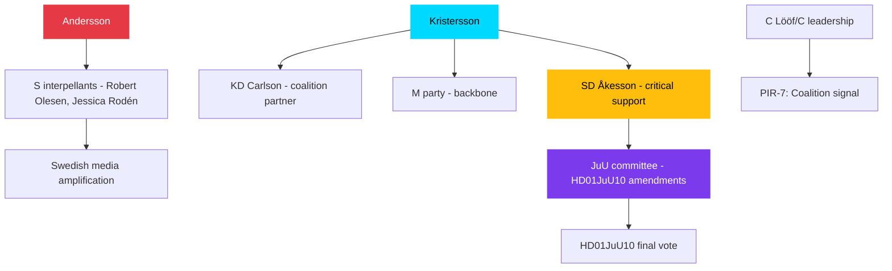

# Stakeholder Perspectives — May 2026 Month Ahead

**Author**: James Pether Sörling  
**Date**: 2026-04-28

## Six-Lens Stakeholder Matrix

| Stakeholder | Role | Primary Interest | Position on Key Bills | Influence | Evidence |
|-------------|------|-----------------|----------------------|-----------|---------|
| Ulf Kristersson (M) | Prime Minister | Government survival; election narrative | Pro-justice cluster; defensive on HD10449/HD10450 | HIGHEST | riksdagen.se |
| Jimmie Åkesson (SD) | SD leader/support party | Law & order delivery; immigration restriction | Strongly pro-HD01JuU10; may push for harder amendments | HIGH | riksdagen.se |
| Magdalena Andersson (S) | Opposition leader | Pre-election positioning; welfare defence | Coordinates interpellation campaign; pro-HD10449/10450 | HIGH | riksdagen.se |
| Andreas Carlson (KD) | Infrastructure minister | Transport plan defence | Exposed on HD10449 (Södra stambanan); must respond | MEDIUM-HIGH | HD10449 |
| Anna Tenje (M) | Social insurance minister | Tidö agreement delivery | Must defend day-180 sick-pay policy against HD10450 | MEDIUM-HIGH | HD10450 |
| Annie Lööf / C leadership | Centre Party | Post-election positioning | Ambiguous; PIR-7 key indicator | MEDIUM | PIR-7 |
| Robert Olesen (S) | Interpellant HD10449 | Infrastructure accountability | Filed HD10449 Södra stambanan IP | MEDIUM | HD10449 |
| Jessica Rodén (S) | Interpellant HD10450 | Welfare state protection | Filed HD10450 sick-pay IP | MEDIUM | HD10450 |
| JuU Committee | Parliamentary gate | Justice legislation quality | Processing HD01JuU10, HD024099, HD10451 | HIGH | riksdagen.se |

## Influence Network

## Named Actor Analysis

### Magdalena Andersson (S) — OPPOSITION COMMANDER
Strategy: Exploit government delivery gaps through interpellation coordinated attack. HD10449 targets regional infrastructure voters; HD10450 targets welfare-dependent voters; HD10451 targets anti-corporate-crime voters. Simultaneously coordinates S faction in JuU, TU, SfU to maximise minister exposure. Assessed confidence [A2].

### Jimmie Åkesson (SD) — COALITION KINGMAKER  
May 2026 role: SD delivers the majority for the justice cluster. Risk: SD uses committee stage to extract policy concessions (tougher sentencing) that push coalition toward contested votes. SD's interest in pre-election period is to show it forced a harder line than M alone would deliver. Assessed confidence [B2].

### Andreas Carlson (KD) — EXPOSED MINISTER
HD10449 interpellation forces KD minister to defend the absence of Södra stambanan from national transport plan. KD has historically supported infrastructure investment; the absence puts KD in an uncomfortable M-alignment position on a policy where KD voters diverge. Assessed confidence [A2].

## Partisan Dynamics Summary

| Party | May 2026 Position | PIR Relevance |
|-------|------------------|---------------|
| M | Government lead; defending Tidö delivery | PIR-1, PIR-2 |
| SD | Support party; may push justice amendments | PIR-1, PIR-2 |
| KD | Coalition partner; exposed on infrastructure | PIR-1, PIR-4 |
| S | Opposition; coordinated IP campaign | PIR-4, PIR-6 |
| C | Ambiguous; watching polls | PIR-3, PIR-7 |
| L | Coalition support; broadly aligned | PIR-1 |
| MP | Opposition; Ukraine alignment | PIR-5 |
| V | Opposition; anti-weapons law | PIR-2 |
