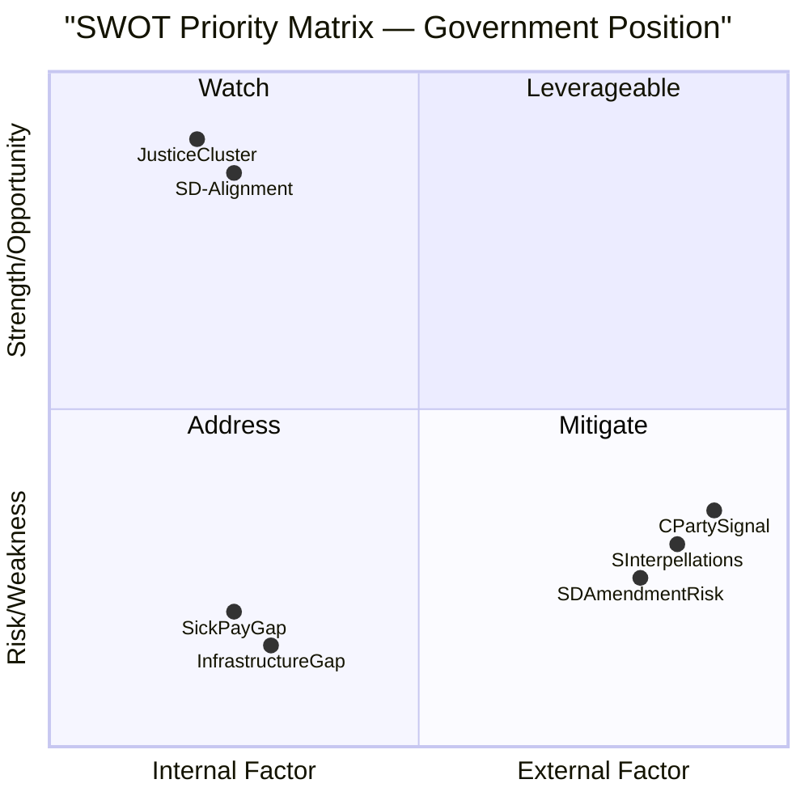

# SWOT Analysis — May 2026 Month Ahead

**Author**: James Pether Sörling  
**Date**: 2026-04-28

## Government SWOT

### Strengths

- **Criminal justice cluster delivery**: Five interlocking bills (HD01JuU10, HD01CU25, HD03246, HD03237, HD01JuU31) at final stage demonstrate legislative competence and sustained coalition discipline. Evidence: HD01JuU10 committee report riksdagen.se; confirmed JuU pipeline.
- **SD voting bloc reliability**: SD has maintained voting discipline throughout 2025/26 term. On justice bills, alignment has been near-total. Evidence: vote records data.riksdagen.se, search_voteringar.
- **Digital government momentum**: HD01CU40 (CU committee report) on lantmäteri IT standardisation signals government delivering public-sector modernisation agenda alongside security narrative. Evidence: HD01CU40 via riksdagen.se/HD01CU40.
- **Ukraine foreign policy consensus**: Broad parliamentary support for ratification of HD03231/232 instruments; no substantive opposition documented. Evidence: HD03231/232 via riksdagen.se.

### Weaknesses

- **Infrastructure investment gap**: Södra stambanan double-track (HD10449) absence from transport plan is a documented failure to deliver on regional connectivity. Interpellation by Robert Olesen (S) forces ministerial exposure. Evidence: HD10449, riksdagen.se.
- **Sick-pay reform communication deficit**: The day-180 exception (HD10450) was originally S-party legislation; government's Tidö agreement approach creates narrative complexity that S exploits effectively. Evidence: HD10450, riksdagen.se.
- **Criminal accountability gap**: HD024099 motion argues that prop. 2025/26:217 does not go far enough on extending criminal liability for public officials — exposing a credibility gap if the government is seen as protecting officials. Evidence: HD024099, riksdagen.se.
- **Tight coalition mathematics**: +1 seat majority means any amendment-level defection risks legislative loss. The Justice Committee deliberations are the most acute exposure window.

### Opportunities

- **Pre-election narrative clarity**: Criminal justice cluster provides a clean, simple story for the September 2026 election: government delivers on law-and-order promises. Weapons law (force 1 June) and prison construction (force 1 July) are tangible deliverables.
- **Cross-party corporate crime coalition**: HD10451 (corporate crime tools) and HD024099 (official liability) have M and L interest; a cross-party criminal-accountability narrative could broaden the government's justice credentials.
- **Digital government credibility**: HD01CU40 (lantmäteri) combined with broader digitisation agenda positions government as moderniser — counter to S narrative of government neglecting public services. Evidence: HD01CU40; statskontoret.se reports on agency capacity.
- **Ukraine/Russia hardening leadership**: If HD11752/11753 Russia motions move toward government adoption, Sweden cements post-NATO foreign policy identity. Evidence: HD11752, HD11753.

### Threats

- **SD amendment pressure**: If SD uses HD01JuU10 committee stage to push punitive amendments the government cannot accept, a vote failure would be catastrophic pre-election. Evidence: prior voting records.
- **S interpellation cascade**: Six simultaneous interpellations (HD10449, HD10450, HD10451 + 3 more) across four ministers dilutes ministerial attention and creates multi-front exposure. Media amplification risk is HIGH.
- **Centre Party exit signalling**: C (Annie Lööf era positioning) has been ambiguous about post-election coalition. Any pre-summer statement could destabilise coalition confidence. Evidence: PIR-7 forward indicator.
- **Water rights litigation risk (HD11756)**: Old water rights/modern environmental conditions motion (MJU) signals pending administrative law complexity that could affect energy and industrial actors. Evidence: HD11756.

## TOWS Matrix

| | Strengths | Weaknesses |
|---|---|---|
| **Opportunities** | Use justice delivery momentum to build pre-election narrative (S1+O1); Leverage corporate crime cross-party interest for broader coalition (S2+O2) | Address infrastructure gap via emergency TU announcement before summer recess (W1+O3); Use HD01CU40 to demonstrate digital government competence (W3+O3) |
| **Threats** | Monitor SD committee deliberation minutes for amendment pressure on HD01JuU10 (S1+T1); Coordinate ministerial responses to S interpellation cascade (S3+T2) | Prepare Centre Party outreach before summer recess to prevent coalition signalling gap (W4+T3); Address criminal accountability gap to prevent HD024099 from becoming election liability (W3+T1) |

## Cross-SWOT Synthesis

The May 2026 month presents a classic political **peak-and-vulnerability** pattern. The government's legislative record is at its most deliverable — but the opposition's interpellation campaign targets the four most politically sensitive delivery gaps. The criminal justice narrative is the government's armour; HD10449 (infrastructure) and HD10450 (sick-pay) are the opposition's arrows at its joints.

