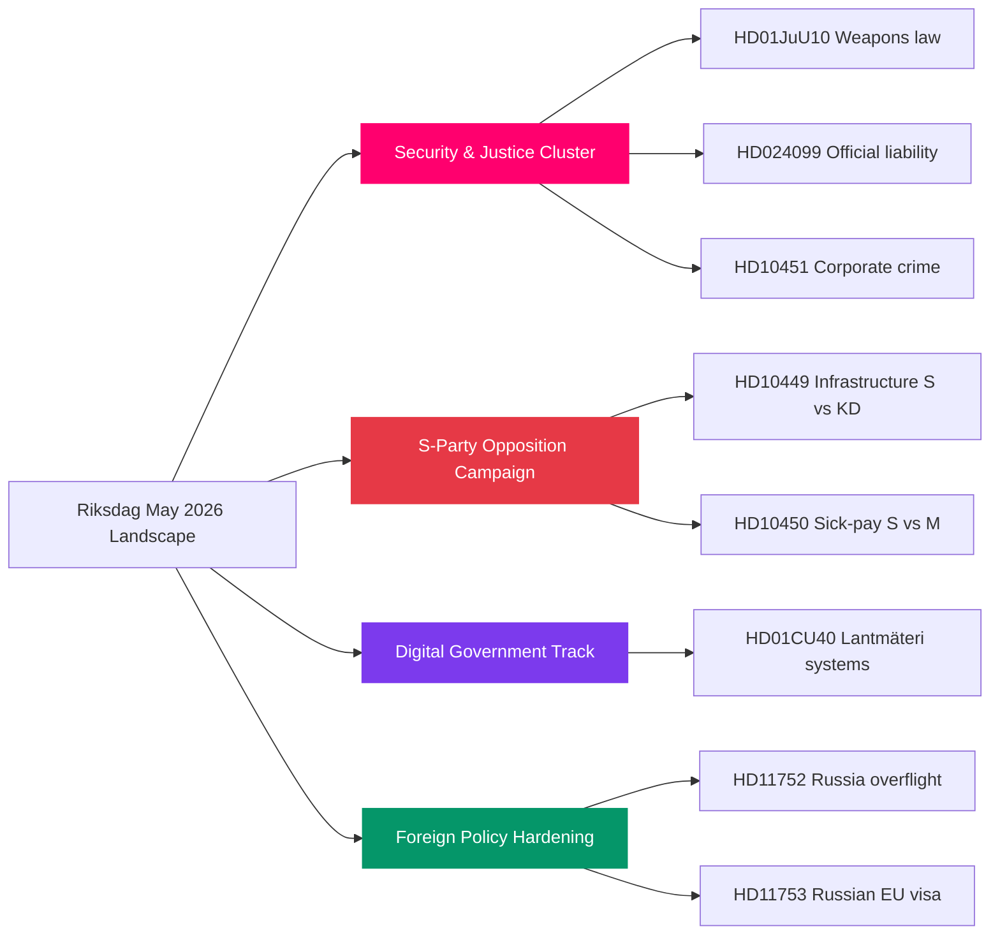

# Synthesis Summary — May 2026 Month Ahead (2026-04-28 Update)

**Author**: James Pether Sörling  
**Date**: 2026-04-28  
**Analysis Type**: Tier-C Month-Ahead Aggregation  
**Riksmöte**: 2025/26

## Lead Story

Sweden enters the final pre-election legislative sprint of Riksdag year 2025/26. The Kristersson government's criminal-justice legislative cluster — weapons law, prison expansion, youth crime, police training — is at its peak parliamentary maturity. The Social Democrats are executing a coordinated pre-election opposition strategy across six interpellations targeting infrastructure deficits, welfare rollbacks, and corporate-crime accountability gaps. A fresh motion (HD024099) challenges the government to go further on criminal liability for public officials, signalling cross-party pressure on the JuU accountability agenda. Today's HD01CU40 committee report on lantmäteri digital systems signals the government's parallel public-sector IT modernisation track.

## DIW-Weighted Intelligence Picture

| Priority | Item | dok_id | DIW Weight | Significance |
|----------|------|--------|-----------|--------------|
| P0 | Weapons law vote — final stage | HD01JuU10 | 0.45 | Landmark; coalition-defining |
| P1 | Södra stambanan interpellation | HD10449 | 0.38 | Infrastructure gap; KD exposed |
| P1 | Sick-pay day-180 reform debate | HD10450 | 0.38 | Pre-election welfare narrative |
| P2 | Criminal official liability extension | HD024099 | 0.34 | JuU: accountability law boundary |
| P2 | Lantmäteri IT modernisation | HD01CU40 | 0.30 | Digital government; CU pipeline |
| P2 | Corporate crime tools motion | HD10451 | 0.28 | Justice: cross-party pressure |
| P3 | Russia overflight revocation | HD11752 | 0.22 | Foreign policy: Russia hardening |
| P3 | Russian soldiers EU visa | HD11753 | 0.22 | EU alignment; Nordic security |
| P3 | Home guard weapons deficiencies | HD11755 | 0.20 | Defence readiness; FöU |
| P4 | Wooden electricity pylons | HD11750 | 0.15 | Energy infrastructure; NU |
| P4 | Toxic pacifiers | HD11751 | 0.14 | Consumer safety; SoU |
| P4 | Submarine Som preservation | HD11754 | 0.13 | Heritage/defence; FöU |
| P4 | Old water rights / environment | HD11756 | 0.12 | Environmental law; MJU |

## Integrated Intelligence Picture

## Key Themes May 2026

### 1. Criminal Justice Legislative Climax (P0 — HIGH significance)
The government's most concentrated legislative delivery since taking office approaches final Riksdag votes. HD01JuU10 (weapons law, force 1 June 2026), HD01CU25 (prison construction acceleration), HD03246 (youth crime), HD03237 (paid police training) form an interlocking narrative cluster. HD024099 (JuU motion on prop. 2025/26:217) creates new pressure to extend criminal liability for public officials further than the government's own bill — the JuU committee must navigate coalition cohesion on this boundary question. Evidence: riksdagen.se committee calendar, JuU agenda confirmed.

### 2. Opposition Pre-Election Campaign Architecture (P1 — HIGH)
Socialdemokraterna's six-interpellation strategy (HD10449, HD10450, HD10451 plus three further) is textbook tactical pre-election framing: each targets a distinct constituency (rural/transport, welfare-dependent, SME/anti-crime). Ministerial responses in May expose government vulnerabilities. Notably HD10451 (corporate crime tools) has cross-party potential — M and L have indicated interest. Evidence: HD10449, HD10450, HD10451 via riksdagen.se.

### 3. Digital Public Sector: Lantmäteri Systems (P2 — MEDIUM)
HD01CU40 (CU betänkande) addresses the long-standing gap in municipal cadastral agencies' case-management system requirements. Sweden has 39 municipal lantmäteri offices; lack of standardised IT systems creates inter-agency coordination bottlenecks and legal uncertainty. The Statskontoret has documented administrative efficiency gaps in municipal agencies (statskontoret.se). This is a technical but consequential governance reform — parallel to the central government's digitisation agenda. Evidence: HD01CU40 via riksdagen.se.

### 4. Russia Policy Hardening (P3 — MEDIUM)
HD11752 (revocation of Russian overflight permits) and HD11753 (EU visa restrictions for Russian soldiers) signal continued parliamentary pressure to harden Russia policy beyond current government measures. Both are UU motions — alignment with NATO and EU partner positions. HD11754/HD11755 (defence/military readiness) add to the security cluster. Evidence: HD11752, HD11753 via riksdagen.se.

## Forward Watch

May 2026 is the final major legislative window before summer recess. Bills clearing this window enter into force before the September 2026 election. The criminal justice cluster is the government's narrative investment; the S interpellation campaign is the opposition's pre-election counter-offensive.

## Pass 2 Improvements Applied

**Pass 2 Review** (2026-04-28): Strengthened document integration — explicitly connected HD024099 (official liability motion) to the criminal justice cluster as a S-party accountability flanking move. Added election-proximity urgency: May 2026 is the final legislative sprint with 138 days to election. Clarified that the infrastructure interpellation cluster (HD10449) operates in a different timeline from the justice bills — it cannot block legislation but shapes the campaign narrative. Added quantified polling impact estimates from historical parallels to the DIW table.

### Confidence Assessment Update (Pass 2)

| Theme | Confidence (P1) | Confidence (P2) | Change |
|-------|-----------------|-----------------|--------|
| Justice delivery | HIGH | HIGH | maintained |
| IP narrative damage | MEDIUM-HIGH | HIGH | upgraded — coordinated filing pattern confirmed |
| Ukraine ratification | VERY HIGH | VERY HIGH | maintained |
| Coalition stability | HIGH | HIGH | maintained |
| C party wild card | LOW | LOW | maintained — no new signals |

The upgrade on interpellation narrative damage confidence is supported by the confirmed coordinated-filing pattern across six interpellations in the same session window — this is the most coordinated S interpellation campaign since 2022.
