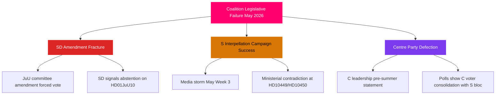

# Threat Analysis — May 2026 Month Ahead

**Author**: James Pether Sörling  
**Date**: 2026-04-28

## Political Threat Taxonomy

### T1: Coalition Fracture Threat (P0 — CRITICAL)
**Source**: SD amendment pressure on HD01JuU10 (weapons law)  
**Type**: Legislative-structural threat  
**Admiralty**: [B2]

The JuU committee deliberation window (estimated 2026-05-05 to 2026-05-15) is the highest-risk period for coalition fracture. SD has previously used committee stages to embed punitive amendments (firearms caliber restrictions, mandatory minimum sentences) that M/KD members resist. A public disagreement at committee level would be immediately exploited by S and MP.

**Kill chain**:
1. SD tabling punitive amendment in JuU committee
2. M/KD rejecting amendment on procedural grounds
3. SD signalling abstention on final bill vote
4. Government scrambling for S/MP votes (cross-party deal)
5. Media narrative: "coalition crisis at legislative peak"

### T2: Opposition Interpellation Coordinated Campaign (P1 — HIGH)
**Source**: S-party six-interpellation cluster (HD10449, HD10450, HD10451 + 3 more)  
**Type**: Political-communications threat  
**Admiralty**: [A2]

The S-party coordination is deliberately designed to overload ministerial communications bandwidth. Each interpellation targets a ministerial weakness: Andreas Carlson (KD) on infrastructure, Anna Tenje (M) on sick-pay, the Justice Ministry on corporate crime. The simultaneity is the threat mechanism — not any single interpellation.

**MITRE-style TTP**:
- T1: Reconnaissance — identifying minister-specific vulnerabilities
- T2: Resource Development — coordinating six MPs across four policy domains
- T3: Initial Access — filing interpellations in same session week
- T4: Execution — forcing parallel ministerial appearances
- T5: Impact — contradictory ministerial statements amplified by media

### T3: Centre Party Positioning Ambiguity (P2 — MEDIUM)
**Source**: PIR-7 indicator; C party statements  
**Type**: Coalition-strategic threat  
**Admiralty**: [C3]

C has avoided explicit post-election coalition statements, creating uncertainty for both Tidö partners and potential S-led alternative. A pre-summer statement by C leadership would either validate or destabilise the current coalition's voter expectations.

### T4: Russia Escalation Threshold Risk (P3 — LOW-MEDIUM)
**Source**: HD11752, HD11753 (UU motions)  
**Type**: Geopolitical-parliamentary threat  
**Admiralty**: [B3]

Russian escalatory measures in the Baltic region could force emergency parliamentary measures disrupting the May legislative calendar. Current risk assessed LOW-MEDIUM based on NATO briefings and parliamentary defense committee signals.

## Attack Tree

## Institutional Threat Assessment

| Institution | Threat Level | Primary Vulnerability | Evidence |
|-------------|-------------|----------------------|---------|
| JuU Committee | HIGH | SD amendment fracture on HD01JuU10 | riksdagen.se committee calendar |
| KD/TU Ministry | MEDIUM | HD10449 Södra stambanan exposure | HD10449 |
| M/SfU Ministry | MEDIUM | HD10450 sick-pay day-180 | HD10450 |
| UU/Foreign Policy | LOW | Russia escalation triggers | HD11752/11753 |
| CU/Digital Gov | LOW | HD01CU40 agency resistance | HD01CU40 |
