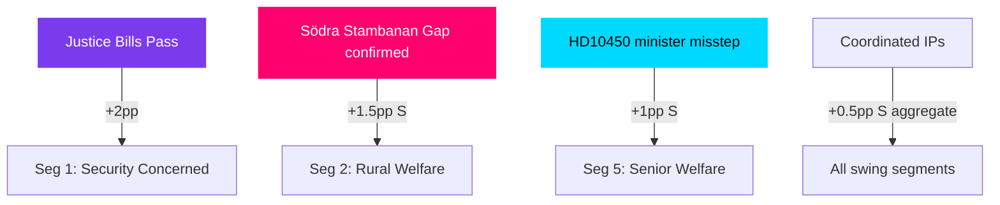

# Voter Segmentation — May 2026 Month Ahead

**Author**: James Pether Sörling  
**Date**: 2026-04-28

## Segmentation Framework

Five strategic voter segments identified for May-September 2026 election cycle, each with distinct policy salience profiles relevant to the current legislative agenda.

## Segment 1: Urban-Suburban Security Concerned (M/SD overlap)
**Size**: ~18% of electorate  
**Geography**: Greater Stockholm suburbs, Gothenburg belt, Malmö north  
**Policy salience**: Criminal justice (HD01JuU10, HD01CU25, HD03246), corporate crime (HD10451)  
**Current disposition**: M-leaning with SD threat if M perceived as soft on crime; rewards tangible justice delivery  
**May 2026 trigger**: Weapons law passage signals M delivers; SD amendment crisis signals "SD got the result"

## Segment 2: Rural Welfare State Defenders (S/C swing)
**Size**: ~14% of electorate  
**Geography**: Norrland, Skåne countryside, Småland  
**Policy salience**: Infrastructure (HD10449 Södra stambanan), sick-pay (HD10450), rural agency access  
**Current disposition**: Historically S; soft toward C on farming/rural issues; alarmed by infrastructure neglect  
**May 2026 trigger**: HD10449 ministerial response either confirms infrastructure gap (S gains) or promises action (C gains); sick-pay day-180 review signals affect welfare calculation

## Segment 3: Young Urban Climate Voters (MP/V)
**Size**: ~11% of electorate  
**Geography**: Stockholm inner city, Uppsala, Lund-Malmö  
**Policy salience**: Climate policy not prominently featured in current legislative agenda; Ukraine (HD03231/232) supports EU solidarity narrative  
**Current disposition**: Stable MP/V base; low engagement with criminal justice agenda  
**May 2026 relevance**: Limited; monitor for energy/climate motions in HD11754/HD11755 context

## Segment 4: Business-Professional Liberal Voters (L/M swing)
**Size**: ~9% of electorate  
**Geography**: Major cities, higher education  
**Policy salience**: Digital modernisation (HD01CU40), corporate crime tools (HD10451), official accountability (HD024099)  
**Current disposition**: L primary, M secondary; HD024099 (extended official liability) resonates with professional accountability concerns  
**May 2026 trigger**: If HD024099 passes, professional voters see accountability signal; if government defeats it, trust in institutional accountability weakens

## Segment 5: Senior Welfare Recipients (S/KD)
**Size**: ~17% of electorate  
**Geography**: National; concentrated in smaller cities  
**Policy salience**: Sick-pay (HD10450), health-adjacent; official misconduct (HD024099 signals accountability)  
**Current disposition**: S primary; KD makes welfare appeals; sick-pay day-180 is a direct household budget concern  
**May 2026 trigger**: HD10450 ministerial response reveals whether review means retrenchment or protection; high-salience news event if minister missteps

## Segment Cross-Impact Matrix

## Implications for Party Strategy

| Party | Key Segment | May 2026 Priority Action |
|-------|-------------|--------------------------|
| M | Seg 1 | Maximise justice delivery narrative |
| S | Seg 2 + Seg 5 | Execute interpellation campaign; document infra/welfare failures |
| SD | Seg 1 | Claim credit for justice delivery; avoid SD-caused amendment chaos |
| L | Seg 4 | Watch HD024099 outcome; signal accountability agenda |
| KD | Seg 5 | Signal social conservative welfare protection |
| C | Seg 2 | Infrastructure narrative; watch PIR-7 coalition signal timing |
