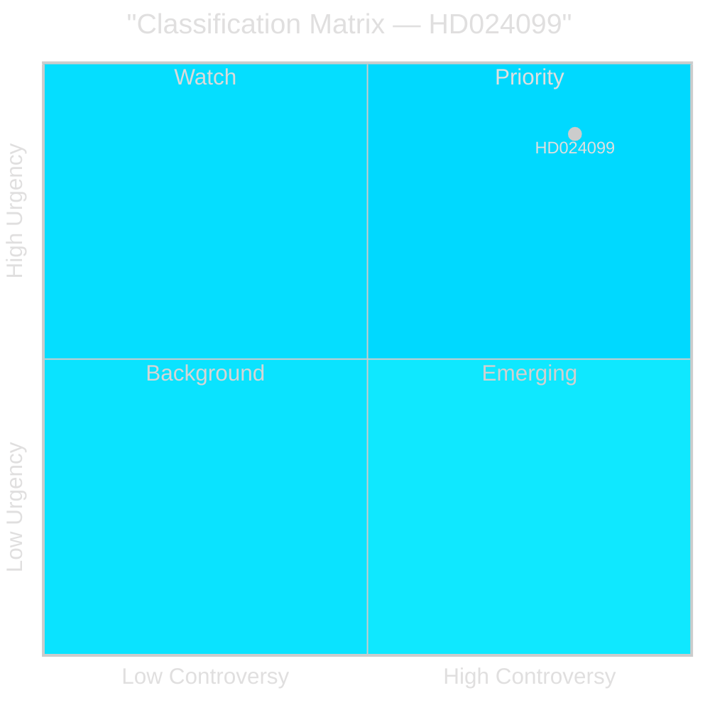

# Classification Results — Opposition Motions 2026-04-28

**Author**: James Pether Sörling  
**Date**: 2026-04-28  
**Framework**: 7-Dimension Political Classification

## Document Classification

### HD024099 — Motion 2025/26:4099 by Teresa Carvalho m.fl. (S)

| Dimension | Classification | Evidence |
|-----------|---------------|---------|
| **Policy Domain** | Criminal Justice / Rule of Law / Public Administration | BrB amendment, JuU committee, civil servant accountability [HD024099] |
| **Political Orientation** | Opposition counter-proposal (Social Democratic) | Teresa Carvalho (S), JuU [riksdagen.se/HD024099] |
| **Legislative Stage** | Committee consideration — JuU processing prop. 2025/26:217 | Filed 2026-04-27, rm 2025/26 [HD024099] |
| **Urgency** | HIGH — effective date prop. 2025/26:217 is 1 August 2026 | Six-week committee window [HD03217] |
| **Controversy Level** | HIGH — cross-party disagreement on criminal law instrument | S rejects core government proposal [HD024099, B2] |
| **Electoral Relevance** | HIGH — civil servant accountability as 2026 election theme | Criminal justice reform is Tidö coalition flagship [C2] |
| **International Dimension** | MEDIUM — UNCAC, EU anti-corruption acquis, Nordic comparisons | Referenced in prop. 2025/26:217 context [HD03217] |

## Priority Tier

**L2+ Priority** (DIW 8.17) — Full intelligence-grade per-document analysis required.

## Data Retention & Access

**Classification**: PUBLIC — data is publicly available via riksdagen.se open data API.  
**GDPR**: Art. 9(2)(e) — publicly declared political positions of named politicians.  
**DPIA Required**: No — no new high-risk personal data processing; documented political positions only.  
**Retention**: Analysis artifacts retained per standard publication lifecycle.

