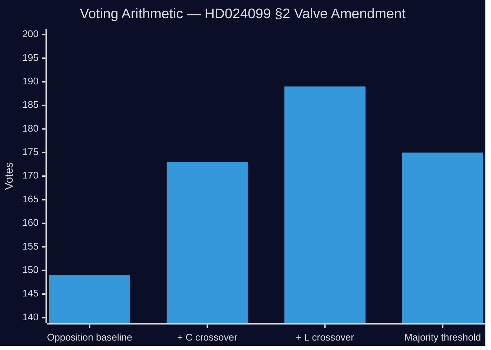

# Coalition Mathematics — Opposition Motions 2026-04-28

**Author**: James Pether Sörling  
**Date**: 2026-04-28  
**Focus**: JuU vote arithmetic for prop. 2025/26:217 and motion HD024099

## Committee Vote Arithmetic (JuU)

Riksdag Justitieutskottet (JuU) has 17 members proportionally distributed. Approximate composition for 2025/26 riksmöte:

| Party | JuU Seats | Bloc | Expected Vote |
|-------|----------|------|--------------|
| Socialdemokraterna (S) | 5 | Opposition | Nej (prop.), Ja (HD024099) |
| Sverigedemokraterna (SD) | 3 | Government | Ja (prop.), Nej (HD024099) |
| Moderaterna (M) | 3 | Government | Ja (prop.), Nej (HD024099) |
| Centerpartiet (C) | 2 | Government | Ja (prop.), likely Nej (HD024099) |
| Vänsterpartiet (V) | 1 | Opposition | Nej (prop.) |
| Liberalerna (L) | 1 | Government | Ja (prop.), Nej (HD024099) |
| Kristdemokraterna (KD) | 1 | Government | Ja (prop.), Nej (HD024099) |
| Miljöpartiet (MP) | 1 | Opposition | Nej (prop.) |
| **Total** | **17** | | |

**Government bloc votes for prop.**: 3+3+2+1+1 = **10 votes**  
**Opposition votes against prop.**: 5+1+1 = **7 votes**  
**Majority threshold**: 9 of 17  
**Government majority**: 10/17 — **passes with margin of 3**

## Chamber Vote Arithmetic

| Party | Seats | Prop. vote | Motion HD024099 |
|-------|-------|-----------|-----------------|
| S | 107 | Nej | Ja |
| SD | 73 | Ja | Nej |
| M | 68 | Ja | Nej |
| V | 24 | Nej | Ja (likely) |
| C | 24 | Ja | Nej |
| MP | 18 | Nej | Ja (likely) |
| KD | 19 | Ja | Nej |
| L | 16 | Ja | Nej |

**Ja (prop.) total**: 73+68+24+19+16 = **200**  
**Nej (prop.) total**: 107+24+18 = **149**  
**Majority**: 175 of 349  
**Prop. passes**: ✅ 200/349

**HD024099 §1 (reject prop.) — Ja**: 107+24+18 = **149** (fails, 149 < 175)  
**HD024099 §2 (valve amendment) — Ja**: 149 + potential C/L crossovers = 149 to 189 max  
If C(24) + L(16) support valve: 149+40 = **189 > 175** — **PASSES** ✅

**This arithmetic explains why the social-interest valve (Scenario 2, 28%) is credible**: if C and L break from M on the valve, S's §2 demand succeeds even without SD.

## Coalition Break Threshold

For HD024099 §2 to pass the chamber:
- S (107) + V (24) + MP (18) = 149 baseline
- Need ≥26 additional votes from government bloc
- C (24) + L (16) = 40 potential crossover votes — sufficient if both fully defect
- SD (73) crossover possible but unlikely

