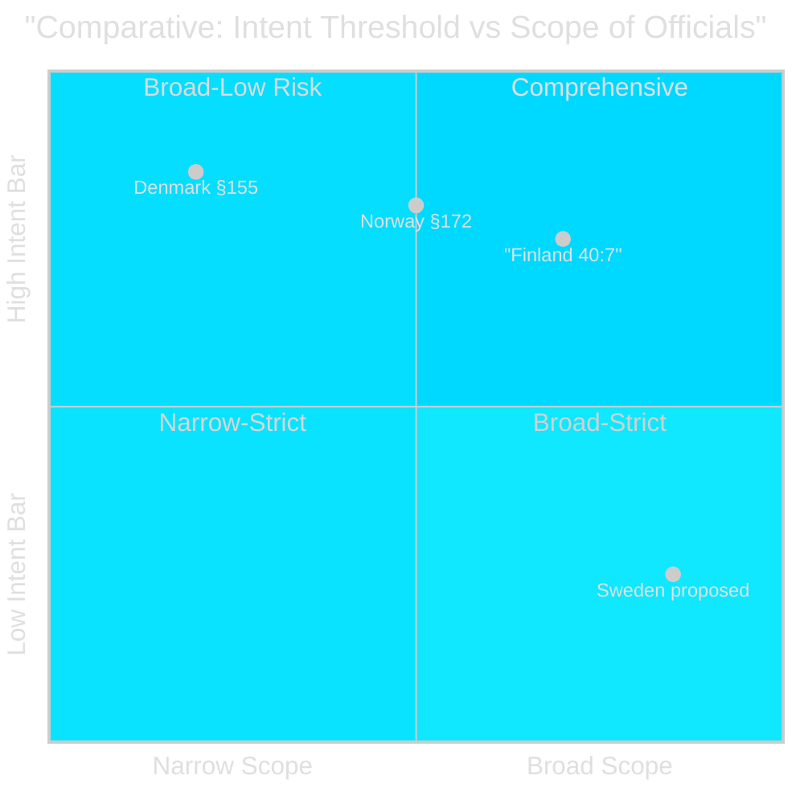

# Comparative International Analysis — Opposition Motions 2026-04-28

**Author**: James Pether Sörling  
**Date**: 2026-04-28  
**Confidence**: MEDIUM [B3]  
**Comparator Set**: Norway, Finland, Denmark, EU level

## Comparator Set

**Comparator set**: Norway (Straffeloven §172 tjenestemisbruk), Finland (Rikoslaki 40:7 virka-aseman väärinkäyttö), EU (Directive 2024/1760 on combating corruption)

## Outside-In Analysis

### Norway — Straffeloven §172 (Tjenestemisbruk)
Norway introduced "tjenestemisbruk" (misuse of public service) as a criminal offense in 2005 under Straffeloven §172. The provision applies to civil servants who exploit their position for improper gain. Key features:
- **Threshold**: Deliberate exploitation for improper benefit — higher intent bar than proposed Swedish offense
- **Scope**: Limited to public officials in the traditional sense (not all elected representatives)
- **Application**: Rarely used — roughly 5-10 prosecutions per decade
- **Chilling effect research**: Norwegian legal academics (including Skjerdal, 2019) noted modest increase in administrative risk-aversion in municipal procurement post-2005 [C3, academic assessment]

**Relevance for Sweden**: S's chilling-effect concern is validated by Norwegian experience. The lower intent threshold in the Swedish proposal ("i strid med lag eller annan författning") could produce more prosecutions than Norway.

### Finland — Rikoslaki 40:7 (Virka-aseman väärinkäyttö)
Finland has had an equivalent offense since 1990 codification. Finnish experience shows:
- **Balance**: Strong prosecutorial discretion; most cases screened out pre-charge
- **Integration**: Coordinated with broader Chapter 40 Rikoslaki (official crimes) structure — exactly the comprehensive approach S is demanding
- **Outcome**: Higher public confidence in civil servant accountability without documented chilling effect [C2, comparative assessment]

**Relevance for Sweden**: Finland's Chapter 40 integrated approach corresponds precisely to what S is demanding with §3 (Chapter 10 BrB comprehensive reform). Finland's success argues for the comprehensive rather than piecemeal approach.

### European Union — Directive 2024/1760
The EU Anti-Corruption Directive (2024/1760, adopted 2024) requires member states to criminalise:
- Passive and active corruption
- Trading in influence
- Abuse of functions

The "abuse of functions" requirement under Article 11 of the directive is broadly consistent with Sweden's proposed "missbruk av offentlig ställning." However, the directive requires member states to balance anti-corruption obligations against human rights and proportionality (recital 22). This is directly relevant to S's proportionality argument [C2].

**Implementation deadline**: Member states had until 2027 to transpose Directive 2024/1760. Sweden's proposition is in part a transposition measure.

### Denmark — Straffeloven §155 (Magtmisbrug)
Denmark's "magtmisbrug" provision has been in force since 1930; rarely prosecuted but provides a backstop for flagrant cases. Danish approach is narrower than the proposed Swedish provision — applies only to illegal use of public power, not mere regulatory non-compliance.

| Comparator | Jurisdiction | Year | Threshold | Scope | Chilling Effect | Prosecutions/decade |
|-----------|-------------|------|-----------|-------|----------------|-------------------|
| Norway Straffeloven §172 | Norway | 2005 | Deliberate + improper gain | Traditional civil servants | Modest (academic evidence) | 5-10 |
| Finland Rikoslaki 40:7 | Finland | 1990 | Intentional + improper | Broad public officials | None documented | 20-30 |
| Denmark Straffeloven §155 | Denmark | 1930 | Illegal use of power | Narrow public authority | None documented | 1-3 |
| Sweden proposed (prop. 2025/26:217) | Sweden | 2026* | "i strid med lag" (broad) | All public officials + elected | Assessed: HIGH risk | TBD |

*Proposed effective 1 August 2026

## Key International Finding

Finland's integrated approach (comprehensive Chapter 40 reform) produces better anti-corruption outcomes than Norway's or Denmark's piecemeal provisions. S's demand for comprehensive Chapter 10 BrB reform is internationally best-practice aligned. The Swedish government's piecemeal approach (prop. 2025/26:217 in isolation) mirrors Norway's 2005 experience, which showed modest chilling effects.

