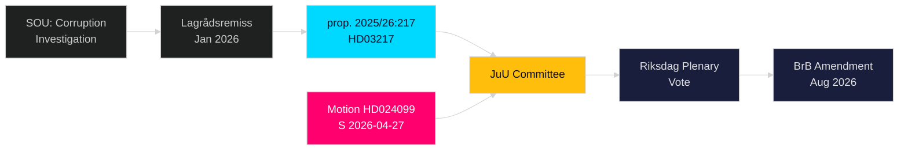

# Cross-Reference Map — Opposition Motions 2026-04-28

**Author**: James Pether Sörling  
**Date**: 2026-04-28  
**Confidence**: HIGH [B2]

## Policy Clusters

### Cluster A: Criminal Law Reform 2025/26 (High Coherence)

| Document | Type | Relationship | Edge |
|----------|------|-------------|------|
| [HD024099](https://riksdagen.se/sv/dokument-och-lagar/dokument/motion/med-anledning-av-prop-202526217-ett-utokat_hd024099) | Motion (S) | Response to | amends |
| [HD03217](https://riksdagen.se/sv/dokument-och-lagar/dokument/proposition/ett-utokat-straffrattslikt-tjanstemannaansvar_hd03217) | Prop. 2025/26:217 | Primary legislation | continues |
| [HD03218](https://riksdagen.se/sv/dokument-och-lagar/dokument/proposition/dubbla-straff-for-brott-i-kriminella-natverk_hd03218) | Prop. (criminal networks) | Companion legislation | bundle |

HD024099 → [amends] → HD03217 (S seeks to modify/reject the proposition)
HD03217 → [continues] → HD03218 (companion criminal justice package)

### Cluster B: Opposition Counter-Budget Spring 2026

| Document | Type | Party | Committee | Edge |
|----------|------|-------|-----------|------|
| HD024098 | Motion (MP) | MP | FiU | thematic |
| HD024096 | Motion (MP) | MP | UU | thematic |
| HD024094 | Motion (C) | C | SoU | thematic |
| HD024092 | Motion (V) | V | FiU | thematic |
| HD024099 | Motion (S) | S | JuU | thematic |

All five motions filed in April 2026 represent multi-party opposition challenge to Spring 2026 government legislative package. **Coordinated-activity pattern**: While not co-signatories, simultaneous multi-opposition filings during the same week suggest coordinated opposition strategy.

## Legislative Chain

```
Corruption Investigation Committee (SOU)
  → Government consideration
  → lagrådsremiss "Ett utökat straffrättsligt tjänstemannaansvar" (Jan 2026)
  → prop. 2025/26:217 [HD03217] (2026-04-09)
  → Kommittémotion 2025/26:4099 [HD024099] (2026-04-27)
  → JuU committee hearing and recommendation (May-June 2026 expected)
  → Riksdag plenary vote (May-June 2026 expected)
  → Potential: BrB amendment effective 1 Aug 2026
```

## Sibling Folder Cross-Reference

No sibling analysis folders for same-day articles in this run. For weekly context see analysis/daily/2026-04-27 and preceding folders.


