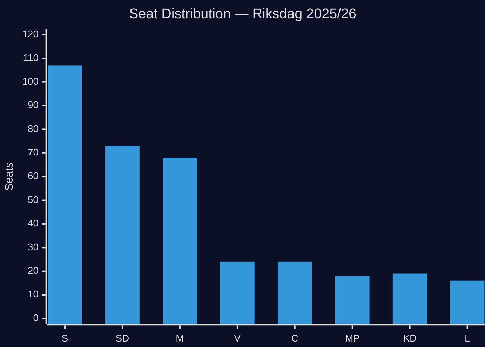

# Election 2026 Analysis — Opposition Motions 2026-04-28

**Author**: James Pether Sörling  
**Date**: 2026-04-28  
**Focus**: Motion HD024099 electoral implications

## Election 2026 Framing

Sweden holds a general election on 13 September 2026 (Riksdagsval 2026). The criminal liability reform in prop. 2025/26:217 and the S opposition motion HD024099 are directly relevant to three electoral dynamics:

1. **Public-sector worker mobilisation**: ~1.2 million civil servants are directly affected; many are LO/TCO members who trend toward S
2. **Law-and-order positioning**: The governing coalition needs to demonstrate effective crime legislation before the election
3. **Accountability narrative**: S seeks to frame the coalition as prioritising criminal punishment over systemic reform

## Current Seat Distribution (2022 Election Result, 2025/26 Riksdag)

| Party | Seats | Bloc |
|-------|-------|------|
| Sverigedemokraterna (SD) | 73 | Government support |
| Moderaterna (M) | 68 | Government (PM) |
| Socialdemokraterna (S) | 107 | Opposition |
| Vänsterpartiet (V) | 24 | Opposition |
| Centerpartiet (C) | 24 | Government |
| Sverigedemokraterna — note: seats above | — | — |
| Kristdemokraterna (KD) | 19 | Government |
| Liberalerna (L) | 16 | Government |
| Miljöpartiet (MP) | 18 | Opposition |
| **Total** | **349** | — |

**Government bloc**: M(68) + SD(73) + KD(19) + C(24) + L(16) = **200 seats** (majority: 175)
**Opposition bloc**: S(107) + V(24) + MP(18) = **149 seats**

## Electoral Impact of HD024099

### Impact on S Electoral Strategy
S filing HD024099 achieves three strategic electoral goals:
1. **Voter protection narrative**: "We protected 1.2 million public-sector workers" — direct communication to LO/TCO members
2. **Competence demonstration**: Teresa Carvalho demonstrates JuU-level legal expertise — S is the responsible party
3. **Differentiation from V/MP**: S's §2/§3 demands are constructive (not pure rejection) — moderate positioning

### Projected Electoral Relevance

| Scenario | S Messaging | Expected Voter Response | Net Seat Effect |
|---------|------------|------------------------|----------------|
| Prop. passes unchanged | "We warned you — civil servants now criminalised" | +2 to +5 S seats from public-sector mobilisation | High |
| Prop. amended with valve | "S forced the government to add protections" | +1 to +3 S seats; partial credit | Medium |
| Chapter 10 commitment | "S won the substantive reform argument" | Neutral to +2; elite perception | Low-Medium |

### Coalition Electoral Calculus
SD needs its municipal-worker voter base to turn out in September 2026. If chilling-effect reports emerge between August and September 2026, SD faces an electoral challenge. This creates a structural incentive for SD to quietly support the social-interest valve (Scenario 2) even if no public dissent is announced before the JuU vote.

