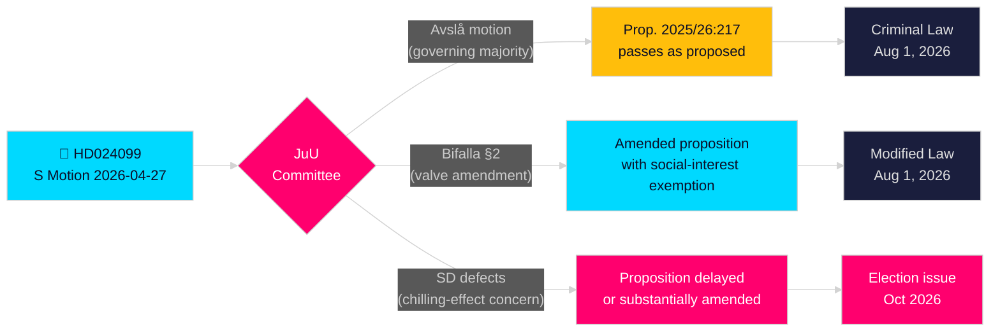

# Social Democrats Challenge Government's Anti-Corruption Overreach

**Author**: James Pether Sörling  
**Date**: 2026-04-28  
**Classification**: PUBLIC — GDPR Art. 9(2)(e)(g)  
**Confidence**: HIGH [B2]  
**Article Type**: Opposition Motions  
**Riksmöte**: 2025/26

---

## 🎯 BLUF

The Social Democrats (S) have filed Motion 2025/26:4099 (HD024099) rejecting the government's flagship anti-corruption proposition (prop. 2025/26:217), arguing the new crime "missbruk av offentlig ställning" will not protect public trust and risks chilling legitimate civil servant discretion. S proposes either full rejection of the new offense or, if passed, a "compelling social interest" exemption; simultaneously demanding government return with broader corruption reforms from the parliamentary Corruption Investigation Committee. This is a direct challenge to Justice Minister Strömmer's (M) signature legislative achievement and signals that S will make criminal justice accountability a central theme in the 2026 election campaign.

## 🧭 Decisions This Brief Supports

1. **Editorial decision**: Whether to frame this as S opposing accountability reform vs. S demanding more comprehensive reform — the evidence strongly supports the latter; S's demand for broader Chapter 10 BrB reform is genuine.
2. **Legislative tracking decision**: JuU will process this motion against prop. 2025/26:217; the committee's recommendation (bifalla/avslå) expected by late May 2026 — monitor for SD party position as pivotal vote.
3. **Election 2026 assessment**: Should criminal justice accountability be elevated as a key S campaign issue? Yes — Teresa Carvalho's filing positions S as the party defending civil servants from criminalization overreach while demanding systemic anti-corruption reform.

## ⚡ 60-Second Read

- **What happened**: S filed Kommittémotion HD024099 on 2026-04-27 against prop. 2025/26:217 [A2]
- **The government proposal**: New criminal offenses "missbruk av offentlig ställning" (misuse of public position) and "grovt missbruk" in Brottsbalken; effective 1 August 2026 [A1]
- **S's core objection**: The new crime "träffar fel" (misses the target) — will not achieve its stated goal and risks chilling civil servant decision-making [B2]
- **S's three demands**: (1) Reject the new offense entirely; (2) if passed, add social-interest valve; (3) return with broader corruption reform [A2]
- **Political stakes**: Pre-election positioning on rule of law; tests governing coalition cohesion; SD pivotal [C2]
- **Key forward trigger**: JuU committee vote, expected 2026 May/June; vote timing may collide with summer budget deliberations [B2]

## 🔺 Top Forward Trigger

**JuU committee deliberation on prop. 2025/26:217**: Expected May–June 2026. If SD breaks with governing coalition on the "chilling effect" concern — possible given SD's electorate of lower-income public-sector workers — the proposition could be amended or delayed, delivering S a partial legislative victory before the 2026 election.

