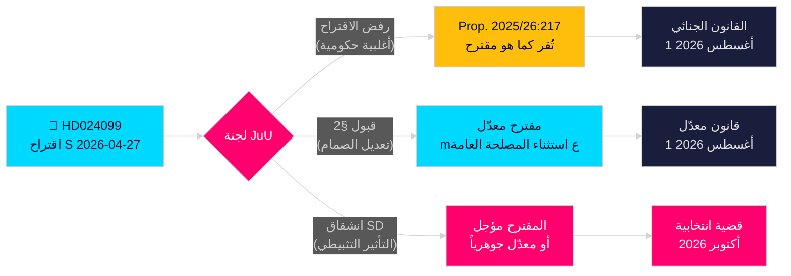

<!-- dir: rtl -->
# الاشتراكيون الديمقراطيون يتحدون تجاوز الحكومة في مكافحة الفساد

**المؤلف**: James Pether Sörling  
**التاريخ**: 2026-04-28  
**التصنيف**: عام — المادة 9(2)(ه)(و) من اللائحة العامة لحماية البيانات  
**مستوى الثقة**: عالٍ [B2]  
**نوع المقال**: اقتراح المعارضة  
**الدورة البرلمانية**: 2025/26

---

## 🎯 الملخص التنفيذي

قدّم الاشتراكيون الديمقراطيون (S) اقتراح اللجنة 2025/26:4099 (HD024099) الرافض للمقترح الرئيسي للحكومة بشأن مكافحة الفساد (prop. 2025/26:217)، بحجة أن الجريمة الجديدة "missbruk av offentlig ställning" لن تحمي الثقة العامة وقد تُثبط ممارسة السلطة التقديرية المشروعة للموظفين. يقترح حزب S إما رفضاً كاملاً للجريمة الجديدة، أو في حال إقرارها، إضافة استثناء "المصلحة الاجتماعية الملحة"؛ ويطالب الحكومة بالعودة بإصلاحات أشمل لمكافحة الفساد من اللجنة البرلمانية التحقيقية. هذا تحدٍّ مباشر لتشريع وزير العدل Strömmer (M) المميز، ويُشير إلى أن S ستجعل المساءلة الجنائية محوراً رئيسياً في الحملة الانتخابية لعام 2026.

## 🧭 القرارات التي تدعمها هذه الوثيقة

1. **قرار تحريري**: هل يُصاغ على أنه S تعارض التدقيق في المساءلة أم أنها تطالب بإصلاح أشمل — الأدلة تدعم بقوة الأخير؛ مطالبة S بإصلاح أوسع للفصل العاشر من BrB حقيقية.
2. **تتبع التشريع**: ستتعامل لجنة JuU مع هذا الاقتراح في مواجهة prop. 2025/26:217؛ يُتوقع صدور توصية اللجنة (bifalla/avslå) في نهاية مايو 2026 — راقب موقف حزب SD بوصفه الصوت الحاسم.
3. **تقييم انتخابات 2026**: هل ينبغي رفع المساءلة الجنائية للفساد كقضية رئيسية في حملة S؟ نعم — تقديم Teresa Carvalho يضع S في موقع الحزب المدافع عن الموظفين من التجريم والمطالب بإصلاح منهجي لمكافحة الفساد.

## ⚡ قراءة في 60 ثانية

- **ما حدث**: قدّم حزب S اقتراح اللجنة HD024099 في 2026-04-27 ضد prop. 2025/26:217 [A2]
- **المقترح الحكومي**: جريمتا "missbruk av offentlig ställning" و"grovt missbruk" الجديدتان في قانون العقوبات Brottsbalken؛ سريان المفعول 1 أغسطس 2026 [A1]
- **الاعتراض الجوهري لحزب S**: الجريمة الجديدة "träffar fel" (تُخطئ الهدف) — لا تحقق هدفها المُعلن وتخاطر بتثبيط قرارات الموظفين [B2]
- **مطالب S الثلاث**: (1) رفض الجريمة الجديدة؛ (2) إن أُقرّت، إضافة صمام المصلحة الاجتماعية؛ (3) العودة بإصلاح أشمل لمكافحة الفساد [A2]
- **الرهانات السياسية**: تموضع انتخابي حول سيادة القانون؛ يختبر تماسك الائتلاف؛ SD حاسم [C2]
- **المحفز المستقبلي الرئيسي**: تصويت لجنة JuU، متوقع في مايو/يونيو 2026؛ قد يتعارض التوقيت مع مداولات الميزانية الصيفية [B2]

## 🔺 أبرز المحفزات المستقبلية

**معالجة لجنة JuU لـ prop. 2025/26:217**: متوقعة في مايو–يونيو 2026. إن خرج SD عن ائتلاف الحكومة في قلق "التأثير التثبيطي" — وهو أمر ممكن نظراً لقاعدة ناخبي SD من الموظفين الحكوميين ذوي الدخل المنخفض — فقد يُعدَّل المقترح أو يُأجَّل، مما يمنح S انتصاراً تشريعياً جزئياً قبيل انتخابات 2026.

<!-- source-sha: 5fe00f1958c56d07b6bd7744501c301ba01f43c4 -->
