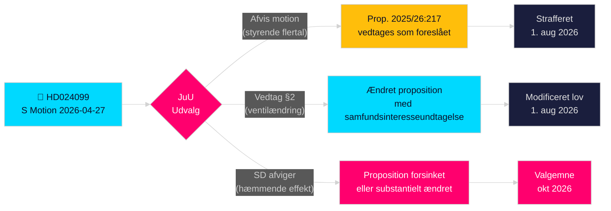

# Socialdemokraterne udfordrer regeringens antikorruptionsoverskridelse

**Forfatter**: James Pether Sörling  
**Dato**: 2026-04-28  
**Klassifikation**: OFFENTLIG — GDPR Art. 9(2)(e)(g)  
**Konfidensgrad**: HØJ [B2]  
**Artikeltype**: Oppositionsmotion  
**Riksmøte**: 2025/26

---

## 🎯 Kernekonklusion

Socialdemokraterne (S) har indgivet Motion 2025/26:4099 (HD024099) mod regeringens flagskibsproposition om antikorruption (prop. 2025/26:217), idet de argumenterer for, at det nye kriminalitetsbegreb "missbruk av offentlig ställning" ikke vil beskytte den offentlige tillid og risikerer at afskrække legitim embedsmandsudøvelse. S foreslår enten fuld afvisning af det nye strafferetsbegreb eller, hvis det vedtages, en "tvingende samfundsinteresse"-undtagelse; og kræver samtidig, at regeringen vender tilbage med bredere korruptionsreformer fra det parlamentariske undersøgelsesudvalg. Dette er en direkte udfordring af justitsminister Strömmers (M) signaturlovgivning og signalerer, at S vil gøre strafferetlig ansvarlighed til et centralt tema i valgkampagnen 2026.

## �� Beslutninger denne note understøtter

1. **Redaktionel beslutning**: Om det skal fremstilles som S imod ansvarsgranskning versus S der kræver mere omfattende reform — evidensen støtter stærkt sidstnævnte; S's krav om bredere kapitel 10 BrB-reform er ægte.
2. **Lovgivningssporing**: JuU vil behandle denne motion mod prop. 2025/26:217; udvalgets anbefaling (bifalla/avslå) forventes i slutningen af maj 2026 — overvåg SD's partiposition som afgørende stemme.
3. **Valg 2026-vurdering**: Bør strafferetlig ansvarlighed for korruption løftes som en nøgle-S-valgkampagnefråga? Ja — Teresa Carvalhos indgivelse positionerer S som det parti, der forsvarer embedsmænd mod kriminalisering og kræver systemisk antikorruptionsreform.

## ⚡ 60-sekunders læsning

- **Hvad skete**: S indgav Kommittémotion HD024099 den 2026-04-27 mod prop. 2025/26:217 [A2]
- **Regeringsforslaget**: Nye strafferetsbegreber "missbruk av offentlig ställning" og "grovt missbruk" i Brottsbalken; ikrafttrædelse 1. august 2026 [A1]
- **S's kerneindvending**: Det nye begreb "träffar fel" (rammer forkert) — opnår ikke sit erklærede mål og risikerer at afskrække embedsmænds beslutningstagning [B2]
- **S's tre krav**: (1) Afvis det nye kriminalitetsbegreb; (2) hvis vedtaget, tilføj samfundsinteresseventil; (3) vend tilbage med bredere korruptionsreform [A2]
- **Politiske indsatser**: Valg­positionering om retsstatsprincippet; tester koalitionssammenhæng; SD afgørende [C2]
- **Vigtigste fremudløser**: JuU-udvalgsafstemning, forventet maj/juni 2026; timing kan kollidere med sommerbudgetdrøftelser [B2]

## 🔺 Topfremudløser

**JuU-udvalgets behandling af prop. 2025/26:217**: Forventet maj–juni 2026. Hvis SD bryder med den styrende koalition om "hæmmende effekt"-bekymringen — muligt givet SD's vælgerbase af laverindkomst offentligt ansatte — kan propositionen ændres eller forsinkes, hvilket giver S en delvis lovgivningssejr inden valget 2026.

<!-- source-sha: 5fe00f1958c56d07b6bd7744501c301ba01f43c4 -->
