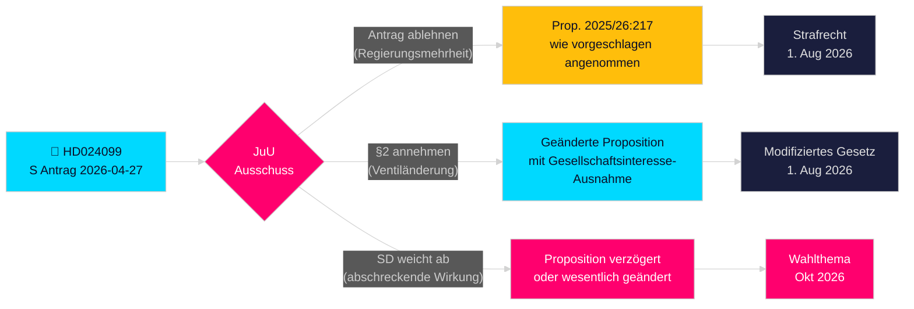

# Sozialdemokraten fordern Regierungsübergriff bei Anti-Korruption heraus

**Autor**: James Pether Sörling  
**Datum**: 2026-04-28  
**Klassifizierung**: ÖFFENTLICH — DSGVO Art. 9(2)(e)(g)  
**Konfidenzniveau**: HOCH [B2]  
**Artikeltyp**: Oppositionsantrag  
**Reichstag**: 2025/26

---

## 🎯 Kernaussage

Die Sozialdemokraten (S) haben den Antrag 2025/26:4099 (HD024099) eingereicht, der die Anti-Korruptions-Leitproposition der Regierung (prop. 2025/26:217) ablehnt, mit der Begründung, dass der neue Straftatbestand "missbruk av offentlig ställning" das öffentliche Vertrauen nicht schützt und riskiert, legitimes Beamtenermessen abzuschrecken. S schlägt entweder die vollständige Ablehnung des neuen Straftatbestands vor oder, falls er dennoch angenommen wird, eine Ausnahme für „zwingendes gesellschaftliches Interesse"; und fordert die Regierung auf, mit umfassenderen Antikorruptionsreformen aus dem parlamentarischen Untersuchungsausschuss zurückzukehren. Dies ist eine direkte Herausforderung an Justizminister Strömmers (M) Signaturgesetzgebung und signalisiert, dass S die strafrechtliche Rechenschaftspflicht zum zentralen Thema des Wahlkampfs 2026 machen wird.

## 🧭 Entscheidungen, die dieses Papier unterstützt

1. **Redaktionelle Entscheidung**: Ob es als S gegen Rechenschaftsprüfung versus S, das umfassendere Reform fordert, dargestellt werden soll — die Beweise unterstützen stark letzteres; S' Forderung nach breiterer Reform von BrB Kapitel 10 ist aufrichtig.
2. **Gesetzgebungsverfolgung**: JuU wird diesen Antrag gegen prop. 2025/26:217 behandeln; die Ausschussempfehlung (bifalla/avslå) wird Ende Mai 2026 erwartet — beobachten Sie SDs Parteihaltung als entscheidende Stimme.
3. **Wahl 2026-Beurteilung**: Sollte strafrechtliche Rechenschaftspflicht für Korruption als Schlüsselthema der S-Kampagne hervorgehoben werden? Ja — Teresa Carvalhos Einreichung positioniert S als die Partei, die Beamte gegen Kriminalisierung verteidigt und systemische Antikorruptionsreform fordert.

## ⚡ 60-Sekunden-Lektüre

- **Was geschah**: S reichte Ausschussantrag HD024099 am 2026-04-27 gegen prop. 2025/26:217 ein [A2]
- **Regierungsvorschlag**: Neue Straftatbestände "missbruk av offentlig ställning" und "grovt missbruk" im Brottsbalken; Inkrafttreten 1. August 2026 [A1]
- **Kerneinwand von S**: Der neue Tatbestand "träffar fel" (trifft das Falsche) — erreicht sein erklärtes Ziel nicht und riskiert, Beamtentscheidungen abzuschrecken [B2]
- **Drei Forderungen von S**: (1) Den neuen Straftatbestand ablehnen; (2) falls angenommen, gesellschaftliches Interesse-Ventil hinzufügen; (3) mit breiterer Antikorruptionsreform zurückkehren [A2]
- **Politische Einsätze**: Wahlpositionierung rund um Rechtsstaatlichkeit; testet Koalitionszusammenhalt; SD entscheidend [C2]
- **Wichtigster Zukunftsauslöser**: JuU-Ausschussabstimmung, erwartet Mai/Juni 2026; Timing kann mit Sommerhaushaltsberatungen kollidieren [B2]

## 🔺 Top-Zukunftsauslöser

**Behandlung von prop. 2025/26:217 durch JuU-Ausschuss**: Erwartet Mai–Juni 2026. Wenn SD in der "abschreckenden Wirkung"-Sorge von der Regierungskoalition abweicht — möglich angesichts SDs Wählerschaft einkommenschwacher Staatsangestellter — könnte die Proposition geändert oder verzögert werden, was S einen Teilsieg bei der Gesetzgebung vor der Wahl 2026 bescheren würde.

<!-- source-sha: 5fe00f1958c56d07b6bd7744501c301ba01f43c4 -->
