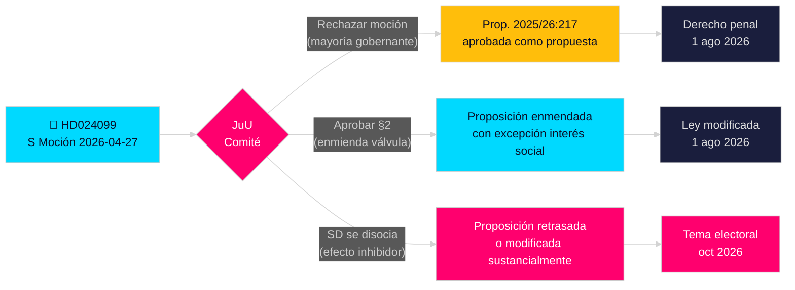

# Los socialdemócratas desafían el exceso del gobierno en anti-corrupción

**Autor**: James Pether Sörling  
**Fecha**: 2026-04-28  
**Clasificación**: PÚBLICO — RGPD Art. 9(2)(e)(g)  
**Nivel de confianza**: ALTO [B2]  
**Tipo de artículo**: Moción de oposición  
**Riksmöte**: 2025/26

---

## 🎯 Conclusión principal

Los socialdemócratas (S) han presentado la moción 2025/26:4099 (HD024099) rechazando la proposición estrella del gobierno sobre anti-corrupción (prop. 2025/26:217), argumentando que el nuevo tipo penal "missbruk av offentlig ställning" no protege la confianza pública y arriesga disuadir el legítimo ejercicio de la discreción funcionarial. S propone o bien el rechazo total del nuevo tipo penal o, si se aprueba, una excepción de "interés social apremiante"; y exige que el gobierno regrese con reformas anticorrupción más amplias del comité de investigación parlamentario. Este es un desafío directo a la legislación insignia del ministro de Justicia Strömmer (M) y señala que S hará de la responsabilidad penal un tema central de la campaña electoral 2026.

## 🧭 Decisiones respaldadas por este documento

1. **Decisión editorial**: Si presentarlo como S oponiéndose al escrutinio de responsabilidad versus S exigiendo reforma más comprehensiva — las evidencias apoyan fuertemente lo último; la demanda de S de una reforma más amplia del capítulo 10 BrB es genuina.
2. **Seguimiento legislativo**: JuU tratará esta moción contra prop. 2025/26:217; la recomendación del comité (bifalla/avslå) se espera a finales de mayo 2026 — vigilar la posición del SD como voto decisivo.
3. **Evaluación electoral 2026**: ¿Debería destacarse la responsabilidad penal por corrupción como tema clave de la campaña de S? Sí — la presentación de Teresa Carvalho posiciona a S como el partido que defiende a los funcionarios contra la criminalización y exige una reforma sistémica anticorrupción.

## ⚡ Lectura de 60 segundos

- **Lo que ocurrió**: S presentó la moción de comisión HD024099 el 2026-04-27 contra prop. 2025/26:217 [A2]
- **Proposición gubernamental**: Nuevos tipos penales "missbruk av offentlig ställning" y "grovt missbruk" en el Brottsbalken; entrada en vigor 1 de agosto de 2026 [A1]
- **Objeción central de S**: El nuevo tipo "träffar fel" (da en el blanco equivocado) — no logra su objetivo declarado y arriesga disuadir la toma de decisiones funcionariales [B2]
- **Tres demandas de S**: (1) Rechazar el nuevo tipo penal; (2) si se aprueba, añadir válvula de interés social; (3) regresar con reforma anticorrupción más amplia [A2]
- **Apuestas políticas**: Posicionamiento electoral en torno al Estado de derecho; pone a prueba la cohesión de la coalición; SD decisivo [C2]
- **Desencadenante futuro más importante**: Votación del comité JuU, prevista mayo/junio 2026; el calendario puede colisionar con las deliberaciones presupuestarias estivales [B2]

## 🔺 Principal desencadenante futuro

**Tratamiento de prop. 2025/26:217 por el comité JuU**: Previsto mayo–junio 2026. Si SD rompe con la coalición gobernante en la preocupación del "efecto inhibidor" — posible dado que la base electoral del SD incluye funcionarios de bajos ingresos — la proposición podría modificarse o retrasarse, dándole a S una victoria legislativa parcial antes de las elecciones 2026.

<!-- source-sha: 5fe00f1958c56d07b6bd7744501c301ba01f43c4 -->
