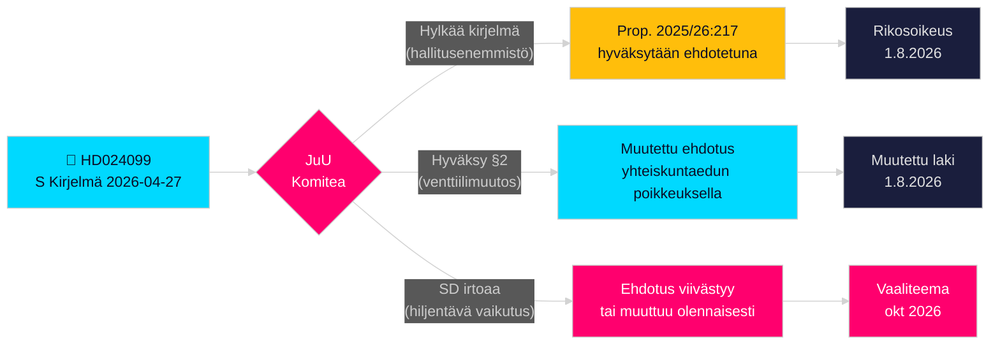

# Sosialidemokraatit haastavat hallituksen korruptionvastaisen ylityksen

**Tekijä**: James Pether Sörling  
**Päivämäärä**: 2026-04-28  
**Luokittelu**: JULKINEN — GDPR Art. 9(2)(e)(g)  
**Luottamustaso**: KORKEA [B2]  
**Artikkelityyppi**: Oppositiokirjelmä  
**Valtiopäivät**: 2025/26

---

## 🎯 Ydinyhteenveto

Sosialidemokraatit (S) ovat jättäneet kirjelmän 2025/26:4099 (HD024099), jolla ne vastustavat hallituksen korruptionvastaista lippulaivaehdotusta (prop. 2025/26:217), väittäen, että uusi rikostyyppi "missbruk av offentlig ställning" ei suojaa julkista luottamusta ja vaarantaa virkamiesten laillisen harkinnan. S ehdottaa joko uuden rikostyypin täydellistä hylkäämistä tai, jos se hyväksytään, "pakottavan yhteiskunnallisen edun" poikkeusta; sekä vaatii hallitusta palaamaan laajemmilla korruptiouudistuksilla parlamentin tutkintakomitealta. Tämä on suora haaste oikeusministeri Strömmerin (M) tunnustuslaille ja signaloi, että S aikoo tehdä rikosoikeudellisesta vastuullisuudesta keskeisen teeman vuoden 2026 vaalikampanjassa.

## 🧭 Päätökset, joita tämä PM tukee

1. **Toimituksellinen päätös**: Esitetäänkö S vastustamassa vastuullisuustarkastelua vai S vaatimassa kattavampaa uudistusta — todisteet tukevat vahvasti jälkimmäistä; S:n vaatimus laajemmasta BrB:n 10. luvun uudistuksesta on aito.
2. **Lainsäädännön seuranta**: JuU käsittelee tätä kirjelmää vastaan prop. 2025/26:217:ään; komitean suositus (hyväksy/hylkää) odotetaan toukokuun 2026 lopussa — seuraa SD:n puoluekantaa ratkaisevana äänenä.
3. **Vaali 2026 -arvio**: Pitäisikö korruption rikosoikeudellinen vastuullisuus nostaa S:n keskeiseksi vaali­teemaksi? Kyllä — Teresa Carvalho'n jättämä kirjelmä asemoi S:n puolueeksi, joka puolustaa virkamiehiä kriminalisoinnilta ja vaatii järjestelmällistä korruptionvastaista uudistusta.

## ⚡ 60 sekunnin lukeminen

- **Mitä tapahtui**: S jätti komiteakirjelmän HD024099 2026-04-27 vastaan prop. 2025/26:217:ään [A2]
- **Valtion ehdotus**: Uudet rikostyypit "missbruk av offentlig ställning" ja "grovt missbruk" rikoslaissa; voimaantulopäivä 1. elokuuta 2026 [A1]
- **S:n ydinvastalause**: Uusi tyyppi "träffar fel" (osuu ohitse) — ei saavuta ilmoitettua tavoitettaan ja vaarantaa virkamiesten päätöksenteon [B2]
- **S:n kolme vaatimusta**: (1) Hylkää uusi rikostyyppi; (2) jos hyväksytään, lisää yhteiskunnallisen edun venttiili; (3) palaa laajemmalla korruptiouudistuksella [A2]
- **Poliittiset panokset**: Vaalisijoittuminen oikeusvaltion ympärille; testaa koalition yhteenkuuluvuutta; SD ratkaisevassa asemassa [C2]
- **Tärkein tulevaisuuden laukasin**: JuU-komitean äänestys, odotettu toukokuu/kesäkuu 2026; ajoitus voi törmätä kesän budjettineuvotteluihin [B2]

## 🔺 Tärkein tulevaisuuden laukasin

**JuU-komitean prop. 2025/26:217 käsittely**: Odotettu touko–kesäkuu 2026. Jos SD irtoaa hallituskoalitiosta "hiljentävän vaikutuksen" huolessa — mahdollista SD:n alempi­tuloisten julkistyöntekijöiden äänestäjäperustan vuoksi — ehdotus voidaan muuttaa tai viivästyttää, mikä antaa S:lle osittaisen lainsäädäntövoiton ennen vuoden 2026 vaaleja.

<!-- source-sha: 5fe00f1958c56d07b6bd7744501c301ba01f43c4 -->
