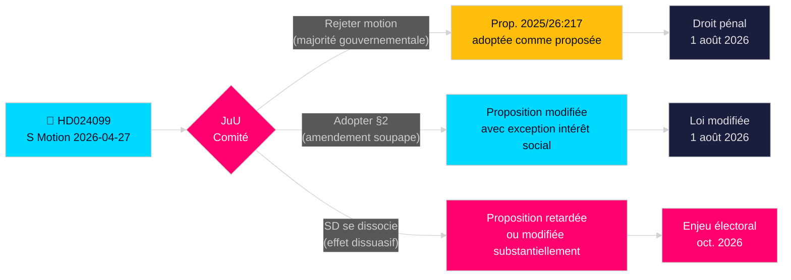

# Les socialistes-démocrates contestent l'excès du gouvernement en matière d'anti-corruption

**Auteur**: James Pether Sörling  
**Date**: 2026-04-28  
**Classification**: PUBLIC — RGPD Art. 9(2)(e)(g)  
**Niveau de confiance**: ÉLEVÉ [B2]  
**Type d'article**: Motion d'opposition  
**Riksmöte**: 2025/26

---

## 🎯 Conclusion principale

Les socialistes-démocrates (S) ont déposé la motion 2025/26:4099 (HD024099) rejetant la proposition phare du gouvernement sur l'anti-corruption (prop. 2025/26:217), arguant que la nouvelle infraction pénale "missbruk av offentlig ställning" ne protège pas la confiance du public et risque de décourager la prise de décision légitime des fonctionnaires. S propose soit le rejet complet de la nouvelle infraction, soit, si elle est adoptée, une exception pour "intérêt social impérieux"; et exige que le gouvernement revienne avec des réformes anti-corruption plus larges issues du comité d'enquête parlementaire. C'est un défi direct à la législation emblématique du ministre de la Justice Strömmer (M) et signale que S fera de la responsabilité pénale un thème central de la campagne électorale 2026.

## 🧭 Décisions soutenues par cette note

1. **Décision éditoriale**: Présenter comme S opposée à l'examen de responsabilité vs. S exigeant une réforme plus complète — les preuves soutiennent fortement la dernière; la demande de S pour une réforme plus large du chapitre 10 BrB est authentique.
2. **Suivi législatif**: JuU traitera cette motion contre prop. 2025/26:217; la recommandation du comité (bifalla/avslå) est attendue fin mai 2026 — surveiller la position du SD comme vote décisif.
3. **Évaluation électorale 2026**: La responsabilité pénale pour corruption doit-elle être mise en avant comme thème clé de la campagne S? Oui — le dépôt de Teresa Carvalho positionne S comme le parti défendant les fonctionnaires contre la criminalisation et exigeant une réforme systémique anti-corruption.

## ⚡ Lecture en 60 secondes

- **Ce qui s'est passé**: S a déposé la motion de commission HD024099 le 2026-04-27 contre prop. 2025/26:217 [A2]
- **Proposition gouvernementale**: Nouvelles infractions pénales "missbruk av offentlig ställning" et "grovt missbruk" dans le Brottsbalken; entrée en vigueur 1er août 2026 [A1]
- **Objection centrale de S**: La nouvelle infraction "träffar fel" (manque la cible) — n'atteint pas son objectif déclaré et risque de décourager la prise de décision des fonctionnaires [B2]
- **Trois exigences de S**: (1) Rejeter la nouvelle infraction; (2) si adoptée, ajouter une soupape d'intérêt social; (3) revenir avec une réforme anti-corruption plus large [A2]
- **Enjeux politiques**: Positionnement électoral autour de l'État de droit; teste la cohésion de la coalition; SD décisif [C2]
- **Déclencheur futur le plus important**: Vote du comité JuU, prévu mai/juin 2026; le calendrier peut entrer en collision avec les délibérations budgétaires estivales [B2]

## 🔺 Déclencheur futur principal

**Traitement de prop. 2025/26:217 par le comité JuU**: Prévu mai–juin 2026. Si SD rompt avec la coalition gouvernementale sur la préoccupation d'"effet dissuasif" — possible étant donné la base électorale de SD composée de fonctionnaires à faibles revenus — la proposition pourrait être modifiée ou retardée, offrant à S une victoire législative partielle avant les élections 2026.

<!-- source-sha: 5fe00f1958c56d07b6bd7744501c301ba01f43c4 -->
