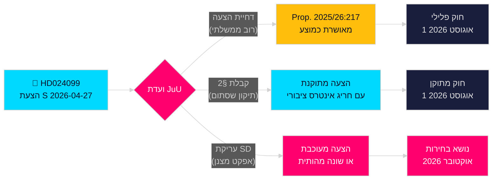

<!-- dir: rtl -->
# הסוציאל-דמוקרטים מאתגרים את החריגה של הממשלה נגד שחיתות

**מחבר**: James Pether Sörling  
**תאריך**: 2026-04-28  
**סיווג**: ציבורי — GDPR סעיף 9(2)(ה)(ז)  
**רמת ביטחון**: גבוהה [B2]  
**סוג מאמר**: הצעה אופוזיציונית  
**מושב פרלמנטרי**: 2025/26

---

## 🎯 תקציר מנהלים

הסוציאל-דמוקרטים (S) הגישו הצעת ועדה 2025/26:4099 (HD024099) הדוחה את הצעת החוק המרכזית של הממשלה נגד שחיתות (prop. 2025/26:217), בטענה שעבירת ה"missbruk av offentlig ställning" החדשה לא תגן על האמון הציבורי ועלולה להרתיע את שיקול הדעת הלגיטימי של פקידי ציבור. S מציע או דחייה מוחלטת של העבירה החדשה, או, אם תאושר, חריג של "אינטרס חברתי מרכזי"; ודורש מהממשלה לחזור עם רפורמות נרחבות יותר נגד שחיתות מוועדת החקירה הפרלמנטרית. זוהי אתגר ישיר לחקיקת הדגל של שר המשפטים Strömmer (M), ומאותת שS תהפוך את האחריות הפלילית לנושא מרכזי בקמפיין הבחירות 2026.

## 🧭 החלטות שמסמך זה תומך בהן

1. **החלטה עריכתית**: האם להציג זאת כ-S המתנגדת לבחינת האחריות לעומת S הדורשת רפורמה מקיפה יותר — הראיות תומכות בחוזקה באחרונה; דרישת S לרפורמה רחבה יותר בפרק 10 של BrB היא אמיתית.
2. **מעקב חקיקתי**: JuU תדון בהצעה זו מול prop. 2025/26:217; המלצת הוועדה (bifalla/avslå) צפויה לקראת סוף מאי 2026 — עקוב אחר עמדת SD כקול מכריע.
3. **הערכה לבחירות 2026**: האם יש לקדם את האחריות הפלילית על שחיתות כנושא מפתח בקמפיין S? כן — הגשת Teresa Carvalho ממצבת את S כמפלגה המגינה על פקידים מפני הפללה ודורשת רפורמה מערכתית נגד שחיתות.

## ⚡ קריאה של 60 שניות

- **מה קרה**: S הגישה הצעת ועדה HD024099 ב-2026-04-27 נגד prop. 2025/26:217 [A2]
- **הצעת הממשלה**: עבירות חדשות "missbruk av offentlig ställning" ו-"grovt missbruk" בחוק העונשין Brottsbalken; כניסה לתוקף 1 באוגוסט 2026 [A1]
- **ההתנגדות המרכזית של S**: העבירה החדשה "träffar fel" (פוגעת במטרה הלא נכונה) — אינה מגיעה למטרתה המוצהרת ועלולה להרתיע קבלת החלטות על ידי פקידים [B2]
- **שלושת דרישות S**: (1) לדחות את העבירה החדשה; (2) אם תאושר, להוסיף שסתום לאינטרס ציבורי; (3) לחזור עם רפורמה נרחבת יותר נגד שחיתות [A2]
- **הימורים פוליטיים**: מיצוב בחירות סביב שלטון החוק; בוחן לכידות קואליציה; SD מכריע [C2]
- **הגורם המעורר העתידי החשוב ביותר**: הצבעת ועדת JuU, צפויה במאי/יוני 2026; התזמון עלול להתנגש עם דיוני התקציב של הקיץ [B2]

## 🔺 הגורם המעורר העתידי המוביל

**טיפול ועדת JuU ב-prop. 2025/26:217**: צפוי במאי–יוני 2026. אם SD תשבור עם קואליציית הממשלה בנושא הדאגה ל"אפקט מצנן" — אפשרי בהתחשב בבסיס הבוחרים של SD בקרב עובדי ציבור בהכנסה נמוכה — ההצעה עשויה להשתנות או להתעכב, מה שייתן ל-S ניצחון חקיקתי חלקי לפני בחירות 2026.

<!-- source-sha: 5fe00f1958c56d07b6bd7744501c301ba01f43c4 -->
