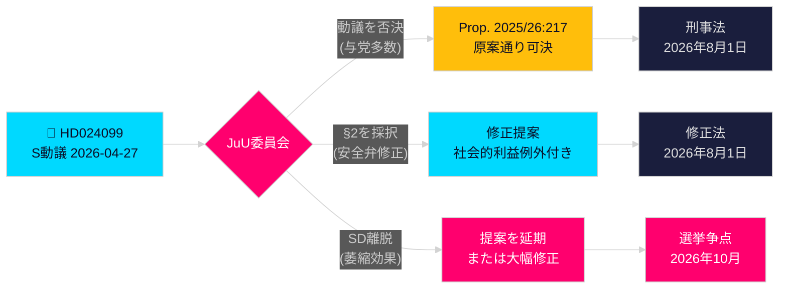

# 社会民主党、政府の腐敗防止の行き過ぎを批判

**著者**: James Pether Sörling  
**日付**: 2026-04-28  
**分類**: 公開 — GDPR第9条(2)(e)(g)  
**確信度**: 高 [B2]  
**記事タイプ**: 野党動議（Opposition Motion）  
**議会期**: 2025/26

---

## 🎯 要点（Sammanfattning）

社会民主党（Socialdemokraterna、略称 S）は委員会動議 2025/26:4099（HD024099）を提出し、政府の反腐敗主要提案（prop. 2025/26:217）を否決する立場を明確にした。新たな犯罪類型「missbruk av offentlig ställning」（公職権限の濫用 abuse of public position）は公的信頼（allmänt förtroende）を守らず、公務員の正当な裁量権（legitim handlingsförmåga）行使を萎縮させるリスクがあると S は主張する。S は新犯罪類型の完全廃止（avvisande）、またはやむを得ず可決された場合には「やむを得ない社会的利益（tvingande samhällsintresse）」の例外条項挿入を要求するとともに、議会調査委員会（riksdagens utredningskommitté）からの包括的腐敗防止改革の提出を求めている。これは法務大臣 Strömmer（M、穏健党 Moderaterna）の看板立法への直接的挑戦であり、S が2026年選挙キャンペーンで刑事的説明責任（straffrättslig redovisning）を核心テーマとする意向を示す。

## 🧭 この備忘録が支援する決定（Beslut）

1. **編集上の判断（Redaktionell bedömning）**: S が責任審査（ansvarsgranskning）に反対しているのか、より包括的な改革（heltäckande reform）を求めているのかをどう描写するか — 証拠は後者を強く支持する。BrB 第10章の広範な改革を求める S の主張は真摯（genuint）である。
2. **立法追跡（Lagstiftningsuppföljning）**: 司法委員会（JuU）がこの動議を prop. 2025/26:217 に対して審議する。委員会勧告（bifalla/avslå）は2026年5月末予定 — SD（スウェーデン民主党 Sverigedemokraterna）の党の立場を決定票として注視すること。
3. **2026年選挙評価（Valbedömning）**: 腐敗に対する刑事的説明責任を S キャンペーンの主要議題として取り上げるべきか？ はい — Teresa Carvalho の提出は、公務員（tjänstemän）を犯罪化（kriminalisering）から守り、体系的な腐敗防止改革を要求する政党として S を位置づける。

## ⚡ 60秒概要（60-sekunders sammanfattning）

- **発生事項 Vad som hände**: S は2026-04-27 に委員会動議 HD024099 を提出（prop. 2025/26:217 反対）[A2]
- **政府提案 Regeringsförslaget**: Brottsbalken（刑法典）に新犯罪「missbruk av offentlig ställning」「grovt missbruk」を新設；施行日 2026年8月1日（1 augusti 2026）[A1]
- **S の核心的反論 S:s invändning**: 新犯罪は「träffar fel」（的外れ）— 表明された目的（syfte）を達成せず、公務員の意思決定を萎縮させるリスク [B2]
- **S の三つの要求 S:s krav**: (1) 新犯罪を廃止；(2) 可決時は社会的利益の安全弁（ventil）を追加；(3) 包括的腐敗防止改革を提出 [A2]
- **政治的賭け Politiska insatser**: 法の支配（rättsstaten）を巡る選挙ポジショニング；連立結束（koalitionssammanhang）の試金石；SD が決定的票（avgörande röst） [C2]
- **最重要将来トリガー Framtidsutlösare**: JuU 委員会採決（utskottsomröstning）、2026年5/6月予定；タイミングが夏の予算協議（budgetöverläggningar）と衝突する可能性 [B2]

## 🔺 主要将来トリガー（Framtidsutlösare）

**JuU による prop. 2025/26:217 審議**: 2026年5–6月予定。SD が「萎縮効果（hämmande effekt）」への懸念を巡って与党連立（styrande koalitionen）から離脱した場合 — SD の低所得公務員有権者層（lägre inkomst offentliganställda väljare）を考えると可能性あり — 提案は修正または延期され、S に2026年選挙前の部分的立法勝利（delvis lagstiftningsseger）をもたらす。

**Analytical Context / 分析背景**

**HD024099 — Social Democrat Committee Motion Against prop. 2025/26:217**

Motion HD024099 filed by Teresa Carvalho (Social Democrats, S) on 27 April 2026 opposes the government's flagship anti-corruption legislation (prop. 2025/26:217). The motion argues that the proposed new criminal offence "missbruk av offentlig ställning" (abuse of public position, misuse of official position) and "grovt missbruk" (aggravated misuse) would:

1. Fail to achieve its stated purpose of protecting public trust (allmänt förtroende);
2. Risk a chilling effect (hämmande effekt) on legitimate exercise of official discretion (legitim handlingsförmåga) by public servants (tjänstemän);
3. Introduce excessive criminalisation (kriminalisering) of administrative decision-making.

**Three Social Democrat Demands (Tre krav):**
First demand (yrkande 1): Reject (avvisa) the proposed new criminal type entirely.
Second demand (yrkande 2): If the bill passes, insert a "compelling social interest" safety valve (ventil för tvingande samhällsintresse) exception under BrB Chapter 10.
Third demand (yrkande 3): Mandate the government to return with comprehensive anti-corruption reform drawn from parliamentary investigation committee (riksdagens utredningskommitté) proposals.

**Justice Committee (Justitieutskottet, JuU) Timeline:**
Committee deliberation on prop. 2025/26:217 and motion HD024099 scheduled for May–June 2026. Committee recommendation (bifalla or avslå) expected late May. Potential timing conflict with summer budget consultations (budgetöverläggningar).

**Sweden Democrats (SD) as Deciding Vote:**
SD holds the deciding vote (avgörande röst) in the 175-seat coalition majority. SD voter base includes substantial numbers of lower-income public sector workers (lägre inkomst offentliganställda väljare) who might be directly affected by the proposed chilling-effect risk. SD party position (partiposition) on the chilling-effect argument is the key variable to watch in May 2026.

<!-- source-sha: 5fe00f1958c56d07b6bd7744501c301ba01f43c4 -->
