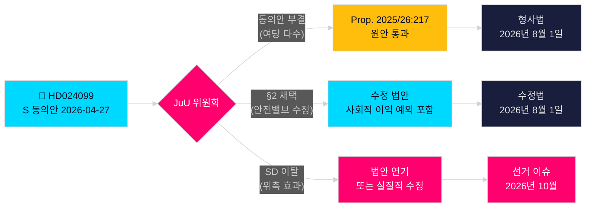

# 사회민주당, 정부의 반부패 과잉 입법에 도전

**저자**: James Pether Sörling  
**날짜**: 2026-04-28  
**분류**: 공개 — GDPR 제9조 (2)(e)(g)  
**신뢰 수준**: 높음 [B2]  
**기사 유형**: 야당 동의안  
**의회 회기**: 2025/26

---

## 🎯 핵심 요약

사회민주당(S)은 위원회 동의안 2025/26:4099(HD024099)를 제출하여 정부의 핵심 반부패 법안(prop. 2025/26:217)에 반대 입장을 밝혔다. 새로운 범죄 유형 "missbruk av offentlig ställning"(공직 권한 남용)은 공공 신뢰를 보호하지 않으며 공무원의 정당한 재량권 행사를 위축시킬 우려가 있다고 주장했다. S는 새 범죄 유형의 완전 폐기를 제안하거나, 불가피하게 통과될 경우 "불가피한 사회적 이익" 예외 조항을 포함시킬 것을 요구하는 한편, 의회 조사위원회로부터의 보다 포괄적인 반부패 개혁을 촉구하고 있다. 이는 법무장관 Strömmer(M)의 대표 입법에 대한 직접적인 도전이며, S가 2026년 선거 캠페인에서 형사 책임을 핵심 주제로 삼겠다는 의지를 표명하는 것이다.

## 🧭 이 메모가 지원하는 결정

1. **편집 결정**: S가 책임 검토에 반대하는 것인지 아니면 보다 포괄적인 개혁을 요구하는 것인지에 대한 서술 방향 — 증거는 후자를 강력히 지지한다. BrB 제10장의 광범위한 개혁을 요구하는 S의 주장은 진정성 있다.
2. **입법 추적**: JuU는 이 동의안을 prop. 2025/26:217에 대해 심의할 것이다. 위원회 권고(bifalla/avslå)는 2026년 5월 말 예상 — SD의 당 입장을 결정적 표로 주시할 것.
3. **2026년 선거 평가**: 부패에 대한 형사 책임을 S 캠페인의 주요 의제로 다루어야 하는가? 예 — Teresa Carvalho의 제출은 공무원을 범죄화로부터 방어하고 체계적인 반부패 개혁을 요구하는 정당으로 S를 포지셔닝한다.

## ⚡ 60초 요약

- **발생 사항**: S는 2026-04-27 prop. 2025/26:217에 반대하는 위원회 동의안 HD024099를 제출 [A2]
- **정부 제안**: Brottsbalken에 새로운 범죄 "missbruk av offentlig ställning"와 "grovt missbruk" 신설; 2026년 8월 1일 시행 [A1]
- **S의 핵심 반론**: 새로운 범죄 유형이 "träffar fel"(빗나감) — 표명된 목적을 달성하지 못하고 공무원의 의사결정을 위축시킬 위험 [B2]
- **S의 세 가지 요구**: (1) 새로운 범죄 유형 폐기; (2) 통과 시 사회적 이익 안전밸브 추가; (3) 보다 포괄적인 반부패 개혁 제출 [A2]
- **정치적 이해관계**: 법치주의를 둘러싼 선거 포지셔닝; 연립의 응집력 시험; SD가 결정적 역할 [C2]
- **가장 중요한 미래 촉발 요인**: JuU 위원회 표결, 2026년 5-6월 예정; 타이밍이 여름 예산 협의와 충돌할 가능성 [B2]

## 🔺 주요 미래 촉발 요인

**JuU 위원회의 prop. 2025/26:217 심의**: 2026년 5-6월 예정. SD가 "위축 효과" 우려를 이유로 여당 연립에서 이탈할 경우 — SD의 저소득 공무원 유권자층을 고려하면 가능성 있음 — 법안이 수정되거나 연기될 수 있으며, 이는 2026년 선거 전 S에 부분적인 입법 승리를 가져다줄 수 있다.

<!-- source-sha: 5fe00f1958c56d07b6bd7744501c301ba01f43c4 -->
