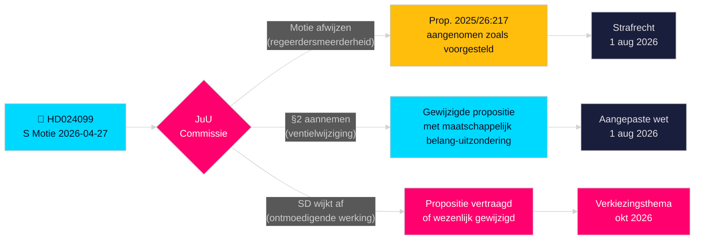

# Sociaaldemocraten daagen overreach van overheid op anti-corruptie uit

**Auteur**: James Pether Sörling  
**Datum**: 2026-04-28  
**Classificatie**: OPENBAAR — AVG Art. 9(2)(e)(g)  
**Vertrouwensniveau**: HOOG [B2]  
**Artikeltype**: Oppositiemotie  
**Riksmöte**: 2025/26

---

## 🎯 Kernbevinding

De sociaaldemocraten (S) hebben motie 2025/26:4099 (HD024099) ingediend die de vlaggenschip anti-corruptieproposit van de overheid (prop. 2025/26:217) afwijst, met het argument dat het nieuwe strafbare feit "missbruk av offentlig ställning" het publieke vertrouwen niet beschermt en het risico loopt legitieme discretie van ambtenaren te ontmoedigen. S stelt óf volledige afwijzing van het nieuwe strafbare feit voor, óf, als het toch wordt aangenomen, een uitzondering voor "dwingende maatschappelijk belang"; en eist dat de overheid terugkomt met bredere anti-corruptiehervormingen van de parlementaire onderzoekscommissie. Dit is een directe uitdaging aan minister van Justitie Strömmers (M) handtekeningwetgeving en geeft aan dat S strafrechtelijke verantwoordingsplicht tot een centraal thema van de verkiezingscampagne 2026 zal maken.

## 🧭 Beslissingen onderbouwd door dit memo

1. **Redactionele beslissing**: Of het gepresenteerd moet worden als S die verantwoordingsscrutiny bestrijdt versus S die uitgebreidere hervorming eist — het bewijs ondersteunt sterk het laatste; S' eis voor bredere hervorming van BrB hoofdstuk 10 is oprecht.
2. **Wetgevingsvolgdienst**: JuU behandelt deze motie tegen prop. 2025/26:217; de aanbeveling van de commissie (bifalla/avslå) wordt eind mei 2026 verwacht — houd de partijpositie van SD in de gaten als doorslaggevende stem.
3. **Verkiezingsbeoordeling 2026**: Moet strafrechtelijke verantwoordingsplicht voor corruptie als sleutelthema van de S-campagne worden gepromoveerd? Ja — Teresa Carvalho's indiening positioneert S als de partij die ambtenaren verdedigt tegen criminalisering en systemische anti-corruptiehervorming eist.

## ⚡ 60-secondenlezing

- **Wat er gebeurde**: S diende commissiemotie HD024099 in op 2026-04-27 tegen prop. 2025/26:217 [A2]
- **Overheidsvoorstel**: Nieuwe strafbare feiten "missbruk av offentlig ställning" en "grovt missbruk" in de Brottsbalken; inwerkingtreding 1 augustus 2026 [A1]
- **Kernbezwaar van S**: Het nieuwe feit "träffar fel" (mist het doel) — bereikt zijn aangegeven doel niet en dreigt de besluitvorming van ambtenaren af te schrikken [B2]
- **Drie eisen van S**: (1) Het nieuwe strafbare feit afwijzen; (2) als aangenomen, ventiel voor maatschappelijk belang toevoegen; (3) terugkomen met bredere anti-corruptiehervorming [A2]
- **Politieke inzetten**: Verkiezingspositionering rondom rechtsstaat; test coalitiecohesie; SD doorslaggevend [C2]
- **Belangrijkste toekomstige aanleiding**: JuU-commissiestemming, verwacht mei/juni 2026; timing kan botsen met zomerse begrotingsbesprekingen [B2]

## 🔺 Belangrijkste toekomstige aanleiding

**Behandeling van prop. 2025/26:217 door JuU-commissie**: Verwacht mei–juni 2026. Als SD breekt met de regeringscoalitie over de "ontmoedigende werking"-zorg — mogelijk gezien SDs kiezersbasis van laagbetaalde overheidswerknemers — kan de propositie worden gewijzigd of uitgesteld, wat S een gedeeltelijke wetgevingsoverwinning geeft vóór de verkiezingen 2026.

<!-- source-sha: 5fe00f1958c56d07b6bd7744501c301ba01f43c4 -->
