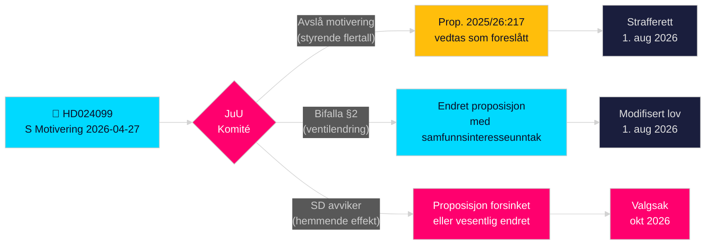

# Sosialdemokratene utfordrer regjeringens antikorrupsjonsoverskridelse

**Forfatter**: James Pether Sörling  
**Dato**: 2026-04-28  
**Klassifisering**: OFFENTLIG — GDPR Art. 9(2)(e)(g)  
**Konfidensnivå**: HØY [B2]  
**Artikkeltype**: Opposisjonsmotivering  
**Riksmøte**: 2025/26

---

## 🎯 Kjerneoppsummering

Sosialdemokratene (S) har levert inn motivering 2025/26:4099 (HD024099) som avviser regjeringens flaggskipproposisjon om antikorrupsjon (prop. 2025/26:217), med argumentet om at den nye kriminalitetstypen "missbruk av offentlig ställning" ikke vil beskytte tilliten til offentlig sektor og risikerer å kvele legitim tjenestemanns­skjønn. S foreslår enten fullstendig avvisning av den nye kriminalitetstypen, eller, dersom den vedtas, et unntak for "tvingende samfunnsinteresse"; og krever at regjeringen kommer tilbake med bredere korrupsjonsreformer fra stortingets utredningskomité. Dette er en direkte utfordring av justisminister Strömmers (M) signatur­lovgivning og signaliserer at S vil gjøre strafferettslig ansvarlighet til et sentralt tema i valgkampen 2026.

## �� Beslutninger denne PM støtter

1. **Redaksjonell beslutning**: Om det skal fremstilles som S mot ansvarsvurdering versus S som krever mer omfattende reform — bevisene støtter sterkt sistnevnte; S's krav om bredere kapittel 10 BrB-reform er genuint.
2. **Lovgivningssporing**: JuU vil behandle denne motivering mot prop. 2025/26:217; komiteens anbefaling (bifalla/avslå) forventes i slutten av mai 2026 — overvåk SDs partiposisjon som avgjørende stemme.
3. **Valg 2026-vurdering**: Bør strafferettslig ansvarlighet for korrupsjon løftes som en nøkkel-S-kampanjesak? Ja — Teresa Carvalhos innlevering posisjonerer S som partiet som forsvarer tjenestemenn mot kriminalisering og krever systemisk antikorrupsjonsreform.

## ⚡ 60-sekunders lesning

- **Hva skjedde**: S leverte inn Kommittémotiering HD024099 den 2026-04-27 mot prop. 2025/26:217 [A2]
- **Regjeringsforslaget**: Nye kriminalitetstyper "missbruk av offentlig ställning" og "grovt missbruk" i Brottsbalken; ikrafttredelse 1. august 2026 [A1]
- **S's kjerninnvending**: Den nye typen "träffar fel" (bommer) — oppnår ikke sitt erklærte mål og risikerer å kvele tjeneste­menns beslutningstaking [B2]
- **S's tre krav**: (1) Forkast den nye kriminalitetstypen; (2) dersom vedtatt, legg til samfunnsinteresse­ventil; (3) kom tilbake med bredere korrupsjonsreform [A2]
- **Politiske innsatser**: Valgposisjonering om rettsstaten; tester koalisjons­kohesjon; SD avgjørende [C2]
- **Viktigste fremutløser**: JuU-komitéavstemning, forventet mai/juni 2026; timing kan kollidere med sommerens budsjett­drøftinger [B2]

## 🔺 Topp fremutløser

**JuU-komiteens behandling av prop. 2025/26:217**: Forventet mai–juni 2026. Dersom SD bryter med den styrende koalisjonen i "hemmende effekt"-bekymringen — mulig gitt SDs velgerbasis av lavlønns offentlig ansatte — kan proposisjonen endres eller forsinkes, noe som gir S en delvis lovgivningsseier før valget 2026.

<!-- source-sha: 5fe00f1958c56d07b6bd7744501c301ba01f43c4 -->
