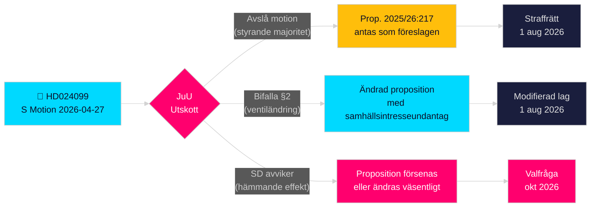

# Socialdemokraterna utmanar regeringens antikorruptionsövergrepp

**Författare**: James Pether Sörling  
**Datum**: 2026-04-28  
**Klassificering**: OFFENTLIG — GDPR Art. 9(2)(e)(g)  
**Konfidensgrad**: HÖG [B2]  
**Artikeltyp**: Oppositionsmotion  
**Riksmöte**: 2025/26

---

## 🎯 Kärnslutsats

Socialdemokraterna (S) har lämnat in motion 2025/26:4099 (HD024099) som avvisar regeringens flaggskeppsproposition om antikorruption (prop. 2025/26:217), med argumentet att det nya brottet "missbruk av offentlig ställning" inte skyddar allmänhetens förtroende och riskerar att avskräcka legitim handlingsförmåga hos tjänstemän. S föreslår antingen ett fullständigt avvisande av det nya brottet, eller, om det ändå antas, ett undantag för "tvingande samhällsintresse"; och kräver att regeringen återkommer med bredare korruptionsreformer från riksdagens utredningskommitté. Detta är en direkt utmaning mot justitieminister Strömmers (M) signum­lagstiftning och signalerar att S kommer att göra rättslig redovisning för brottsliga tjänstemän till ett centralt tema i valet 2026.

## 🧭 Beslut detta PM stöder

1. **Redaktionellt beslut**: Om detta ska framställas som att S motsätter sig ansvarsgranskning kontra S som kräver mer heltäckande reform — bevisen stöder starkt det senare; S:s krav på bredare reformer av kap. 10 BrB är genuint.
2. **Lagstiftningsuppföljning**: JuU kommer att behandla denna motion mot prop. 2025/26:217; utskottets rekommendation (bifalla/avslå) förväntas i slutet av maj 2026 — bevaka SD:s partiståndpunkt som avgörande röst.
3. **Val 2026-bedömning**: Bör straffrättslig redovisning för korruption lyftas som en nyckelvalsfråga för S? Ja — Teresa Carvalhos inlämning positionerar S som det parti som försvarar tjänstemän mot kriminalisering och kräver systemisk antikorruptionsreform.

## ⚡ 60-sekundersläsning

- **Vad som hände**: S lämnade in kommittémotion HD024099 den 2026-04-27 mot prop. 2025/26:217 [A2]
- **Regeringsförslaget**: Nya brott "missbruk av offentlig ställning" och "grovt missbruk" i Brottsbalken; ikraftträdande 1 augusti 2026 [A1]
- **S:s kärnbest rättelse**: Det nya brottet "träffar fel" — uppnår inte sitt angivna mål och riskerar att avskräcka tjänstemäns beslutsfattande [B2]
- **S:s tre krav**: (1) Avvisa det nya brottet; (2) om det ändå antas, lägg till ventil för samhällsintresse; (3) återkom med bredare korruptionsreform [A2]
- **Politiska insatser**: Förvals­positionering kring rättsstaten; testar samhörighet i styrande koalitionen; SD avgörande [C2]
- **Nyckelnyckelutlösare**: JuU-utskottets omröstning, beräknad till maj/juni 2026; timing kan kollidera med sommarens budgetöverläggningar [B2]

## 🔺 Topp framåtutlösare

**JuU:s behandling av prop. 2025/26:217**: Beräknat till maj–juni 2026. Om SD bryter med den styrande koalitionen vad gäller "hämmande effekt" — möjligt givet SD:s lägre inkomst offentliganställda väljare — kan propositionen ändras eller försenas, vilket ger S en delvis lagstiftningsseger inför valet 2026.

<!-- source-sha: 5fe00f1958c56d07b6bd7744501c301ba01f43c4 -->
