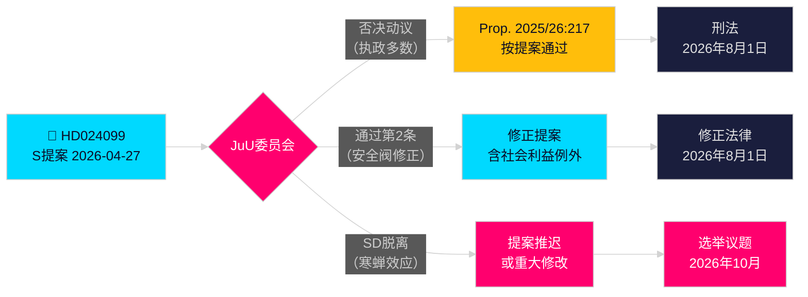

# 社会民主党挑战政府反腐过度立法

**作者**: James Pether Sörling  
**日期**: 2026-04-28  
**分类**: 公开 — GDPR第9(2)(e)(g)条  
**置信水平**: 高 [B2]  
**文章类型**: 反对党动议（Opposition Motion）  
**议会会期**: 2025/26

---

## 🎯 核心结论（Kärnslutsats）

社会民主党（Socialdemokraterna，简称 S）提交了委员会动议 2025/26:4099（HD024099），拒绝政府的反腐旗舰提案（prop. 2025/26:217），理由是新犯罪类型「missbruk av offentlig ställning」（滥用公职权力 abuse of public position）不能保护公众信任（allmänt förtroende），且有可能抑制公务员的正当裁量权（legitim handlingsförmåga）行使。S 提议彻底废除（avvisande）该新犯罪类型，或者如果获批，则增加「迫切社会利益（tvingande samhällsintresse）」例外条款；同时要求政府从议会调查委员会（riksdagens utredningskommitté）带回更全面的反腐改革方案。这是对司法部长 Strömmer（M，温和党 Moderaterna）标志性立法的直接挑战（direkt utmaning），并表明 S 将在2026年选举运动中将刑事问责（straffrättslig redovisning）作为核心主题。

## 🧭 本备忘录支持的决策（Beslut）

1. **编辑决策（Redaktionellt beslut）**: 是将其描述为 S 反对问责审查（ansvarsgranskning），还是 S 要求更全面改革（heltäckande reform）— 证据强烈支持后者；S 对 BrB 第10章更广泛改革的要求是真诚的（genuint）。
2. **立法跟踪（Lagstiftningsuppföljning）**: 司法委员会（JuU）将审议这项动议与 prop. 2025/26:217，委员会建议（bifalla/avslå）预计在2026年5月底 — 注意观察 SD（瑞典民主党 Sverigedemokraterna）的党派立场作为关键投票（avgörande röst）。
3. **2026年选举评估（Valbedömning）**: 是否应将腐败刑事问责提升为 S 竞选的关键主题？是的 — Teresa Carvalho 的提交使 S 定位为捍卫公务员（tjänstemän）免遭刑事追究（kriminalisering）并要求系统性反腐改革的政党。

## ⚡ 60秒速读（60-sekunders sammanfattning）

- **发生事项 Vad som hände**: S 于2026-04-27提交委员会动议 HD024099，反对 prop. 2025/26:217 [A2]
- **政府提案 Regeringsförslaget**: Brottsbalken（刑法典）新增犯罪「missbruk av offentlig ställning」和「grovt missbruk」；2026年8月1日（1 augusti 2026）生效 [A1]
- **S 的核心异议 S:s invändning**: 新犯罪类型「träffar fel」（打偏了 missing the target）— 未能实现其声称的目标（syfte），有可能抑制公务员决策 [B2]
- **S 的三项要求 S:s tre krav**: (1) 否决新犯罪类型；(2) 如获通过，增加社会利益安全阀（ventil）；(3) 带回更广泛的反腐改革 [A2]
- **政治赌注 Politiska insatser**: 围绕法治（rättsstaten）的选举定位；考验联合执政凝聚力（koalitionssammanhang）；SD 关键 [C2]
- **最重要未来触发因素 Framtidsutlösare**: 司法委员会（JuU）投票，预计2026年5月/6月；时机可能与夏季预算磋商（budgetöverläggningar）冲突 [B2]

## 🔺 主要未来触发因素（Framtidsutlösare）

**JuU委员会审议 prop. 2025/26:217**: 预计2026年5–6月。如果 SD 在「寒蝉效应（hämmande effekt）」担忧上脱离执政联盟（styrande koalitionen）— 鉴于 SD 选民群体中有大量低收入公务员（lägre inkomst offentliganställda väljare），这是有可能的 — 该提案可能被修改或推迟，在2026年大选前为 S 带来部分立法胜利（delvis lagstiftningsseger）。

**Analytical Context / 分析背景**

**HD024099 — Social Democrat Committee Motion Against prop. 2025/26:217**

Motion HD024099 filed by Teresa Carvalho (Social Democrats, S) on 27 April 2026 opposes the government's flagship anti-corruption legislation (prop. 2025/26:217). The motion argues that the proposed new criminal offence "missbruk av offentlig ställning" (abuse of public position, misuse of official position) and "grovt missbruk" (aggravated misuse) would:

1. Fail to achieve its stated purpose of protecting public trust (allmänt förtroende);
2. Risk a chilling effect (hämmande effekt) on legitimate exercise of official discretion (legitim handlingsförmåga) by public servants (tjänstemän);
3. Introduce excessive criminalisation (kriminalisering) of administrative decision-making.

**Three Social Democrat Demands (Tre krav):**
First demand (yrkande 1): Reject (avvisa) the proposed new criminal type entirely.
Second demand (yrkande 2): If the bill passes, insert a "compelling social interest" safety valve (ventil för tvingande samhällsintresse) exception under BrB Chapter 10.
Third demand (yrkande 3): Mandate the government to return with comprehensive anti-corruption reform drawn from parliamentary investigation committee (riksdagens utredningskommitté) proposals.

**Justice Committee (Justitieutskottet, JuU) Timeline:**
Committee deliberation on prop. 2025/26:217 and motion HD024099 scheduled for May–June 2026. Committee recommendation (bifalla or avslå) expected late May. Potential timing conflict with summer budget consultations (budgetöverläggningar).

**Sweden Democrats (SD) as Deciding Vote:**
SD holds the deciding vote (avgörande röst) in the 175-seat coalition majority. SD voter base includes substantial numbers of lower-income public sector workers (lägre inkomst offentliganställda väljare) who might be directly affected by the proposed chilling-effect risk. SD party position (partiposition) on the chilling-effect argument is the key variable to watch in May 2026.

<!-- source-sha: 5fe00f1958c56d07b6bd7744501c301ba01f43c4 -->
