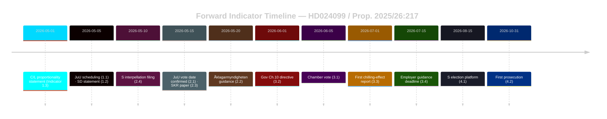

# Forward Indicators — Opposition Motions 2026-04-28

**Author**: James Pether Sörling  
**Date**: 2026-04-28  
**PIR Coverage**: PIR-1, PIR-2, PIR-3

## Overview

Forward indicators across four time horizons to track the evolution of the prop. 2025/26:217 / HD024099 legislative trajectory.

---

## Horizon 1: Immediate (7-14 days)

**Indicator 1.1** — JuU scheduling announcement  
**Due by**: 2026-05-05  
**Signal**: JuU secretariat publishes agenda for prop. 2025/26:217 hearing. If the hearing includes academic legal experts, signals possible openness to amendment (Scenario 2).  
**Track at**: riksdagen.se/sv/utskott/justitieutskottet/kallelser

**Indicator 1.2** — SD JuU member public statement  
**Due by**: 2026-05-05  
**Signal**: Any SD JuU member statement on "missbruk av offentlig ställning" that mentions proportionality or municipal workers signals potential Scenario 2 support.  
**Track at**: SD press releases, riksdagen.se ledamot activity

**Indicator 1.3** — C or L statement on proportionality  
**Due by**: 2026-05-01  
**Signal**: C or L public statement referencing chilling effect or proportionality in criminal law → HIGH probability Scenario 2 (social-interest valve amendment).  
**Track at**: Centerpartiet.se, Liberalerna.se, riksdagen.se

---

## Horizon 2: Short-term (2-4 weeks)

**Indicator 2.1** — JuU committee vote date confirmed  
**Due by**: 2026-05-15  
**Signal**: JuU vote scheduled for prop. 2025/26:217. If postponed beyond May, may indicate negotiation on valve amendment.  
**Track at**: riksdagen.se utskott kalender

**Indicator 2.2** — Åklagarmyndigheten guidance announcement  
**Due by**: 2026-05-20  
**Signal**: If Åklagarmyndigheten proactively publishes guidance on prosecutorial discretion for the new offense BEFORE the JuU vote, signals that the government is addressing chilling-effect concerns without accepting HD024099 §2.  
**Track at**: aklagare.se/nyheter

**Indicator 2.3** — SKR public position paper  
**Due by**: 2026-05-15  
**Signal**: SKR (Swedish Association of Local Authorities and Regions) publishing formal guidance to member municipalities on the new offense signals implementation concerns being institutionalised.  
**Track at**: skr.se/aktuellt

**Indicator 2.4** — S Riksdag debate request  
**Due by**: 2026-05-10  
**Signal**: If S files a chamber debate request (anmälan om interpellation or ministerial question) specifically on chilling effects, signals S is escalating media pressure on this issue.  
**Track at**: riksdagen.se fragor och interpellationer

---

## Horizon 3: Medium-term (1-2 months)

**Indicator 3.1** — Chamber vote date confirmed  
**Due by**: 2026-06-05  
**Signal**: Prop. 2025/26:217 passed by JuU and scheduled for chamber vote. Vote arithmetic will determine if Scenario 1, 2 or 3 materialises.  
**Track at**: riksdagen.se ärendelista

**Indicator 3.2** — Government directive on Chapter 10 BrB  
**Due by**: 2026-06-01  
**Signal**: Government publishes a kommittédirektiv commissioning a Chapter 10 BrB review. This would confirm Scenario 3 (12%) materialised.  
**Track at**: regeringen.se kommittédirektiv

**Indicator 3.3** — First chilling-effect media report  
**Due by**: 2026-07-01  
**Signal**: Any major Swedish media report (DN, SVT, SR) describing a specific case of a civil servant delaying a decision due to fear of prosecution under the new law.  
**Track at**: Danish-equivalent media monitoring; riksdag press archive

**Indicator 3.4** — Employer guidance publication  
**Due by**: 2026-07-15  
**Signal**: If no employer guidance is published before the August 2026 effective date, the chilling-effect risk escalates significantly (Risk 2 in risk-assessment.md).  
**Track at**: arbetsgivarverket.se; skr.se

---

## Horizon 4: Long-term (3-6 months / Election proximity)

**Indicator 4.1** — S election platform publication  
**Due by**: 2026-08-15  
**Signal**: If S's 2026 Riksdagsval platform includes a commitment to repeal or comprehensively reform the new offense, confirms that HD024099 has been successfully elevated to electoral issue.  
**Track at**: socialdemokraterna.se

**Indicator 4.2** — First prosecution under new law  
**Due by**: 2026-10-31  
**Signal**: Åklagarmyndigheten files first charge under "missbruk av offentlig ställning." If the case involves a municipal social-welfare worker (not a high-level official), vindicates S's chilling-effect concern and becomes major campaign issue.  
**Track at**: aklagare.se pressrum; Brå statistics

**Indicator 4.3** — Chapter 10 BrB commission appointment (post-election)  
**Due by**: 2026-12-31  
**Signal**: If the post-September 2026 government (regardless of which bloc forms it) appoints a Chapter 10 BrB reform commission, confirms long-term legislative trajectory consistent with S's §3 demand.  
**Track at**: riksdagen.se; regeringen.se kommittéer

---

## Indicator Dashboard Summary

| Horizon | Indicator | Due Date | PIR | Status |
|---------|---------|----------|-----|--------|
| 1: Immediate | JuU scheduling | 2026-05-05 | PIR-1 | PENDING |
| 1: Immediate | SD statement | 2026-05-05 | PIR-1 | PENDING |
| 1: Immediate | C/L proportionality | 2026-05-01 | PIR-1 | PENDING |
| 2: Short-term | JuU vote date | 2026-05-15 | PIR-1 | PENDING |
| 2: Short-term | Åklagarmyndigheten guidance | 2026-05-20 | PIR-2 | PENDING |
| 2: Short-term | SKR position paper | 2026-05-15 | PIR-2 | PENDING |
| 2: Short-term | S interpellation | 2026-05-10 | PIR-1 | PENDING |
| 3: Medium | Chamber vote | 2026-06-05 | PIR-1 | PENDING |
| 3: Medium | Gov. Ch.10 directive | 2026-06-01 | PIR-3 | PENDING |
| 3: Medium | First media report | 2026-07-01 | PIR-2 | PENDING |
| 3: Medium | Employer guidance | 2026-07-15 | PIR-2 | PENDING |
| 4: Long | S election platform | 2026-08-15 | PIR-3 | PENDING |
| 4: Long | First prosecution | 2026-10-31 | PIR-2 | PENDING |

