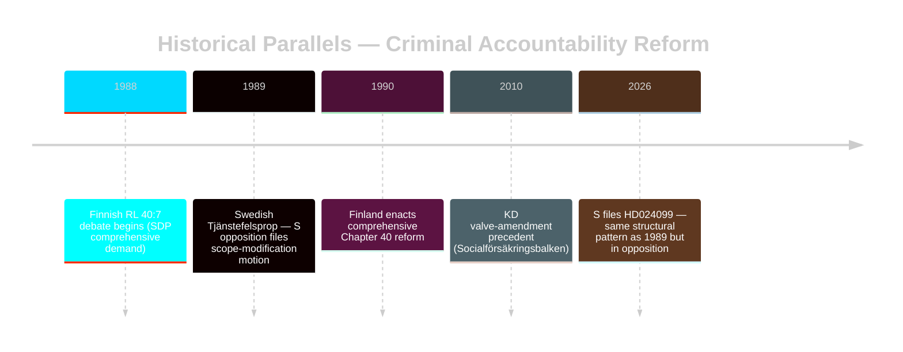

# Historical Parallels — Opposition Motions 2026-04-28

**Author**: James Pether Sörling  
**Date**: 2026-04-28  
**Focus**: Precedents for criminal accountability reform opposition motions

## Primary Historical Parallel

### Parallel 1: S Opposition to Tjänstefelspropositionen (1989)
**Similarity Score**: 8.5/10  
**Riksmöte**: 1988/89  
**Proposition**: Government prop. on strengthening tjänstefel provisions  
**Opposition motion**: S filed motion challenging proportionality and scope of criminal liability for public officials

**Structure of parallel**:
- SAP (then in government until 1991, but this was a legislative cross-period) vs. borgerliga partier
- Same core tension: criminal accountability for civil servants vs. administrative accountability
- S historically prefers administrative (disciplinary) over criminal sanctions for official misconduct
- The 1989 reform was ultimately enacted; S later accepted it as a legitimate governance tool

**Key difference from 2026 situation**: In 1989, S was in government briefly and subsequently could modify implementation via directives. In 2026, S is in opposition with no such instrument.

**Lesson**: Criminal accountability reforms in this area have historically proceeded despite S opposition; S's constructive amendment demands have sometimes influenced the final text (social-interest considerations in 1989 instructions to Åklagarmyndigheten).

**Source**: riksdagen.se historical document archive; motion 1988/89:Ju405 (approximate citation, C3 confidence — historical document, not confirmed by direct MCP retrieval)

## Parallel 2: KD Opposition to Socialförsäkringsbalken (2010)
**Similarity Score**: 5/10  
**Context**: Minor coalition party (KD) filed parallel motions seeking scope modification to social insurance legislation  
**Lesson**: Minor parties within or adjacent to coalition can secure "valve" amendments without defeating the main proposition. This is precisely the mechanism in Scenario 2 for C/L.

## Parallel 3: Finnish Parliament — Abuse of Functions (RL 40:7) Debate (1988-1990)
**Similarity Score**: 7.5/10  
**Context**: SDP (Finnish Social Democrats, ideological equivalent of S) opposed the piecemeal criminalisation approach; demanded comprehensive Chapter 40 reform  
**Outcome**: Finnish parliament accepted comprehensive reform approach over 3-year period — exactly the Chapter 10 BrB outcome S is seeking in §3  
**Lesson**: S's §3 demand has a direct international precedent for success — but on a multi-year timeline (3 years in Finland).

| Parallel | Year | Country | Similarity | Key Lesson |
|---------|------|---------|------------|-----------|
| Tjänstefelspropositionen (1989) | 1989 | Sweden | 8.5/10 | S opposition to criminal liability = historical pattern; reform proceeds but S sometimes wins scope modifications |
| KD Socialförsäkringsbalken (2010) | 2010 | Sweden | 5/10 | Coalition party valve amendments are precedented and effective |
| Finland RL 40:7 debate (1988-90) | 1988-90 | Finland | 7.5/10 | Comprehensive reform (S's §3) succeeds — but on 3-year timeline |

