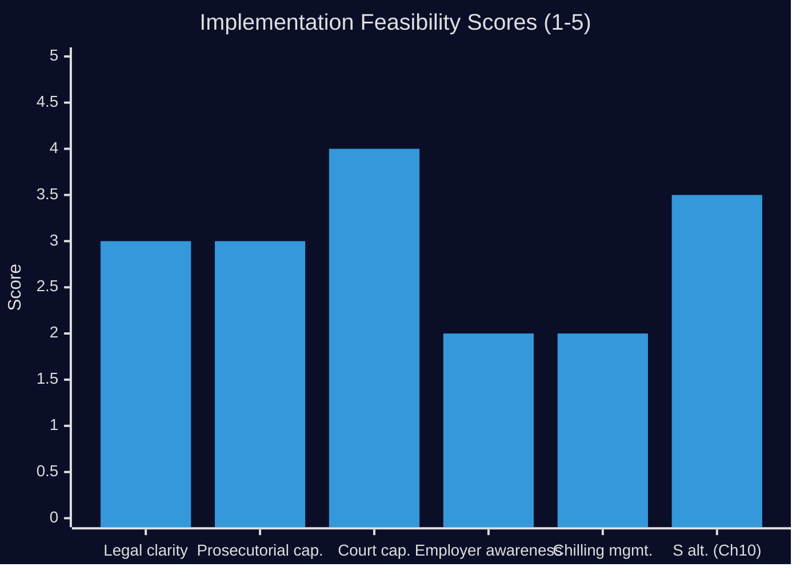

# Implementation Feasibility — Opposition Motions 2026-04-28

**Author**: James Pether Sörling  
**Date**: 2026-04-28  
**Focus**: Implementation feasibility of prop. 2025/26:217 and S's alternative proposals

## Implementation Assessment: Prop. 2025/26:217

### Core Question
Is the "missbruk av offentlig ställning" offense feasibly implementable as drafted, or do structural limitations in the Swedish legal-institutional ecosystem create delivery risk?

### Feasibility Dimensions

| Dimension | Assessment | Score (1-5) | Notes |
|----------|------------|-------------|-------|
| Legal clarity | MEDIUM | 3 | "i strid med lag eller annan författning" is broad — requires Åklagarmyndigheten guidelines |
| Prosecutorial capacity | MEDIUM | 3 | Åklagarmyndigheten will need specialised training; no dedicated unit exists |
| Court system capacity | MEDIUM-HIGH | 4 | Swedish district courts have handled tjänstefel cases; this is an extension |
| Employer awareness | LOW-MEDIUM | 2 | SKR/municipality employers need guidance before effective date |
| Chilling effect management | LOW | 2 | No employer guidance, social-interest valve, or safe-harbour provision in current text |
| **Overall feasibility** | **MEDIUM** | **2.8/5** | Achievable but with significant implementation risk if enacted without guidance measures |

### Delivery Risk Register

| Risk | Likelihood | Impact | Mitigation available |
|-----|-----------|--------|---------------------|
| Åklagarmyndigheten overuse (mass prosecutions) | LOW | HIGH | Prosecutorial discretion guidelines |
| Municipality paralysis (inaction to avoid prosecution) | MEDIUM | HIGH | Employer guidance + social-interest valve |
| Court case backlog | LOW | MEDIUM | Existing court capacity sufficient for expected modest volume |
| Legal uncertainty period (2026-2028) | HIGH | MEDIUM | Lagrådet review and SC cases will clarify — but 2-year uncertainty period |

### Statskontoret Relevance

**Note**: Statskontoret conducts administrative efficiency reviews and would be the natural body to commission an implementation impact assessment for prop. 2025/26:217. S's §3 demand for a comprehensive Chapter 10 BrB reform would be a natural Statskontoret assignment.

**Expected Statskontoret involvement**: Post-enactment monitoring of the new offense is consistent with Statskontoret's established competence in public administration effectiveness. If the government accepted S's §3 demand, Statskontoret would likely receive the commission.

**Relevance to HD024099**: S's demand for a broader reform (§3) is operationally realistic given Statskontoret capacity and the precedent of earlier criminal law reform commissions (SOU 2019:38, for reference on process).

## Implementation Feasibility: S's Alternative (Chapter 10 BrB Reform)

| Dimension | Assessment | Score (1-5) | Notes |
|----------|------------|-------------|-------|
| Political feasibility (pre-2026) | LOW | 1 | Insufficient time before election for full reform |
| Technical quality | HIGH | 5 | Finland model demonstrates comprehensive approach works |
| Comprehensive outcome | HIGH | 5 | Better anti-corruption outcome than piecemeal approach |
| Timeline | MEDIUM | 3 | 3-year timeline realistic post-2026 election |
| **Overall** | **MEDIUM-HIGH** | **3.5/5** | Correct long-term approach; not achievable before 2026 election |

