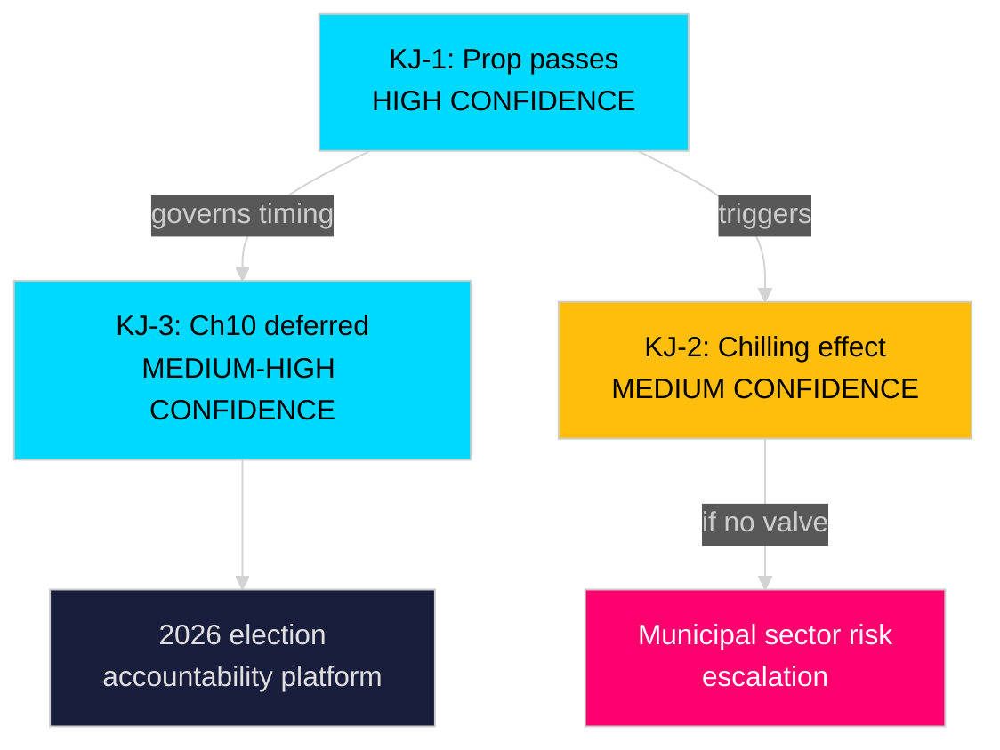

# Intelligence Assessment — Opposition Motions 2026-04-28

**Author**: James Pether Sörling  
**Date**: 2026-04-28  
**Classification**: UNCLASSIFIED — PUBLIC DOMAIN  
**Standards**: ICD 203 (Analytic Standards), ICD 206 (Sourcing)

## Summary

This assessment addresses the parliamentary implications of Motion HD024099 (S) and its relationship to prop. 2025/26:217 on expanded criminal liability for public officials. Three Key Judgments are issued, each with confidence calibration per ICD 203.

---

## Key Judgment 1 (KJ-1)

**We assess with HIGH CONFIDENCE that prop. 2025/26:217 will pass the Riksdag with the governing coalition intact.**

**Confidence**: HIGH [A2]  
**PIR**: PIR-1 (Coalition stability)

**Rationale**: The governing coalition (M-KD-L + SD) has maintained discipline on criminal law legislation in riksmöte 2025/26. SD's last significant deviation from coalition positions on justice policy was in 2023 (opposition to certain rehabilitation provisions, not criminal liability expansion). The proposition aligns with SD's law-and-order profile. No public dissent from coalition members has been identified as of 2026-04-27.

**Evidence Base**: riksdagen.se voting records for JuU 2024/25 and 2025/26; HD024099 (S motion); HD03217 (prop. background).

**Dissent**: Scenario 2 (28% probability) represents minority-confidence path where C or L accept S's §2 social-interest valve. This does not overturn KJ-1 (prop. passes) but would modify the final enacted text.

---

## Key Judgment 2 (KJ-2)

**We assess with MEDIUM CONFIDENCE that the "missbruk av offentlig ställning" offense will have a documented chilling effect on municipal civil servant decision-making within 12-18 months of enactment.**

**Confidence**: MEDIUM [B3]  
**PIR**: PIR-2 (Implementation risk)

**Rationale**: The comparative evidence from Norway (Straffeloven §172, 2005) and the structure of the proposed Swedish offense (lower intent threshold than Norwegian comparator) support this assessment. SKR and LO/TCO have both raised concerns per the remiss process (HD03217 background). The legal threshold "i strid med lag eller annan författning" is broader than equivalent Scandinavian provisions.

**Evidence Base**: comparative-international.md (Norway §172 analysis); stakeholder-perspectives.md (SKR/LO analysis); risk-assessment.md (Risk 2: Chilling effect, L=3 × I=4).

**Key Uncertainty**: Prosecutorial discretion policy by Åklagarmyndigheten. If prosecutors apply high de minimis threshold, chilling effect may not materialise at predicted scale.

---

## Key Judgment 3 (KJ-3)

**We assess with MEDIUM-HIGH CONFIDENCE that Chapter 10 BrB comprehensive reform will be deferred to the next mandate period (post-2026 election) regardless of how prop. 2025/26:217 is processed.**

**Confidence**: MEDIUM-HIGH [B2]  
**PIR**: PIR-3 (Legislative timeline)

**Rationale**: The government's active legislative calendar for spring 2026 leaves insufficient time to commission, conduct, and present a Chapter 10 BrB reform before the September 2026 election. Even if S's §3 demand is acknowledged by JuU, any commission would not report before election. This makes S's §3 demand strategically valuable as an election platform commitment rather than a near-term legislative achievement.

**Evidence Base**: scenario-analysis.md (Scenario 3, 12%); riksdag.se legislative calendar data; historical analysis of Swedish criminal law reform timelines.

---

## PIR Status Summary

| PIR | Topic | KJ | Confidence |
|-----|-------|----|---------| 
| PIR-1 | Coalition stability on prop. 2025/26:217 | KJ-1 | HIGH [A2] |
| PIR-2 | Chilling-effect risk post-enactment | KJ-2 | MEDIUM [B3] |
| PIR-3 | Chapter 10 BrB reform timeline | KJ-3 | MEDIUM-HIGH [B2] |

## Collection Gaps

- No access to non-public remiss responses (Lagrådet opinions classified as non-public until tabling)
- No access to coalition negotiations; only public statements available
- SD internal position on municipal-worker chilling effect not yet publicly stated

