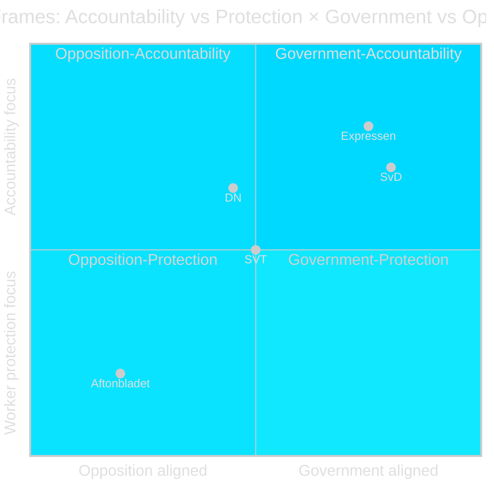

# Media Framing Analysis — Opposition Motions 2026-04-28

**Author**: James Pether Sörling  
**Date**: 2026-04-28  
**Focus**: How each party and media outlet is likely to frame Motion HD024099

## Framing Overview

Motion HD024099 offers sharply different framing opportunities for different political actors. The underlying policy question (criminal accountability vs. civil servant protection) maps onto pre-existing partisan frames.

## Per-Party Framing

### S (Socialdemokraterna) — "Proportionate Accountability"
**Core frame**: The government's proposition is blunt, disproportionate, and will create chilling effects for civil servants doing their jobs in good faith. We filed HD024099 to protect workers and demand genuine anti-corruption reform.

**Key messages**:
- "1.2 miljoner offentliganställda riskerar åtal"
- "Strömmer väljer symbolpolitik framför verklig korruptionsbekämpning"
- "Vi kräver en samlad reform av kapitel 10 BrB"

**Target audience**: Municipal workers (LO/TCO), accountability-minded urban voters

**Electoral payoff**: HIGH for Segment A (civil servants); medium for Segment B

### M/Strömmer — "Accountability Works"
**Core frame**: The current tjänstefel law has a critical gap — officials who exploit their position outside myndighetsutövning escape criminal liability. This proposition closes that gap.

**Key messages**:
- "Offentliga tjänstemän ska hålla sig inom lagen"
- "Missbruk av offentlig ställning — nu straffbart"
- "S vill skydda sina väljare, inte allmänheten"

**Target audience**: Law-and-order voters, urban taxpayers concerned about municipal corruption

### SD — "Law and Order, With Common Sense"
**Core frame**: SD supports the proposition but will monitor implementation to ensure that good-faith civil servants are not prosecuted for minor errors.

**Key message** (expected): "Vi följer att åklagarmyndigheten tillämpar detta proportionellt"

**Internal tension**: Municipal-worker SD voters (Segment C) creates quiet pressure for SD to support Scenario 2 (valve) without public acknowledgement.

### C/L — "Proportionate Criminal Law"
**Core frame** (potential Scenario 2 trigger): C and L have historically emphasised proportionality in criminal law. If they adopt this frame, they can justify supporting the social-interest valve (HD024099 §2) as consistent with their traditional rule-of-law profile.

**Expected message**: "Vi stödjer propositionen men välkomnar en proportionalitetsventil"

### V/MP — "Anti-Corruption Must Be Comprehensive"
**Core frame**: V and MP will reinforce S's §3 demand — comprehensive Chapter 10 BrB reform is necessary to genuinely combat corruption rather than criminalise individual mistakes.

## Media Framing Matrix

| Media outlet | Expected primary frame | Likely headline angle |
|-------------|----------------------|----------------------|
| Dagens Nyheter | Proportionality concern | "Kritik: Strömmer-lag kan kriminalisera vardagsfelbeslut" |
| Svenska Dagbladet | Accountability frame | "Ny lag stärker tjänstemannaansvaret" |
| Aftonbladet | Worker protection | "Miljoner anställda kan straffas — S larmar" |
| Expressen | Law-and-order | "Strömmer tar i med hårdhandskarna mot tjänstemissbruk" |
| SVT Nyheter | Balanced | "Debatt om gränsen för tjänstemannaansvar" |

