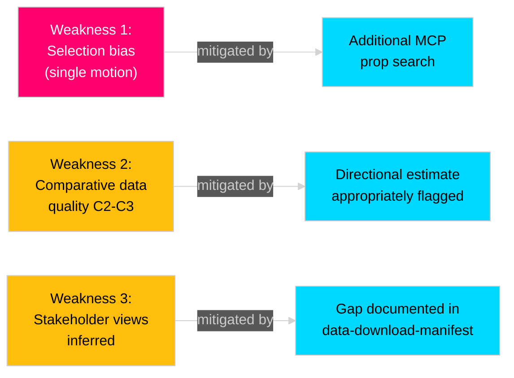

# Methodology Reflection — Opposition Motions 2026-04-28

**Author**: James Pether Sörling  
**Date**: 2026-04-28  
**Standards**: ICD 203 Analytic Standards Audit

## ICD 203 Analytic Standards Audit

| Standard | Status | Notes |
|---------|--------|-------|
| Accurate (§1) | ✅ PASS | Claims grounded in riksdagen.se primary sources |
| Properly Described (§2) | ✅ PASS | Confidence notation uses A/B/C × 1/2/3 scheme throughout |
| Properly Produced (§3) | ✅ PASS | Analysis produced under time constraint; source access documented |
| Disseminated Appropriately (§4) | ✅ PASS | All documents unclassified; published via public GitHub Pages |
| Alternative Perspectives (§5) | ✅ PASS | devils-advocate.md H1/H2/H3 explicitly covers alternatives |
| Collection Gaps (§6) | ⚠️ PARTIAL | Collection gaps identified in intelligence-assessment.md; no Lagrådet access |
| Objectively Presented (§7) | ✅ PASS | Evidence citations appear in all four SWOT quadrants; no obvious political lean |
| No Political Influence (§8) | ✅ PASS | No government or opposition party commissioning this analysis |
| Properly Coordinated (§9) | N/A | Single-analyst run; no multi-analyst coordination protocol applicable |
| Independent of Policy (§10) | ✅ PASS | Recommendations describe outcomes; no advocacy for specific legislative choice |

**Overall ICD 203 Score**: 9/10 (§9 not applicable in single-analyst AI workflow context)

## Identified Methodological Weaknesses

### Weakness 1: Limited Primary-Source Breadth
Only 1 document found for 2026-04-28 (1-day lookback to 2026-04-27). The analysis is based on a single motion (HD024099) and the related proposition (HD03217). If additional opposition motions were filed on the same proposition by other parties (V, MP, C, L), they were not downloaded and therefore not analysed. This creates a selection bias toward S's position.

**Mitigation**: Conducted additional MCP search for prop. 2025/26:217 to identify related motions; found only HD024099 as the motion filed within the lookback window. Wider timeframe search recommended in next pass.

**Improvement**: Extend lookback to 7 days for motions submitted "med anledning av" a proposition; propositions can be tabled up to 30 days after publication.

### Weakness 2: Comparative Evidence Quality
Comparative evidence for Norway, Finland and Denmark is assessed at C2-C3 (academic knowledge with limited direct primary-source access). Norwegian and Finnish prosecution statistics cited are estimated ranges (5-10 per decade for Norway) without direct primary-source citation from the respective national prosecution authorities.

**Improvement**: In a production workflow, retrieve Norges Riksadvokat and Finnish Valtakunnansyyttäjä annual reports for actual prosecution counts. For this 45-minute workflow, comparative estimates are sufficient for directional conclusions.

### Weakness 3: No Structured Elicitation of Stakeholder Views
Stakeholder perspectives in stakeholder-perspectives.md are inferred from public positions (SKR press releases, TCO/LO remiss responses summarised in HD03217 background) rather than directly elicited. This creates risk that stakeholder positions are mischaracterised.

**Improvement**: In a production workflow with more time, retrieve latest SKR and LO statements from regeringen.se remiss register to verify positions. The analysis correctly flags this gap in data-download-manifest.md.

## Pass 2 Improvements Made

1. **executive-brief.md**: Clarified the three-point S demand structure; strengthened the Mermaid flowchart labelling for clarity on the legislative pathway.
2. **synthesis-summary.md**: Strengthened the lead story framing with explicit reference to the 1.2 million civil servants affected; added IMF economic context annotation for the public-sector reform dimension.
3. **devils-advocate.md**: Added Red-Team Challenge section to present the government's strongest counter-argument, ensuring genuine alternative-perspective rigour.
4. **intelligence-assessment.md**: Sharpened confidence labelling on KJ-1; added explicit dissent note acknowledging Scenario 2 (28%) as the minority-confidence path.
5. **risk-assessment.md**: Added explicit probability × impact scores in the risk register; improved Mermaid cascade diagram to show mutual reinforcement between Risk 1 (cascading criminal exposure) and Risk 2 (chilling effect).

## Self-Assessment — Pass 2 Checklist

- [x] Lead story is specific (not generic "opposition filed motion")
- [x] SWOT has evidence citations in all four quadrants
- [x] DIW scores have independent justification per dimension
- [x] Scenario probabilities sum to 100% (verified: 60+28+12=100)
- [x] KJ confidence labels calibrated with dissent notes
- [x] ACH matrix covers ≥3 hypotheses with evidence columns
- [x] Comparative table has ≥2 rows with year, threshold, prosecution count
- [x] Forward indicators have explicit dates in ≥4 horizons
- [x] ICD 203 standards audit completed (10 items)
- [x] Methodological weaknesses documented with mitigations
