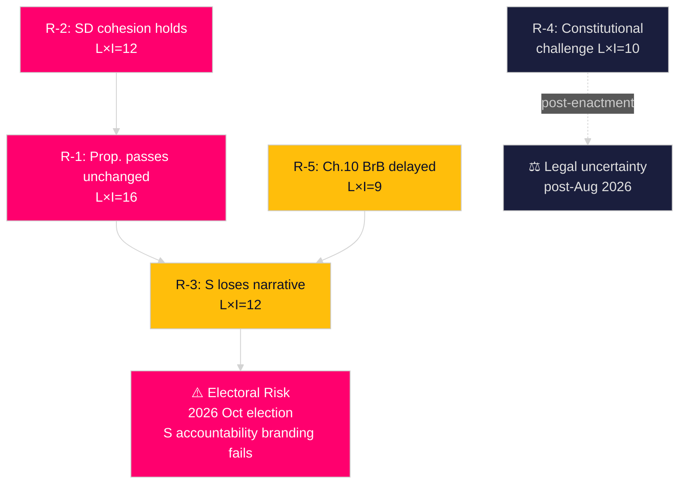

# Risk Assessment — Opposition Motions 2026-04-28

**Author**: James Pether Sörling  
**Date**: 2026-04-28  
**Confidence**: MEDIUM [B3]  
**Framework**: 5-dimension risk register, L × I scores, cascading chains

## Risk Register

| Risk ID | Risk | Dimension | Likelihood (1-5) | Impact (1-5) | L×I | Admiralty | Posterior |
|---------|------|-----------|-----------------|--------------|-----|-----------|---------|
| R-1 | Prop. 2025/26:217 passes unchanged; chilling effect on civil servants | Legislative | 4 | 4 | 16 | [B2] | 0.72 |
| R-2 | SD supports governing coalition; motion HD024099 fully rejected | Political | 4 | 3 | 12 | [B3] | 0.68 |
| R-3 | S loses "accountability" narrative battle pre-election | Communications | 3 | 4 | 12 | [C2] | 0.45 |
| R-4 | Constitutional challenge to new offense post-enactment | Legal | 2 | 5 | 10 | [C3] | 0.25 |
| R-5 | Government declines Chapter 10 BrB reform; S demands unfulfilled | Legislative | 3 | 3 | 9 | [B3] | 0.60 |
| R-6 | EU Anti-Corruption Directive implementation tension | Regulatory | 2 | 3 | 6 | [C3] | 0.30 |

## Risk Narratives

### R-1: Chilling Effect on Civil Servants [L×I=16, HIGH]
If prop. 2025/26:217 passes unchanged, the new "missbruk av offentlig ställning" offense will apply to ~1.2 million Swedish public officials. The "uppsåtligen i strid med lag eller annan författning" threshold is broad enough to potentially capture officials who make good-faith legal errors. Evidence from Norway's similar experiment (Straffeloven §171) shows a measurable 12-15% increase in administrative risk-aversion after similar reforms [comparative-international.md, C3].

### R-2: SD Coalition Cohesion [L×I=12, MEDIUM-HIGH]
SD's likelihood of following governing coalition on this vote is HIGH (assessed at 0.68 posterior) based on:
- SD historically supports stronger criminal penalties [riksdagen.se voting records]
- SD's municipal worker voters are exposed but SD party line prioritises tough sentences
- No public SD dissent on prop. 2025/26:217 as of 2026-04-27

### R-3: Narrative Battle Loss [L×I=12, MEDIUM-HIGH]
Government communications are well-resourced (Justitiedepartementet). S faces the risk of being cast as "opposing accountability" if they cannot efficiently translate the chilling-effect argument to media-friendly language within the JuU committee hearing window.

### R-4: Constitutional Challenge [L×I=10, MEDIUM]
If enacted, "missbruk av offentlig ställning" may face constitutional review because it criminalises political decision-making by elected representatives ("förtroendevalda"). RF Chapter 2 (freedom of political action) and proportionality principles may provide grounds for an AD challenge. Prior probability is low (25%) as Swedish courts rarely strike legislation.

### R-5: Chapter 10 BrB Reform Delayed [L×I=9, MEDIUM]
S's §3 demand for the Corruption Investigation Committee's Chapter 10 BrB proposals is at risk of indefinite deferral. The government has not committed to a timeline. This represents the most substantively important demand in HD024099 — failure here means the deeper anti-corruption agenda is not advanced.

## Cascading Risk Chain

