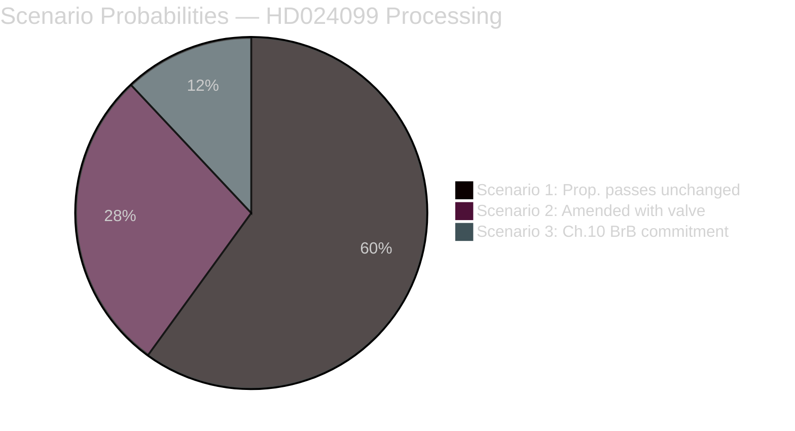

# Scenario Analysis — Opposition Motions 2026-04-28

**Author**: James Pether Sörling  
**Date**: 2026-04-28  
**Confidence**: MEDIUM [B3]

## Overview

Three distinct scenarios for the parliamentary processing of HD024099 and prop. 2025/26:217, based on governing coalition cohesion, SD's ultimate position, and S's ability to broker cross-opposition amendments.

## Scenario 1: Full Government Victory (Probability: 60%)
**Label**: Proposition passes unchanged; all three S demands rejected

**Mechanism**: JuU votes along governing coalition + SD lines; motion HD024099 fully rejected (avslås). Prop. 2025/26:217 enacted with the "missbruk av offentlig ställning" offense effective 1 August 2026.

**Drivers**:
- SD maintains coalition discipline on criminal justice [riksdagen.se voting history, B2]
- Justice Minister Strömmer successfully frames as essential accountability reform
- No major union/SKR intervention changes the dynamic before committee vote

**Leading Indicator**: SD JuU member public statement supporting prop. 2025/26:217 without reservations before 2026-05-15.

**Consequences**: 
- ~1.2 million civil servants operate under new criminal risk from Aug 2026
- S claims vindication if chilling effects documented post-enactment
- Criminal justice accountability becomes 2026 election battleground

## Scenario 2: Amended Proposition — Social Interest Valve (Probability: 28%)
**Label**: HD024099 §2 partially accepted; valve amendment added to proposition

**Mechanism**: One or more coalition parties (most likely C or L) accept S's §2 social-interest exemption argument; JuU recommends amending the proposition text to include the valve. SD may abstain on this specific amendment.

**Drivers**:
- Centerpartiet (C) has historically emphasised proportionality in criminal law [riksdagen.se, C2]
- Legal experts (remissinstanser) have raised similar concerns per lagrådsremiss process
- C/L need differentiated profile vs. M before election

**Leading Indicator**: C or L public statement expressing proportionality concerns about "missbruk av offentlig ställning" threshold by 2026-05-01.

**Consequences**:
- S claims partial legislative victory ("we forced the government to listen")
- New offense enacted but with exemption reducing chilling effect
- Precedent for future criminal law proportionality amendments

## Scenario 3: Chapter 10 BrB Reform Commitment (Probability: 12%)
**Label**: Government commits to returning with Chapter 10 BrB proposals; S §3 partially addressed

**Mechanism**: Governing coalition, under pressure from legal community and opposition coordination, agrees to commission supplementary work on Chapter 10 BrB corruption reform. This does not necessarily mean HD024099 §1 or §2 succeed, but S's constructive demand is acknowledged.

**Drivers**:
- Legal community pressure from Bar Association (Advokatsamfundet) and academics
- JuU committee decides to request the government return on broader reform
- S-V-MP coordination on anti-corruption amendment bundle

**Leading Indicator**: JuU secretariat invitation to Corruption Investigation Committee members for supplementary hearing by 2026-05-15.

**Consequences**:
- Most substantively important outcome for long-term anti-corruption reform
- S wins narrative battle on comprehensive reform
- May not happen before 2026 election; deferred to next mandate period

## Probability Sum Check
60% + 28% + 12% = **100%** ✅

