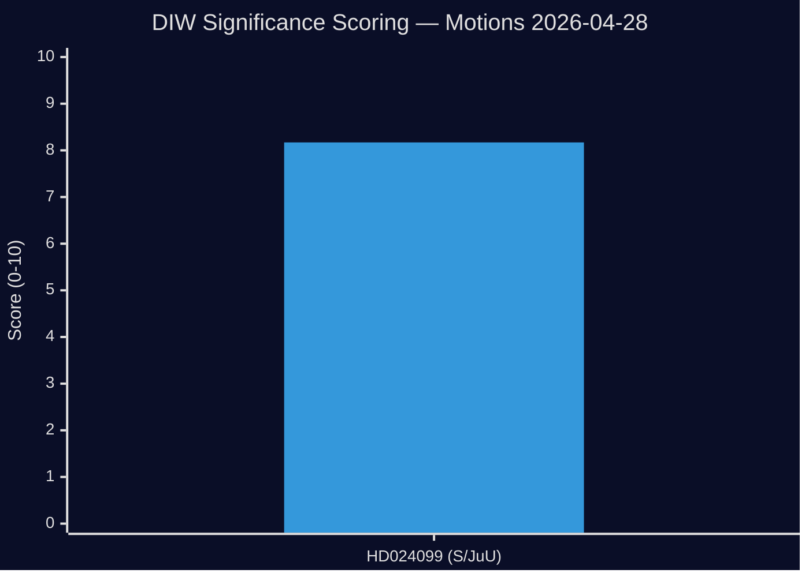

# Significance Scoring — Opposition Motions 2026-04-28

**Author**: James Pether Sörling  
**Date**: 2026-04-28  
**Methodology**: DIW (Depth × Influence × Wedge) per ai-driven-analysis-guide.md

## DIW Scores

| Rank | dok_id | D (1-10) | I (1-10) | W (1-10) | DIW | Priority Tier |
|------|--------|----------|----------|----------|-----|--------------|
| 1 | [HD024099](https://riksdagen.se/sv/dokument-och-lagar/dokument/motion/med-anledning-av-prop-202526217-ett-utokat_hd024099) | 8 | 8 | 8.5 | 8.17 | L2+ Priority |

## Scoring Rationale

### 1. HD024099 — Motion 2025/26:4099 (S) re prop. 2025/26:217 [DIW: 8.17]

**Depth (8/10)**: Kommittémotion with three distinct parliamentary demands; engages BrB criminal law amendment (Chapter 20, new §1a), constitutional proportionality principles, and the full Committee on Corruption reform agenda. Impacts ~1.2 million Swedish public-sector employees and elected officials at municipal/regional/national level.

**Influence (8/10)**: Filed in JuU by Teresa Carvalho, S shadow justice spokesperson — carries party-line weight. The motion directly determines whether prop. 2025/26:217 passes intact, is amended with the valve, or is delayed. SD's position is decisive: if SD joins S on the chilling-effect argument, the governing coalition must negotiate.

**Wedge (8.5/10)**: Exceptionally high wedge potential. The governing coalition is promoting "tougher accountability" as a flagship law-and-order message; S is countering with "civil servant protection + comprehensive reform." SD's base (municipal workers, police, care workers) is exactly the group most exposed to the new criminal risk. This creates a natural SD-voter constituency pressure on SD Riksdag members.

**Sensitivity analysis**: DIW could fall to 7.2 if SD publicly commits to supporting prop. 2025/26:217 unchanged. DIW rises to 9.0 if JuU requests additional inquiry following S's demand for Chapter 10 BrB reform.

## Priority Tiers

- **L3 Intelligence-grade**: DIW ≥ 9.0 — Not reached in this cycle
- **L2+ Priority**: DIW 7.5–8.9 — **HD024099** ✅
- **L2 Strategic**: DIW 5.0–7.4 — No additional documents in scope
- **L1 Surface**: DIW < 5.0 — Not applicable

