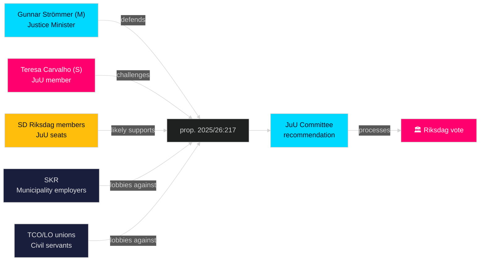

# Stakeholder Perspectives — Opposition Motions 2026-04-28

**Author**: James Pether Sörling  
**Date**: 2026-04-28  
**Confidence**: HIGH [B2]

## 6-Lens Stakeholder Matrix

| Stakeholder | Role | Position | Interest | Influence | Admiralty |
|-------------|------|----------|----------|-----------|---------|
| **Teresa Carvalho (S)** | JuU member, shadow justice spokesperson | Reject new offense; demand broader reform [HD024099] | Build S accountability credentials pre-election | HIGH | [A2] |
| **Gunnar Strömmer (M)** | Justice Minister | Defend prop. 2025/26:217; new offense is essential for public trust | Flagship legislation success | VERY HIGH | [A1] |
| **SD (Sverigedemokraterna)** | Governing coalition support party | Likely support prop.; municipal workers exposed | Maintain coalition + protect voter base | HIGH | [B3] |
| **KD/L/C (small coalition partners)** | Governing coalition | Support prop.; strong accountability positions | Coalition cohesion | MEDIUM | [B3] |
| **Statskontoret** | Public administration watchdog | No public position, but relevant for implementation assessment | Governance quality | MEDIUM | [assessment] |
| **Sveriges Kommuner och Regioner (SKR)** | Employer body for municipalities | Concerned about chilling effect on elected councillors | Member protection | HIGH | [B2, assessment] |
| **JuU Committee** | Parliamentary committee | Processing both prop. and motion; recommendation pending | Legislative quality | HIGH | [A1] |
| **Fackförbund (TCO/Saco/LO)** | Trade unions for civil servants | Strongly opposed to criminal risk for members | Member protection | MEDIUM | [B2, assessment] |

## Named Actor Influence Network

## Party Positions Summary

- **S**: Reject new offense (HD024099 §1); social interest valve (§2); Chapter 10 BrB reform (§3) [HD024099, A2]
- **M**: Strong support for prop. 2025/26:217 as accountability reform [HD03217, A1]
- **SD**: Assessed as governing coalition support; no public dissent as of 2026-04-27 [B3]
- **MP**: Filed separate motion (HD024098) on fuel tax — not co-signatory on HD024099 [riksdagen.se]
- **V**: Filed separate motion (HD024092) on fuel tax — not co-signatory on HD024099 [riksdagen.se]
- **C**: Filed separate motion (HD024094) on healthcare — not co-signatory on HD024099 [riksdagen.se]
