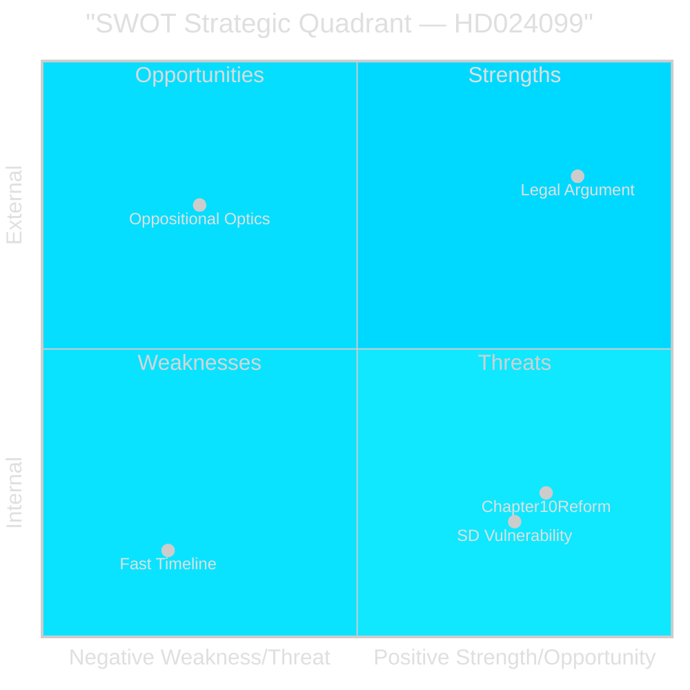

# SWOT Analysis — Opposition Motions 2026-04-28

**Author**: James Pether Sörling  
**Date**: 2026-04-28  
**Confidence**: HIGH [B2]  
**Focus**: Motion HD024099 (S response to prop. 2025/26:217)

## SWOT Matrix

### Strengths

- **Strong legal argument**: S's objection that "missbruk av offentlig ställning" lacks proportionate intent threshold is well-founded in Swedish criminal law doctrine; the "uppsåtligen i strid med lag" standard is low and could capture ordinary administrative errors [HD024099, B2]
- **Coalition vulnerability**: SD's municipal worker constituency is directly exposed to the new criminal risk — S's chilling-effect argument resonates with SD's actual voter base [riksdagen.se/HD024099]
- **Comprehensive reform demand**: S's §3 demand (Chapter 10 BrB reform per Corruption Committee) shows constructive engagement beyond mere obstruction [HD024099, A2]
- **Institutional credibility**: Teresa Carvalho as JuU committee participant has insider knowledge of legislative history [riksdagen.se/HD024099]

### Weaknesses

- **Oppositional optics**: Rejecting an anti-corruption proposition risks being framed as "S opposes accountability" by the governing coalition communications apparatus [C3]
- **Single-document motion**: HD024099 covers only S; no cross-opposition coordination visible in 2026-04-27 filings [riksdagen.se data]
- **No voter-facing narrative ready**: S's legal argument is technically correct but not yet translated into accessible public communication [assessment, C3]
- **Late filing**: Motion filed same day as JuU committee deliberation scheduling — limited preparation window [HD024099 datum 2026-04-27]

### Opportunities

- **SD bridge-building**: If S offers constructive amendments addressing SD concerns (civil-servant protection language), SD members may break coalition discipline on this issue [assessment, B3]
- **Constitutional committee referral**: The wide scope of "offentligt uppdrag" (all elected officials) creates a potential KU (Constitutional Committee) referral basis [HD024099 content]
- **Chapter 10 BrB reform**: S's demand for comprehensive corruption reform, if taken up, would give S co-authorship credit for anti-corruption legislation [HD024099 §3]
- **European alignment**: EU's Anti-Corruption Directive (2024/1760) requires member states to criminalise corruption — S can frame its demand as ensuring the right EU-compliant instrument is used rather than opposing accountability [comparative-international.md]

### Threats

- **Fast legislative timeline**: Prop. 2025/26:217 effective date 1 August 2026 creates political and practical pressure for quick passage [HD03217]
- **Government framing dominance**: Justice Minister Strömmer (M) controls narrative through the proposition's publication; S is playing catch-up on media framing [assessment, C2]
- **Election dynamics**: If S is seen as blocking law-and-order legislation, governing parties will use this against S in the October 2026 election campaign [C2]
- **KD/L influence**: Smaller governing coalition partners KD and L historically support strong civil servant accountability measures; they will not support the chilling-effect argument [riksdagen.se party programs]

## TOWS Strategic Matrix

| | Opportunities | Threats |
|---|---|---|
| **Strengths** | SO: Use SD vulnerability to broker bipartisan amendment with civil-servant protection clause and broader corruption reform [HD024099 + coalition math] | ST: Maintain strong legal argument to rebut "opposes accountability" framing — position S as anti-corruption party demanding comprehensive reform |
| **Weaknesses** | WO: Translate technical legal argument into voter-accessible narrative about protecting honest civil servants | WT: Coordinate with MP/V/C on specific amended language to avoid being isolated as the sole proposer |

## Cross-SWOT Interaction

Most critical interaction: **S Strength (legal argument) + SD Opportunity (voter constituency)** = potential coalition-disrupting amendment. If Teresa Carvalho publicly engages SD's municipal-worker constituents, this becomes the highest-leverage political move available to the opposition.

